# a-mbl: Client Guide

> **Who this is for:** anyone who wants to understand what a-mbl does and how
> it behaves, with no technical background needed. There is no code in this
> guide. For the technical version (files, database, API), see
> [PROJECT_GUIDE.md](PROJECT_GUIDE.md).
>
> **Version described:** a-mbl 0.2.0 (university prototype), October 2026.

---

## Contents

1. [a-mbl in one minute](#1-a-mbl-in-one-minute)
2. [The problem it helps with](#2-the-problem-it-helps-with)
3. [The three kinds of accounts](#3-the-three-kinds-of-accounts)
4. [How the pieces fit together](#4-how-the-pieces-fit-together)
5. [Getting started: connecting and creating an account](#5-getting-started-connecting-and-creating-an-account)
6. [Checking a message, step by step](#6-checking-a-message-step-by-step)
7. [Understanding a result](#7-understanding-a-result)
8. [Checking a screenshot instead of typing](#8-checking-a-screenshot-instead-of-typing)
9. [Cases: what gets saved, and for how long](#9-cases-what-gets-saved-and-for-how-long)
10. [Inside a case](#10-inside-a-case)
11. [Teens and guardians](#11-teens-and-guardians)
12. [Schools and sharing](#12-schools-and-sharing)
13. [Alerts](#13-alerts)
14. [Who can see what](#14-who-can-see-what)
15. [Reports and the PDF](#15-reports-and-the-pdf)
16. [Your data: export and delete](#16-your-data-export-and-delete)
17. [How a-mbl protects privacy](#17-how-a-mbl-protects-privacy)
18. [How the "AI" works, and its limits](#18-how-the-ai-works-and-its-limits)
19. [Trying the app yourself (test guide)](#19-trying-the-app-yourself-test-guide)
20. [Frequently asked questions](#20-frequently-asked-questions)
21. [Glossary](#21-glossary)
22. [What comes next](#22-what-comes-next)

---

## 1. a-mbl in one minute

**a-mbl is a mobile app that helps people check whether a message they
received might be cyberbullying.**

- You **type or paste** a message, or take a **screenshot** of a chat.
- a-mbl **estimates** whether it contains harmful language. It sorts the
  message into one of five groups (*Normal, Offensive, Harassment, Hate speech,
  Threat*), adds a separate *Body shaming* tag when needed, and gives **calm,
  practical advice**.
- **Ordinary messages are thrown away immediately.** Possibly harmful ones are
  kept **locked (encrypted) for 30 days**, then deleted automatically, so the
  person can come back to them, ask for a second opinion, or show them to
  someone they trust.
- A **parent or guardian** can be linked to a young person's account, and a
  user can choose to **share** a specific case with their **school**.
- Serious cases create **alerts** inside the app. If the person running the
  server has switched it on, linked guardians and schools also get a short
  **email**. Alerts and emails never show the message itself.
- Everyone sees simple **charts** on the Home tab and can produce a **summary
  report** and a **PDF** with the message text hidden.

The app gives **estimates to support a human conversation**, never verdicts
about a person.

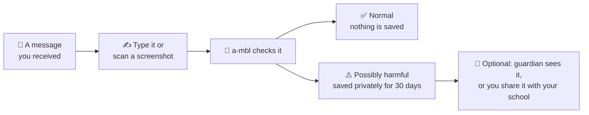
```mermaid
flowchart LR
    A["📱 A message<br/>you received"] --> B["✍️ Type it or<br/>scan a screenshot"]
    B --> C["🔎 a-mbl checks it"]
    C --> D["✅ Normal<br/>nothing is saved"]
    C --> E["⚠️ Possibly harmful<br/>saved privately for 30 days"]
    E --> F["👥 Optional: guardian sees it,<br/>or you share it with your school"]
```

---

## 2. The problem it helps with

Hurtful messages often arrive privately, late at night, and without anyone
else seeing them. The person receiving them may not be sure whether a message
"counts" as bullying, may not want to show it to anyone yet, and may lose the
message before they decide.

a-mbl was designed around four ideas:

| Idea | What it means in the app |
| --- | --- |
| **You stay in control** | Nothing is checked unless you choose to submit it. Nothing is shared with a school unless you choose to share it, and you can take it back. |
| **Calm, careful wording** | Results say "*may* contain", show how confident the check is, and always remind you it is an estimate. |
| **Keep only what helps** | Ordinary messages are not stored. Harmful ones are encrypted and delete themselves after 30 days. |
| **Bring in trusted adults** | Guardians and school staff can help, but only within clear, visible limits. |

> **What a-mbl does *not* do:** it does not read your other apps, monitor the
> phone in the background, connect to social-media accounts, or send text
> messages or push notifications. It only ever sees what someone
> deliberately types or scans into it. (The one exception to "no messages
> sent" is an optional alert email to guardians and schools, which never
> contains the message; see [section 13](#13-alerts).)

---

## 3. The three kinds of accounts

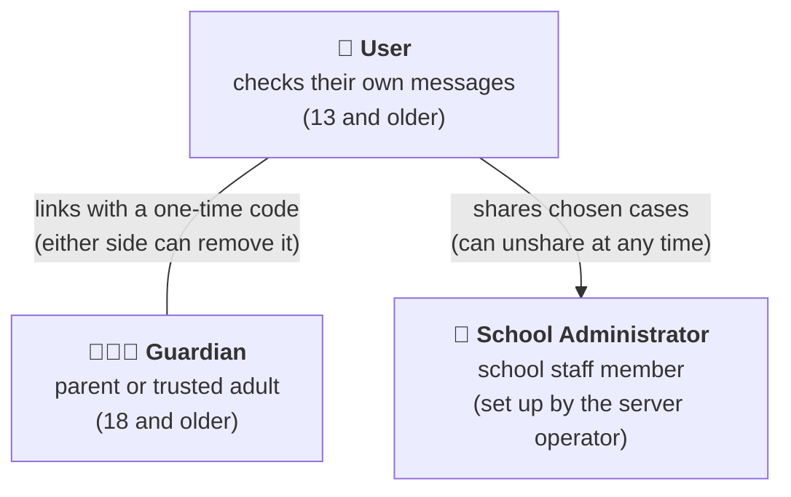
```mermaid
flowchart TB
    U["👤 <b>User</b><br/>checks their own messages<br/>(13 and older)"]
    G["🧑‍🧑‍🧒 <b>Guardian</b><br/>parent or trusted adult<br/>(18 and older)"]
    S["🏫 <b>School Administrator</b><br/>school staff member<br/>(set up by the server operator)"]
    U -- "links with a one-time code<br/>(either side can remove it)" --- G
    U -- "shares chosen cases<br/>(can unshare at any time)" --> S
```

| Account | Who it is for | How it is created | What it can do |
| --- | --- | --- | --- |
| **User** | Anyone aged 13 or older who wants to check messages | Self sign-up in the app. Ages 13–17 need a guardian's approval before they can start. | Check messages and screenshots, keep cases, ask for reviews, attach screenshots, share cases with a school, link a guardian, make reports. |
| **Guardian** | A parent or trusted adult (must be 18+) | Self sign-up in the app, choosing "A parent or guardian" | Approve a young person's account, see the cases of linked users, receive their alerts, add reviews, make reports. Can also check their own messages. |
| **School Administrator** | A member of school staff | **Cannot** sign up in the app. The person running the a-mbl server creates these accounts. | See **only** the cases that users have explicitly shared with their school, add reviews, receive alerts for those cases, manage the school's administrator list, make reports. |

Nobody under 13 can create an account. If someone enters a birth date that
makes them younger than 13, the app politely explains this and **saves
nothing at all**.

---

## 4. How the pieces fit together

a-mbl has two parts, like a shop with a counter and a back office:

- **The app on the phone** is the counter. It shows the screens, takes what
  you type, and displays results.
- **The a-mbl server** is the back office. It runs on a computer (during this
  project, the developer's Mac). It checks the messages, applies the rules,
  stores the locked cases, and builds reports.

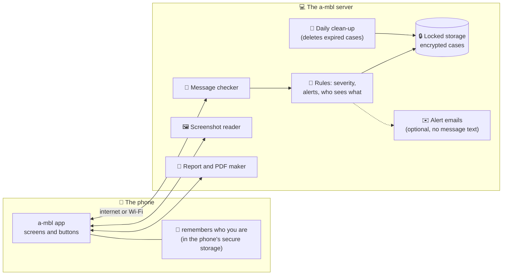
```mermaid
flowchart LR
    subgraph Phone["📱 The phone"]
        APP["a-mbl app<br/>screens and buttons"]
        KEY["🔑 remembers who you are<br/>(in the phone's secure storage)"]
    end
    subgraph Server["💻 The a-mbl server"]
        CHECK["🔎 Message checker"]
        RULES["📏 Rules: severity,<br/>alerts, who sees what"]
        OCR["🖼️ Screenshot reader"]
        PDF["📄 Report and PDF maker"]
        CLEAN["🧹 Daily clean-up<br/>(deletes expired cases)"]
        VAULT[("🔒 Locked storage<br/>encrypted cases")]
        MAIL["✉️ Alert emails<br/>(optional, no message text)"]
    end
    APP <-- "internet or Wi-Fi" --> CHECK
    CHECK --> RULES --> VAULT
    RULES -.-> MAIL
    APP <--> OCR
    APP <--> PDF
    CLEAN --> VAULT
    APP --- KEY
```

**Why a server, and not everything on the phone?** The screenshot reader, the
PDF maker and the trained AI model (see [section 18](#18-how-the-ai-works-and-its-limits))
are heavy tools that run better on a computer. Keeping the rules on the server also means **the phone cannot be
tricked into showing someone a case they are not allowed to see**: every
request is checked by the server, every time.

**The server address.** Because the server is the developer's own computer
during this project, the app asks for its address the first time it opens.
This looks like `http://192.168.1.20:8000` on the same Wi-Fi, or like
`https://something.trycloudflare.com` for testing from anywhere. You only
enter it once; the app remembers it.

---

## 5. Getting started: connecting and creating an account

### 5.1 The first screens

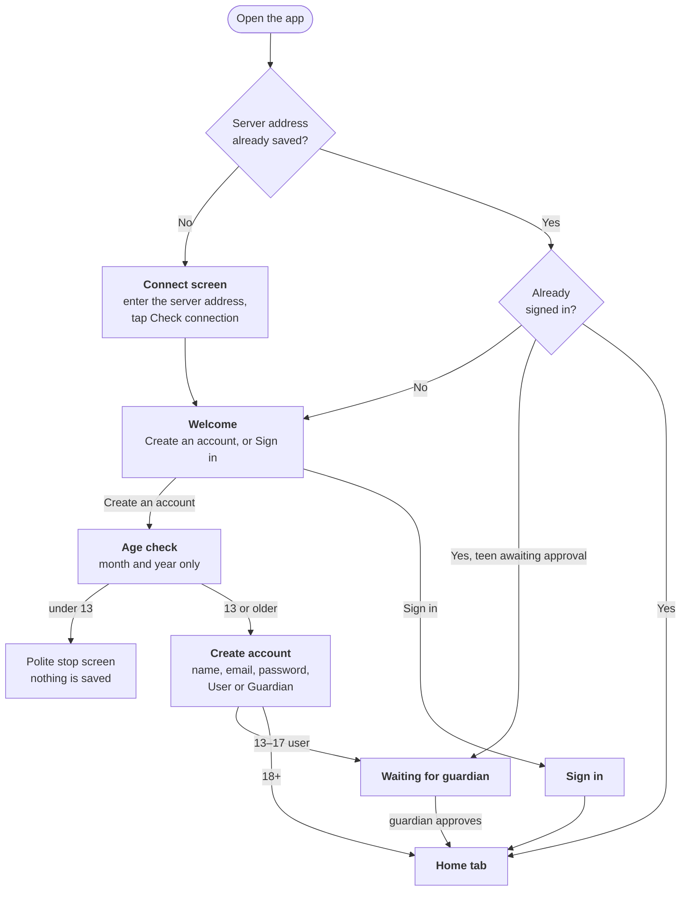
```mermaid
flowchart TD
    Open(["Open the app"]) --> Saved{"Server address<br/>already saved?"}
    Saved -- No --> Connect["<b>Connect screen</b><br/>enter the server address,<br/>tap Check connection"]
    Connect --> Welcome
    Saved -- Yes --> Signed{"Already<br/>signed in?"}
    Signed -- No --> Welcome["<b>Welcome</b><br/>Create an account, or Sign in"]
    Signed -- "Yes, teen awaiting approval" --> Pending["<b>Waiting for guardian</b>"]
    Signed -- Yes --> Home["<b>Home tab</b>"]
    Welcome -- "Create an account" --> Age["<b>Age check</b><br/>month and year only"]
    Age -- "under 13" --> Stop["Polite stop screen<br/>nothing is saved"]
    Age -- "13 or older" --> Register["<b>Create account</b><br/>name, email, password,<br/>User or Guardian"]
    Register -- "13–17 user" --> Pending
    Register -- "18+" --> Home
    Welcome -- "Sign in" --> Login["<b>Sign in</b>"] --> Home
    Pending -- "guardian approves" --> Home
```

  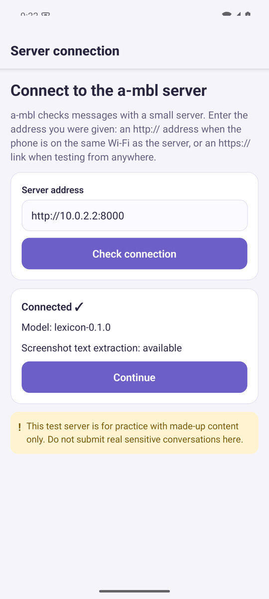
  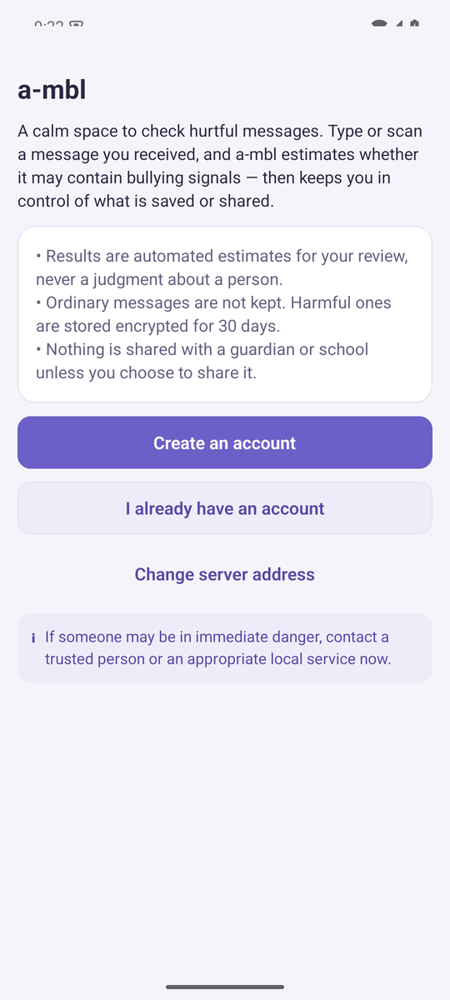
  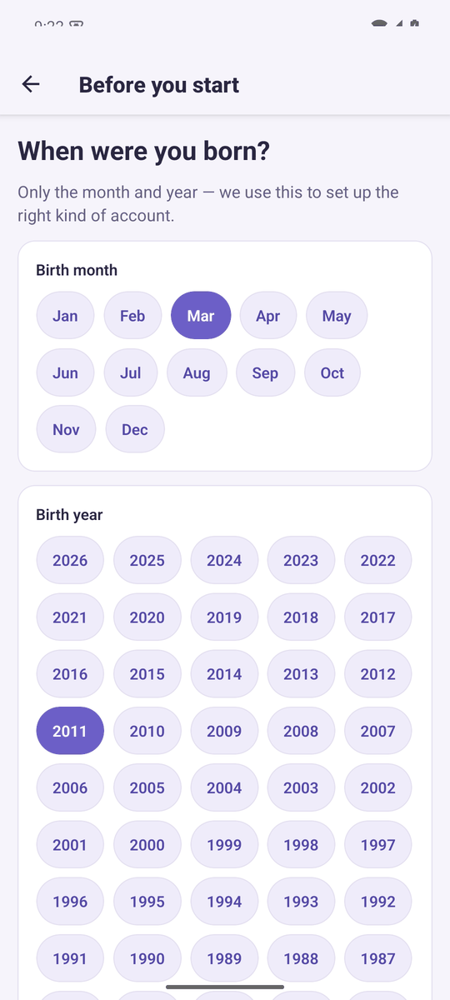

<em>Left to right: the Connect screen after a successful check, the Welcome screen, and the age check.</em>

### 5.2 The age check

Before asking for any personal details, the app asks only for the **month and
year of birth**. It uses them once to decide which kind of account fits, then
keeps **only an age group** ("13–17" or "18+"), never the birth date itself.

| Age | What happens |
| --- | --- |
| Under 13 | No account is created and nothing is stored. The screen suggests talking to a trusted adult. |
| 13–17 | The account is created but **waits for a guardian's approval** before it can be used (see [section 11](#11-teens-and-guardians)). |
| 18 or older | The account works straight away. Only adults can register as a Guardian. |

### 5.3 Creating the account

The sign-up form asks for a **display name** (what others will see, for
example a first name), an **email**, a **password** (at least 8 characters),
and whether you are *a user checking messages* or *a parent or guardian*.

  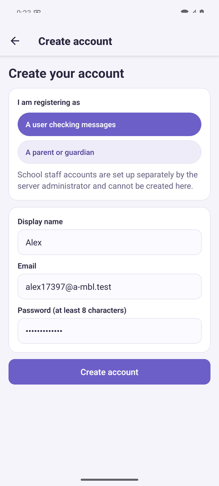
  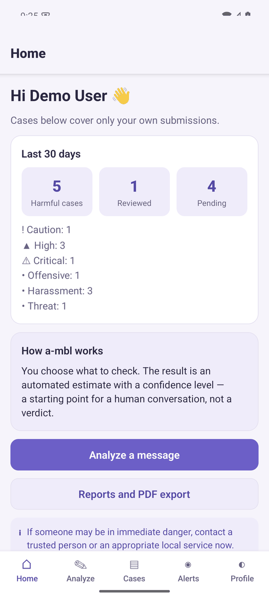

<em>The sign-up form, and the Home tab you land on afterwards.</em>

### 5.4 The five tabs

Once signed in, everything lives in five tabs at the bottom of the screen:

| Tab | What it shows |
| --- | --- |
| **Home** (Overview for guardians and schools) | A 30-day summary: how many harmful cases, how many reviewed, a breakdown by severity and category, and shortcuts to Analyze and Reports. Once there are cases, it also shows three simple charts: **cases per week**, **cases by day of the week**, and **repeat senders** (the sender nicknames typed in most often, top five). |
| **Analyze** | Where you check a message, by typing it or scanning a screenshot. |
| **Cases** (Review for schools) | The list of saved cases you are allowed to see, with severity filters. |
| **Alerts** | The in-app inbox for serious cases. |
| **Profile** | Your account, guardian links, privacy controls, the app version and the server you are connected to, and sign out. |

---

## 6. Checking a message, step by step

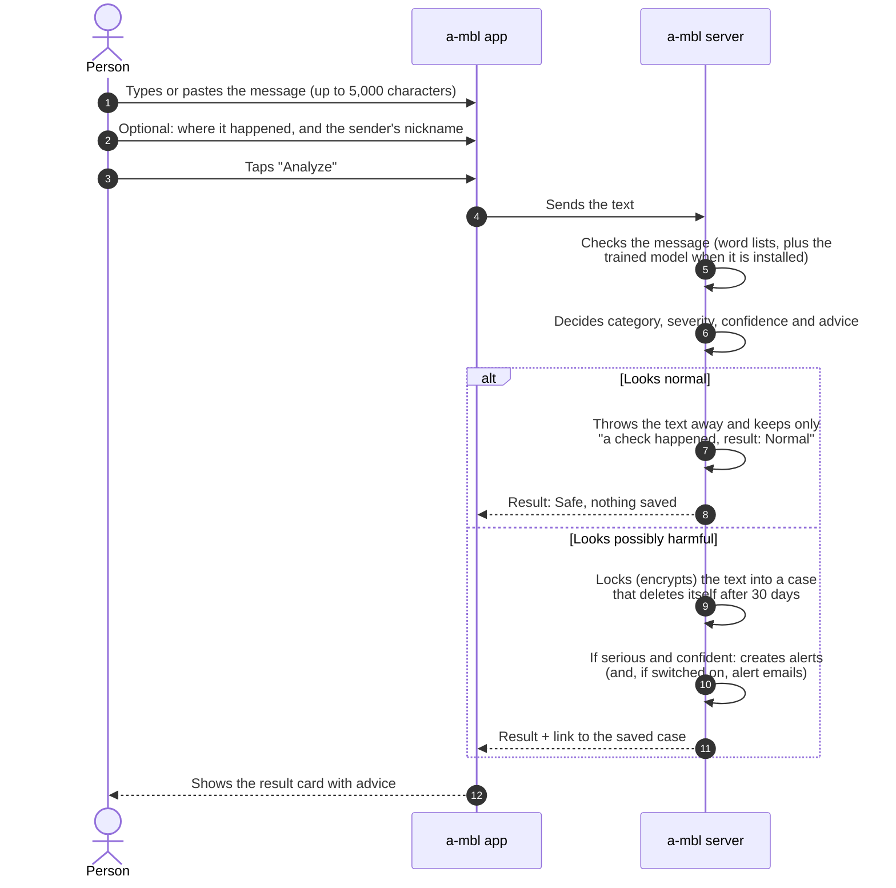
```mermaid
sequenceDiagram
    autonumber
    actor P as Person
    participant A as a-mbl app
    participant S as a-mbl server
    P->>A: Types or pastes the message (up to 5,000 characters)
    P->>A: Optional: where it happened, and the sender's nickname
    P->>A: Taps "Analyze"
    A->>S: Sends the text
    S->>S: Checks the message (word lists, plus the<br/>trained model when it is installed)
    S->>S: Decides category, severity, confidence and advice
    alt Looks normal
        S->>S: Throws the text away and keeps only<br/>"a check happened, result: Normal"
        S-->>A: Result: Safe, nothing saved
    else Looks possibly harmful
        S->>S: Locks (encrypts) the text into a case<br/>that deletes itself after 30 days
        S->>S: If serious and confident: creates alerts<br/>(and, if switched on, alert emails)
        S-->>A: Result + link to the saved case
    end
    A-->>P: Shows the result card with advice
```

The two optional fields, **Platform** (for example "ChatApp") and **Sender
nickname** (for example "anon_17"), are only notes for the person and anyone
helping them. They are labelled *unverified*: the app cannot know who really
sent a message, and these notes **never change the result**. The sender
nicknames are also what the **Repeat senders** chart on Home and the
"by sender" list in Reports count.

  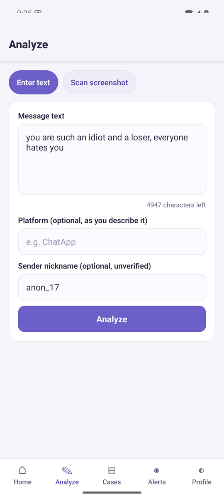
  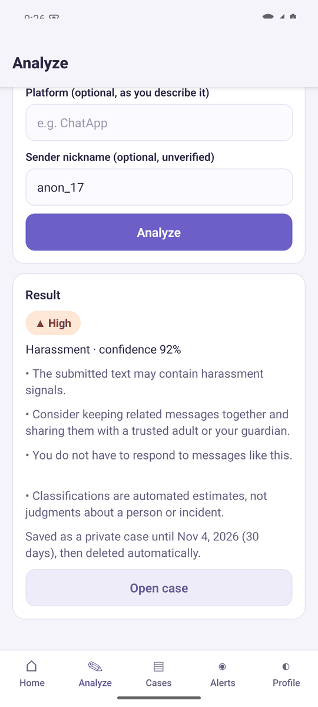
  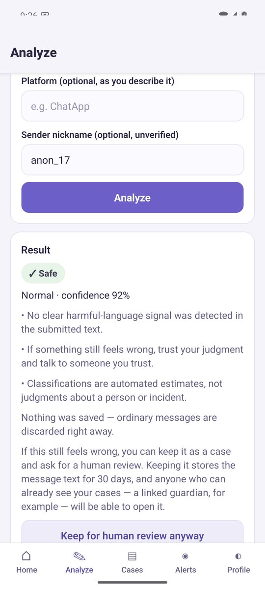

<em>Typing a message, a harmful result (saved as a case), and a normal result (nothing saved).</em>

---

## 7. Understanding a result

Every result card shows four things: a **severity badge**, a **category**, a
**confidence** percentage, and **advice**.

### 7.1 The five categories and the extra tag

| Category | Plain meaning | Example (made up) |
| --- | --- | --- |
| **Normal** | No clear sign of harmful language. | "See you at practice tomorrow, bring your racket!" |
| **Offensive** | Rude, insulting or crude language, not clearly aimed at bullying someone. | "that new rule is so stupid, this app is trash" |
| **Harassment** | Language aimed at a person to hurt, isolate or humiliate them. | "you are such an idiot and a loser, everyone hates you" |
| **Hate speech** | Attacks on a group because of who they are (religion, ethnicity, sexuality, disability and so on). | "go back to your country" |
| **Threat** | Language suggesting harm, violence, or telling someone to hurt themselves. | "stop showing up or i will hurt you" |
| ➕ **Body shaming tag** | An *extra* tag, not a sixth category, added when a message mocks someone's body or weight. It can appear together with any category. | "you are so fat, stop eating" |

### 7.2 Severity: how serious it may be

Severity is always shown as an **icon + word + colour together**, so it is
clear even for people who cannot tell colours apart.

| Badge | Severity | When it is used |
| --- | --- | --- |
| ✓ **Safe** (green) | Safe | The message looked Normal. |
| ! **Caution** (yellow) | Caution | Offensive language. |
| ▲ **High** (orange) | High | Harassment or hate speech, **or any message with the body-shaming tag**. |
| ⚠ **Critical** (red) | Critical | A possible threat. |

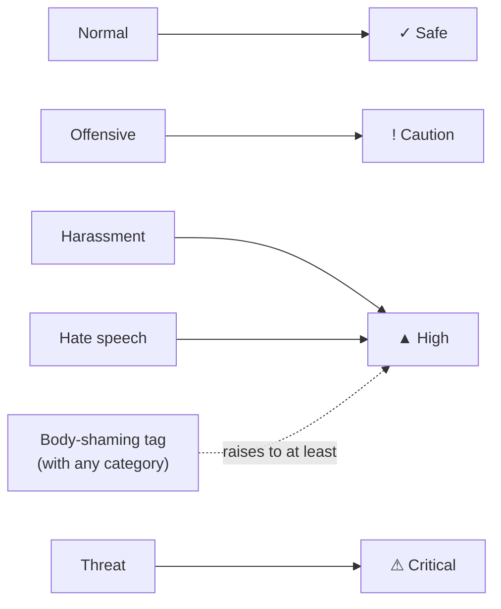
```mermaid
flowchart LR
    N["Normal"] --> SAFE["✓ Safe"]
    O["Offensive"] --> CAU["! Caution"]
    H["Harassment"] --> HIGH["▲ High"]
    HS["Hate speech"] --> HIGH
    BS["Body-shaming tag<br/>(with any category)"] -. "raises to at least" .-> HIGH
    T["Threat"] --> CRIT["⚠ Critical"]
```

### 7.3 Confidence, and "uncertain" results

The **confidence** percentage says how sure the check is about its own
answer. When it is **below 70%**, the result card adds a yellow note:
*"This result is uncertain and should be reviewed by a person."*

For example, "he looks fat in that photo" comes out as *Offensive + body
shaming tag*, severity **High**, at **68%** confidence, so it is marked
uncertain. That is the right outcome: the sentence may or may not be cruel
depending on context, and a person should decide.

### 7.4 The advice

Advice is short, calm and practical, and changes with the category. For a
threat it reads, for example:

> - The submitted text may contain threatening language.
> - If someone may be in immediate danger, contact a trusted person or an appropriate local service now.
> - Consider keeping this evidence and involving a trusted adult as soon as possible.
> - Classifications are automated estimates, not judgments about a person or incident.

### 7.5 "Keep for human review anyway"

If a message comes back **Normal** but still feels wrong, the person can tap
**Keep for human review anyway**. The app clearly warns that this **stores
the message for 30 days** and that anyone who can already see their cases (a
linked guardian, for example) will be able to open it. This is the only way a
normal message is ever kept, and only with the person's explicit choice.

---

## 8. Checking a screenshot instead of typing

On the **Analyze** tab, **Scan screenshot** lets the person pick a picture
from the gallery or take a photo of a screen. The server reads the text out of
the image (this is called *OCR*, optical character recognition), and the app
puts that text into the message box.

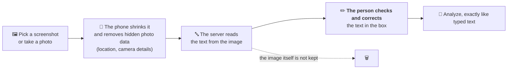
```mermaid
flowchart LR
    P["🖼️ Pick a screenshot<br/>or take a photo"] --> C["📐 The phone shrinks it<br/>and removes hidden photo data<br/>(location, camera details)"]
    C --> R["🔤 The server reads<br/>the text from the image"]
    R --> E["✏️ <b>The person checks and corrects</b><br/>the text in the box"]
    E --> A["🔎 Analyze, exactly like typed text"]
    R -. "the image itself is not kept" .-> X["🗑️"]
```

  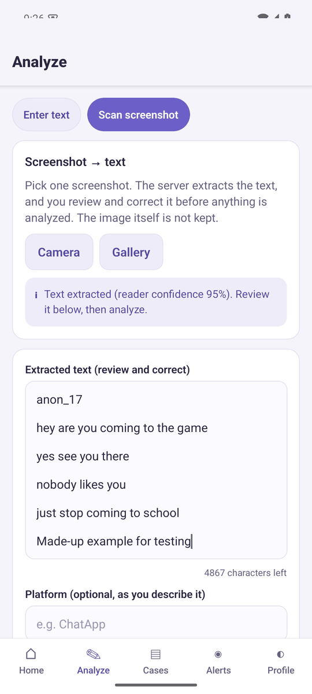

<em>A made-up chat screenshot after scanning: the extracted text is in the box, ready to be checked and corrected.</em>

Important details:

- **Nothing is checked until the person has seen and confirmed the text.** The
  reader can make mistakes (for example with unusual fonts), so the person
  always gets a chance to fix them first.
- If the reader was not confident, the app says so and asks the person to
  check the text carefully.
- The reader copes with dark-mode screenshots, low-contrast themes and
  sideways images.
- **The screenshot itself is not saved.** If the person wants to keep the
  original image as evidence, they can attach it to a case later (see
  [section 10](#10-inside-a-case)).
- Only JPEG and PNG images up to 10 MB are accepted.
- The camera and photo permissions are only requested at the moment the
  person chooses to use them.

---

## 9. Cases: what gets saved, and for how long

A **case** is a saved, possibly harmful message. Cases exist so a person can
come back to a message, ask for a second opinion, or show it to someone they
trust, without having to keep the original chat forever.

### 9.1 The life of a message

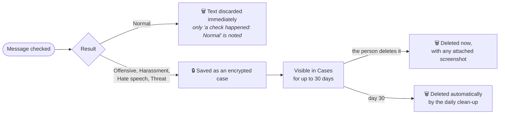
```mermaid
flowchart LR
    M(["Message checked"]) --> Q{"Result"}
    Q -- "Normal" --> D1["🗑️ Text discarded immediately<br/><i>only 'a check happened: Normal' is noted</i>"]
    Q -- "Offensive, Harassment,<br/>Hate speech, Threat" --> L["🔒 Saved as an encrypted case"]
    L --> V["Visible in Cases<br/>for up to 30 days"]
    V -- "the person deletes it" --> D2["🗑️ Deleted now,<br/>with any attached screenshot"]
    V -- "day 30" --> D3["🗑️ Deleted automatically<br/>by the daily clean-up"]
```

| What | Is the message text kept? | For how long |
| --- | --- | --- |
| A **Normal** result | ❌ No. Only the fact that a check happened and its result. | — |
| A **possibly harmful** result | ✅ Yes, **encrypted** (scrambled so it is unreadable without the server's key). | 30 days, then deleted automatically |
| A Normal result the person chose to **keep for review** | ✅ Yes, encrypted | 30 days |
| A **screenshot** used only for scanning | ❌ No | — |
| A screenshot **attached** to a case | ✅ Yes, encrypted | Deleted together with the case |

The exact deletion date is shown on every case ("Deletes automatically").

### 9.2 The Cases list

The **Cases** tab lists every case the person is allowed to see, newest first,
with filters for **All / Caution / High / Critical**. Each row shows the
severity badge, the category, the date, whose case it is, the platform note,
whether it has been reviewed, and a 📎 when a screenshot is attached.

  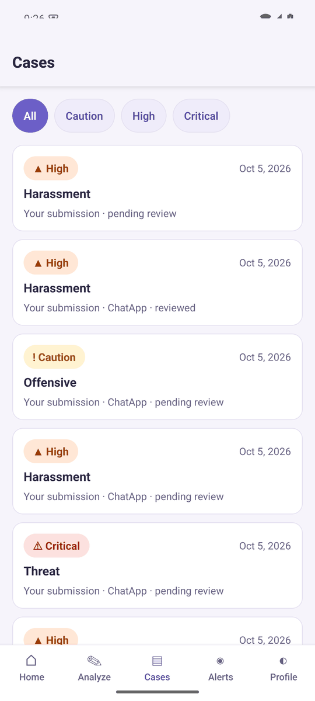
  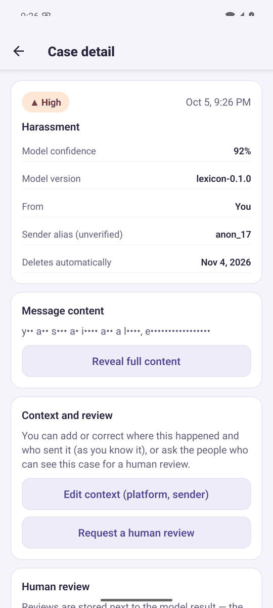

<em>The Cases list, and a case with its message text hidden until "Reveal" is tapped.</em>

---

## 10. Inside a case

Opening a case shows, from top to bottom:

1. **The original result**: badge, category, confidence, the version of the
   checker that produced it, who the case belongs to, the optional notes, and
   the automatic deletion date. **This original result never changes**, even
   after people review it.
2. **Message content, hidden by default.** The text is shown *masked*: every
   word is reduced to its first letter (for example `y•• a•• s••• a• i••••`).
   The full text appears only when someone deliberately taps **Reveal full
   content**, so a message is never shown by accident, for example over
   someone's shoulder. Sometimes the trained model (see
   [section 18](#18-how-the-ai-works-and-its-limits)) flags a message that
   contains none of the listed words, so there is nothing specific to hide.
   For those, the hidden view shows *"Content withheld — open the case to
   view it."* and the text appears only after **Reveal full content**.
3. **Context and review** (owner only): edit the platform and sender notes,
   and **Request a human review** to signal to the people who can see the case
   that the owner would like a second opinion.
4. **Human review**: anyone who can see the case can add a review: their own
   choice of category ("this looks like harassment to me"), a note, or both.
   Reviews are stored *next to* the original result; they do not overwrite it.
   Once reviewed, the case shows as "reviewed".
5. **Sharing with a school** (owner only): see [section 12](#12-schools-and-sharing).
6. **Screenshot evidence**: the owner can attach **one** screenshot. It is
   stored encrypted, can be viewed by anyone allowed to see the case, and is
   deleted together with the case.
7. **Delete this case** (owner only): removes the text and any screenshot
   permanently, straight away.

  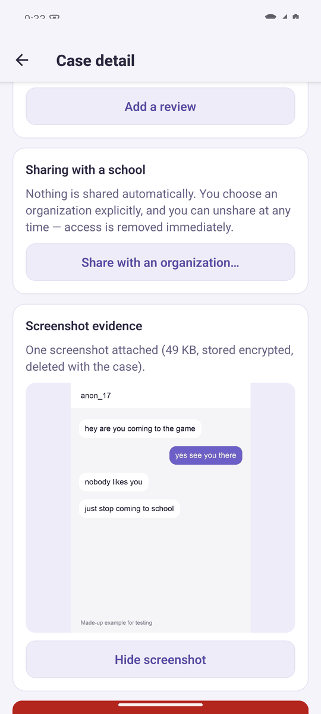

<em>A screenshot attached to a case. It is stored encrypted and shown only to people allowed to see the case.</em>

---

## 11. Teens and guardians

A **guardian link** connects a User with a Guardian. While the link is
active, the guardian can see the user's cases and receives alerts for their
serious ones. For users aged **13–17**, a guardian's approval is required
before the account can be used.

### 11.1 How a teen's account gets approved

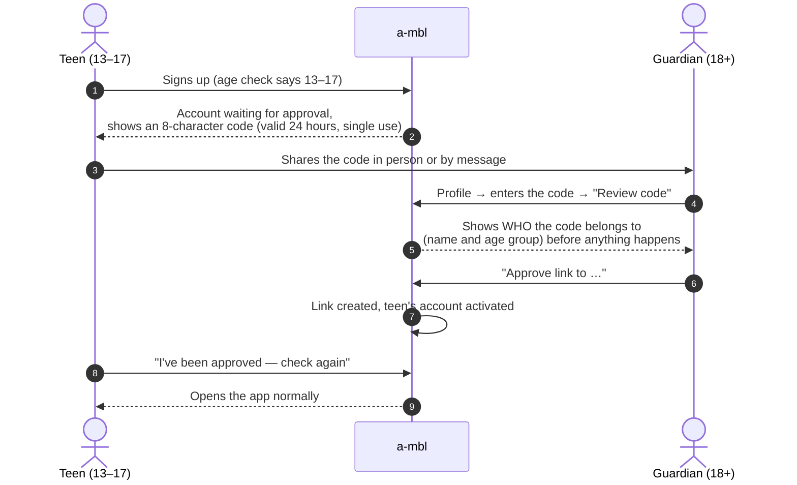
```mermaid
sequenceDiagram
    autonumber
    actor T as Teen (13–17)
    participant A as a-mbl
    actor G as Guardian (18+)
    T->>A: Signs up (age check says 13–17)
    A-->>T: Account waiting for approval,<br/>shows an 8-character code (valid 24 hours, single use)
    T->>G: Shares the code in person or by message
    G->>A: Profile → enters the code → "Review code"
    A-->>G: Shows WHO the code belongs to<br/>(name and age group) before anything happens
    G->>A: "Approve link to …"
    A->>A: Link created, teen's account activated
    T->>A: "I've been approved — check again"
    A-->>T: Opens the app normally
```

  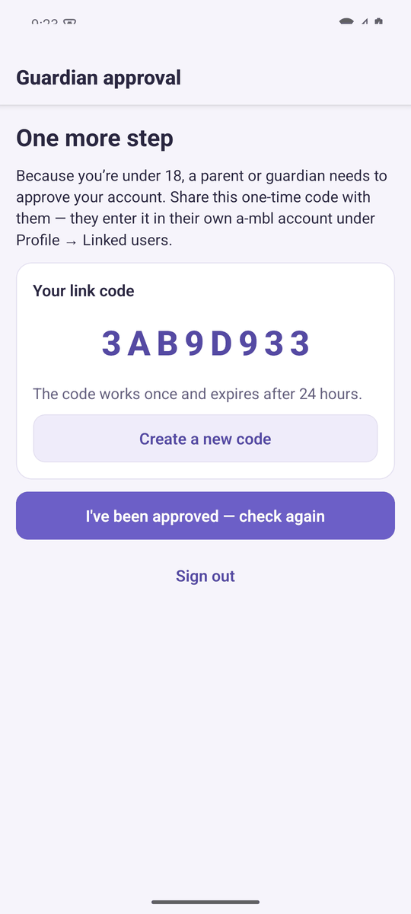
  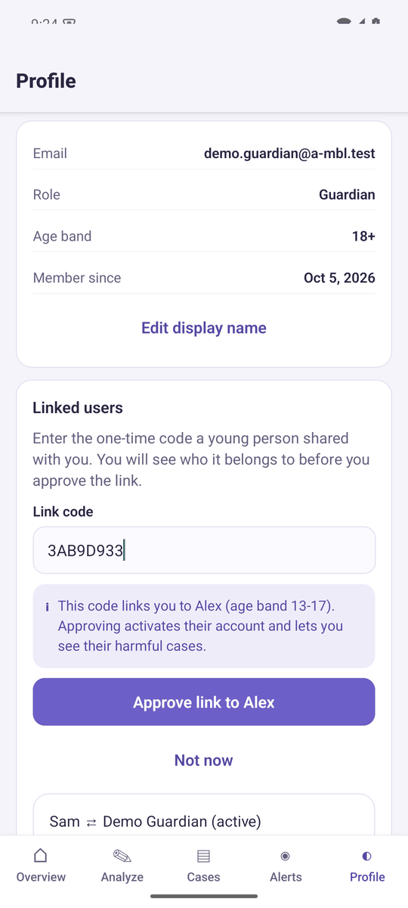

<em>The teen's waiting screen with the code, and the guardian reviewing whose code it is before approving.</em>

Good to know:

- The code works **once** and expires after **24 hours**. The teen can make a
  new code at any time.
- The guardian always sees **whose** code it is before approving, so a code
  typed by mistake cannot link the wrong person.
- **Either side can remove the link** at any time (Profile → Remove link).
  Neither account is deleted; the guardian simply loses access to the user's
  cases and their related alerts straight away.
- Adult users can also link a trusted adult as a guardian from their Profile,
  using the same code process.

### 11.2 What a guardian sees

A linked guardian sees, in their Home, Cases, Alerts and Reports, the cases
of every user linked to them (and their own, if they check messages
themselves). They can open a case, reveal the text, view an attached
screenshot, and add a review. They **cannot** delete, share or edit the
user's case; those choices stay with its owner.

---

## 12. Schools and sharing

School administrators see **nothing by default**. A case only becomes
visible to a school when its owner **explicitly shares it**, one case at a
time, and the owner can **unshare** whenever they like.

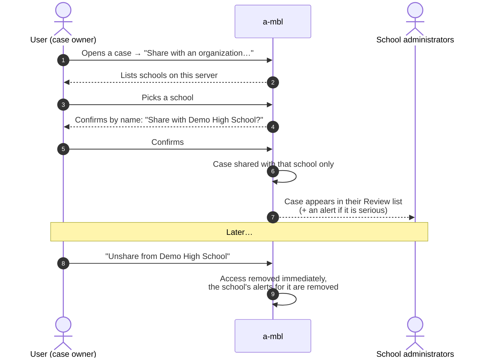
```mermaid
sequenceDiagram
    autonumber
    actor U as User (case owner)
    participant A as a-mbl
    actor S as School administrators
    U->>A: Opens a case → "Share with an organization…"
    A-->>U: Lists schools on this server
    U->>A: Picks a school
    A-->>U: Confirms by name: "Share with Demo High School?"
    U->>A: Confirms
    A->>A: Case shared with that school only
    A-->>S: Case appears in their Review list<br/>(+ an alert if it is serious)
    Note over U,S: Later…
    U->>A: "Unshare from Demo High School"
    A->>A: Access removed immediately,<br/>the school's alerts for it are removed
```

School administrator accounts are created by the person who runs the a-mbl
server, never through the app. An administrator can see their school's
administrator list, add another existing administrator account by email, and
remove one. A removed administrator loses access immediately.

  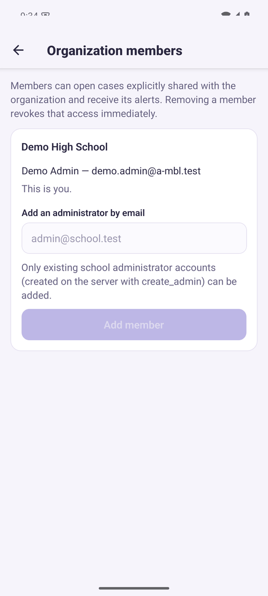

<em>A school administrator's member list.</em>

---

## 13. Alerts

Alerts are short notices in the **Alerts** tab that say "a serious case
exists". **An alert never contains the message itself**: only the severity,
the category, whose case it is, and when. Tapping it opens the case, and the
server checks again that the person is still allowed to see it.

### 13.1 When is an alert created?

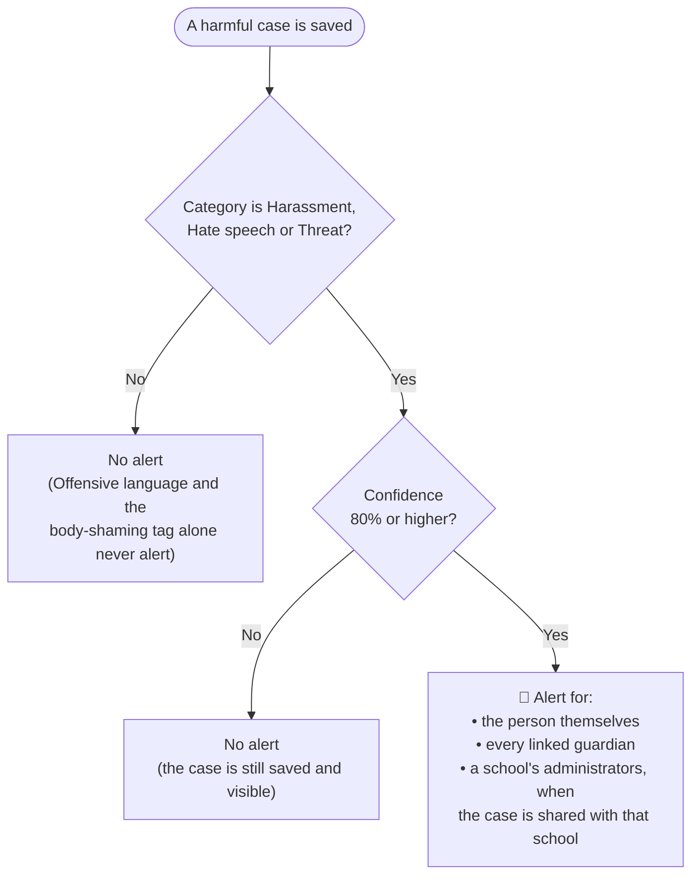
```mermaid
flowchart TD
    C(["A harmful case is saved"]) --> K{"Category is Harassment,<br/>Hate speech or Threat?"}
    K -- No --> N1["No alert<br/>(Offensive language and the<br/>body-shaming tag alone never alert)"]
    K -- Yes --> L{"Confidence<br/>80% or higher?"}
    L -- No --> N2["No alert<br/>(the case is still saved and visible)"]
    L -- Yes --> Y["🔔 Alert for:<br/>• the person themselves<br/>• every linked guardian<br/>• a school's administrators, when<br/>the case is shared with that school"]
```

This careful rule is deliberate: alerting adults about every rude word would
quickly bury the messages that really matter, and would discourage young
people from using the app.

  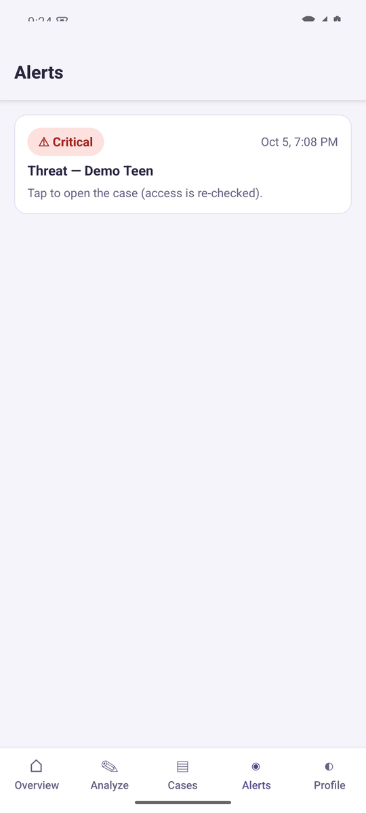

<em>A guardian's alert inbox. Unread alerts have a dot and a highlighted border.</em>

### 13.2 How alerts arrive

There are no phone notifications in this version, by design. The Alerts tab
refreshes when it is opened, when the app comes back to the foreground, every
minute while it stays open, and when the person pulls down on the list.

### 13.3 Optional alert emails

The person running the a-mbl server can also connect an email account to it.
When they do, linked guardians and school administrators get a short email
whenever a case creates an alert for them. Without it, no emails are sent and
the Alerts tab works exactly the same.

- The email says only that a possible case of a certain kind (for example
  *threat*) and severity (for example *critical*) involving a named person was
  flagged, and asks the reader to open the app.
- It **never contains the message**, and reminds the reader that results are
  automated estimates.
- The person who checked the message is not emailed, because they have just
  seen the result.
- Each person is emailed **only once per alert**, so the same alert never
  sends a second email. (If a case is unshared and later shared with the
  school again, that creates a new alert, and so a new email.)

---

## 14. Who can see what

| | **User** (the case owner) | **Guardian** (linked) | **School Administrator** |
| --- | :---: | :---: | :---: |
| See the case in their lists | ✅ | ✅ while linked | ✅ only if shared with their school |
| Reveal the full message text | ✅ | ✅ | ✅ (shared cases only) |
| View an attached screenshot | ✅ | ✅ | ✅ (shared cases only) |
| Add a human review | ✅ | ✅ | ✅ |
| Receive alerts for serious cases | ✅ | ✅ | ✅ (shared cases only) |
| Receive optional alert emails (when switched on) | — (they have just seen the result) | ✅ | ✅ (shared cases only) |
| Edit notes, request a review | ✅ | — | — |
| Attach a screenshot | ✅ | — | — |
| Share or unshare with a school | ✅ | — | — |
| Delete the case | ✅ | — | — |

If someone tries to open a case they are not allowed to see, the server
answers as if the case **does not exist**, so it does not even reveal that the
case is there.

---

## 15. Reports and the PDF

The **Reports** screen (from Home, or Profile for school administrators)
summarises the cases the person is allowed to see:

- a date range: last 7, 30 or 90 days, or custom dates;
- totals: harmful cases, reviewed, pending;
- breakdowns by severity and category;
- a **weekly trend** bar chart;
- cases grouped **by sender nickname**, clearly labelled as *unverified*
  (it is whatever the person typed, not proof of who sent it);
- **Download and share PDF**: a tidy report the person can save or send.

  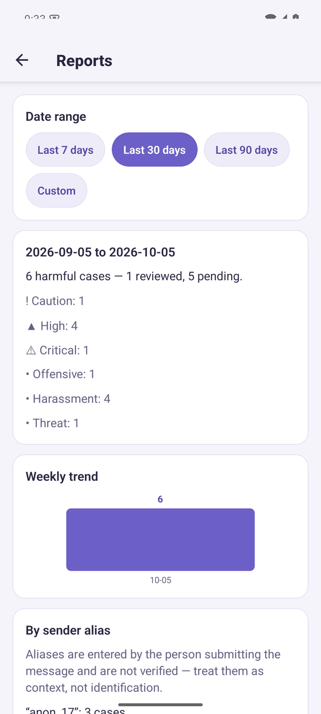

<em>The Reports screen with the weekly trend.</em>

**The PDF never contains readable messages.** It lists each case's date,
category, confidence, body-shaming tag, severity, status, a **masked**
preview (first letters only), and any review notes, followed by a reminder
that the classifications are estimates. Each person's PDF only includes the
cases their own account is allowed to see.

---

## 16. Your data: export and delete

From **Profile → Privacy**:

- **Export my data** creates a copy of everything the account holds (profile,
  the history of checks, saved cases with their text, links, alerts) and opens
  the phone's share menu so it can be saved or sent.
- **Delete my account…** asks for the password again, then permanently
  deletes the account and **everything it owns**: cases, screenshots, links,
  alerts and sessions. Only anonymous counters (for example "an account was
  deleted on this date") remain, with nothing that points back to the person.

---

## 17. How a-mbl protects privacy

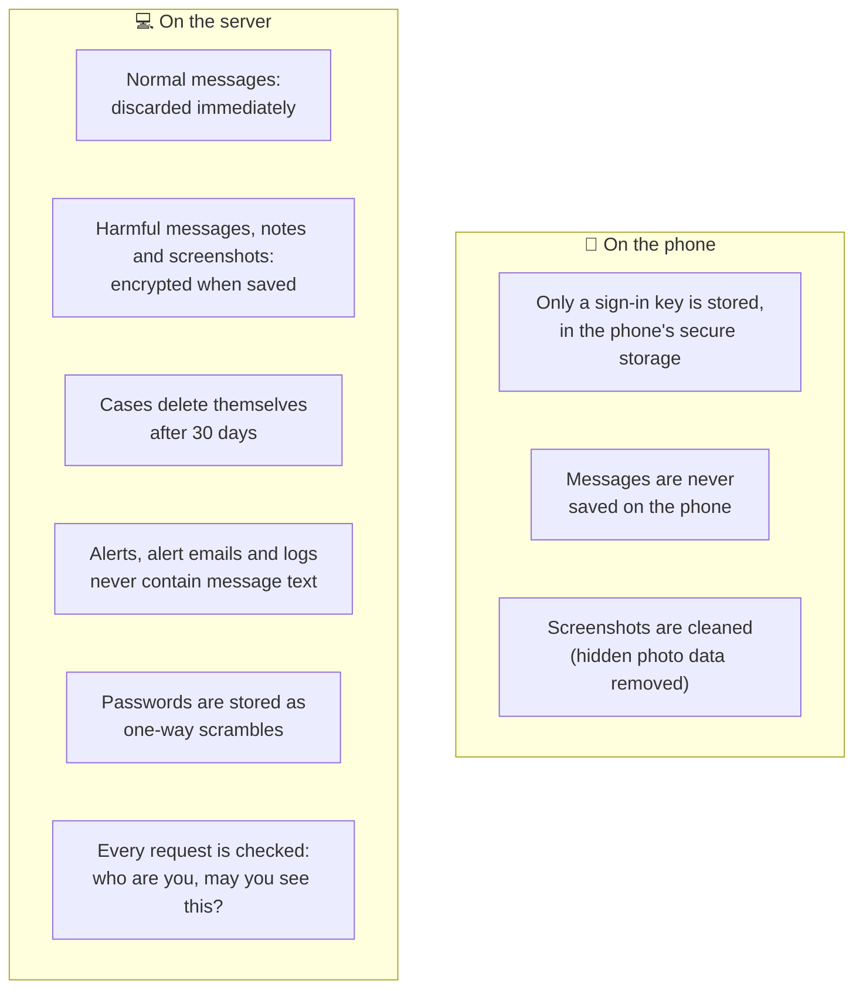
```mermaid
flowchart TB
    subgraph Phone["📱 On the phone"]
        P1["Only a sign-in key is stored,<br/>in the phone's secure storage"]
        P2["Messages are never<br/>saved on the phone"]
        P3["Screenshots are cleaned<br/>(hidden photo data removed)"]
    end
    subgraph Server["💻 On the server"]
        S1["Normal messages:<br/>discarded immediately"]
        S2["Harmful messages, notes and screenshots:<br/>encrypted when saved"]
        S3["Cases delete themselves<br/>after 30 days"]
        S4["Alerts, alert emails and logs<br/>never contain message text"]
        S5["Passwords are stored as<br/>one-way scrambles"]
        S6["Every request is checked:<br/>who are you, may you see this?"]
    end
```

In more detail:

- **Data minimisation.** The app keeps the least it can: an age group instead
  of a birth date, and no text at all for normal messages. Automated tests
  inspect the raw database file to prove that normal messages never reach it.
- **Encryption at rest.** Saved message text, review notes and attached
  screenshots are encrypted with a key that only the server holds.
- **Automatic expiry.** Every case carries its own deletion date; expired
  cases disappear from every screen immediately and are erased by the daily
  clean-up.
- **Content-free alerts and logs.** Alerts, the optional alert emails and the
  server's activity log record *that* something happened, never *what* the
  message said.
- **Deliberate reveal.** Message text is masked on screen and in PDFs until
  someone chooses to reveal it.
- **Strong sign-in.** Passwords are stored only as salted one-way hashes;
  sign-in keys expire quickly and renew automatically; a stolen, reused
  sign-in key logs that account out everywhere.
- **Access is enforced by the server**, not by hiding buttons in the app.

> **Prototype boundary.** a-mbl 0.2.0 is a university prototype running on a
> developer's computer. It has not been security-audited, it is not a
> production service, and it makes no legal-compliance claims. **Please use
> made-up messages only** when testing. The app shows this reminder on several
> screens too.

---

## 18. How the "AI" works, and its limits

### 18.1 What it is today

The message checker in this version has two parts that work together:

- A **trained model** (named `tfidf-logreg-0.2.0`). It is a computer program
  that learned from about 160,000 real online comments that people had
  already labelled as insulting, threatening, hateful, rude or fine. It picks
  up the kind of wording that goes with each category, so it can catch a
  message even when none of the listed words appear: `I will find out where
  you live` comes out as a **Threat**.
- A **word-and-phrase checker** (named `lexicon-0.1.0`). It contains lists of
  phrases for each category (threats such as "i will find you", harassment
  such as "nobody likes you", hate-speech patterns, offensive words,
  body-shaming terms) and rules for combining them. For example, a word about
  a group *plus* an attacking word counts as hate speech, and "you" plus two
  insults counts as harassment.

The server asks both and keeps **whichever answer is more serious**, so the
model can only add catches; it can never cancel one the phrase lists found.
The phrase checker also does two jobs the model cannot: it finds the exact
words to hide in previews and PDFs, and it recognizes **body shaming**, for
which no public training data exists.

The trained model is a file on the developer's computer. A computer without
that file uses the phrase checker on its own. The connection screen shows
which one is in use (*Model: …*), and every case shows the checker version
that produced it.

Together they see through common tricks people use to dodge filters:

| Trick | Example | Still caught? |
| --- | --- | --- |
| Numbers or symbols for letters | `i will k1ll you!` | ✅ Threat |
| Stretched letters | `u r such a l0000ser` | ✅ Offensive |
| Extra spaces between words | `kill     you` | ✅ Threat |
| A symbol hiding a letter | `k*ll yourself` | ⚠️ Threat, but marked uncertain so a person checks it |

A disguised spelling makes the checker *more* sure, not less: someone who
dodges a filter usually knows the word is hurtful.

### 18.2 Its honest limits

The trained model was tested on about 24,000 comments it had never seen,
mixed in the same proportions as real life (about nine in ten ordinary).
The project set four targets before testing and reports all four:

| What was measured | Target | Result |
| --- | --- | --- |
| Answers that were right overall | at least 85% | **90%** ✅ |
| Ordinary comments wrongly flagged (false alarms) | under 10% | **about 5%** ✅ |
| Real threats that were caught | at least 80% | **about 72%** (roughly 7 in 10) ❌ |
| Balanced score across all five categories (0 to 1) | at least 0.75 | **0.56** ❌ |

- Two of the four targets are **not met**. The main reasons: threats are rare
  in the training data (fewer than 500 of the 160,000 comments), and those
  comments come from Wikipedia discussion pages, not from teenagers' chats.
- It works in **English only**, and **new slang, sarcasm, inside jokes and
  context** can still fool it. It can miss harmful messages and can flag
  harmless ones (for example, friends teasing each other).
- The phrase checker's confidence numbers are **rules of thumb**, not
  measured statistics; on a computer without the model file, there is no
  measured accuracy at all.

That is exactly why the app always uses cautious wording, shows confidence,
flags uncertain results, keeps the original result next to human reviews,
and never takes action on anyone's behalf.

### 18.3 What comes next

The plan is a stronger model, trained on messages closer to real teenage
chats, compared honestly against this one, plus labelled body-shaming
examples so that tag no longer depends on a word list. The app was built so a
new model can be swapped in **without changing anything else**: same
categories, same screens, same privacy rules.

---

## 19. Trying the app yourself (test guide)

### 19.1 What you need

- An **Android phone** (the test app is an `.apk` file, which works on
  Android only; iPhones cannot install it).
- The **a-mbl APK file** and a **server address**, both sent by the developer.
- The developer's server must be **running during your test**. Agree a time
  window with them.

### 19.2 Installing the app

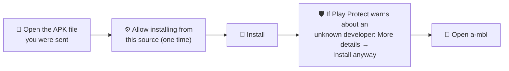
```mermaid
flowchart LR
    A["📩 Open the APK file<br/>you were sent"] --> B["⚙️ Allow installing from<br/>this source (one time)"]
    B --> C["📲 Install"]
    C --> D["🛡️ If Play Protect warns about an<br/>unknown developer: More details →<br/>Install anyway"]
    D --> E["🚀 Open a-mbl"]
```

1. Open the `.apk` file on the phone (from WhatsApp, email, Google Drive or
   the Downloads folder).
2. Android may say that installing from this source is not allowed. Tap
   **Settings**, switch on **Allow from this source**, and go back.
3. Tap **Install**.
4. Google Play Protect may say the app is from an unknown developer. This is
   expected for a test app that is not on the Play Store: tap **More
   details → Install anyway**.
5. Open **a-mbl**. Its icon is a white speech bubble with a purple shield.

### 19.3 Connecting

On the first screen, **Connect to the a-mbl server**, paste the address you
were given exactly as sent, tap **Check connection**, wait for
**"Connected ✓"**, then tap **Continue**. If it fails, check the address and
that the developer's server is running, then try again.

### 19.4 Ready-made demo accounts

The developer can prepare these practice accounts (password for all:
`demo-pass-123`):

| Email | Account | What is already there |
| --- | --- | --- |
| `demo.user@a-mbl.test` | Adult user | Sample cases of every severity |
| `demo.guardian@a-mbl.test` | Guardian | Linked to the teen; has an alert |
| `demo.teen@a-mbl.test` | Teen user (13–17) | Already approved by the guardian |
| `demo.admin@a-mbl.test` | School administrator | "Demo High School" |

You can also create your own accounts. Any made-up email address works.

### 19.5 Suggested test scenarios (about 20 minutes)

**A. Checking messages (as `demo.user@a-mbl.test`)**

1. Sign in. Look at the **Home** totals.
2. Go to **Analyze**, type `See you at practice tomorrow!` and tap
   **Analyze**. Expect **✓ Safe**, with *"Nothing was saved"*.
3. Replace the text with
   `you are such an idiot and a loser, everyone hates you` and tap
   **Analyze**. Expect **▲ High · Harassment**, saved as a case.
4. Tap **Open case**. The text is masked; tap **Reveal full content**.
5. Tap **Add a review**, choose a category, write a note, and save.
6. Try the screenshot route: **Scan screenshot → Gallery**, pick a screenshot
   of a (made-up) chat, correct the text if needed, and analyze it.

**B. Sharing with a school**

1. Still as the demo user, open the **⚠ Critical** (threat) case and tap
   **Share with an organization… → Demo High School**, then confirm.
2. Sign out (Profile → Sign out) and sign in as `demo.admin@a-mbl.test`. The
   case appears under **Review**, and an alert appears under **Alerts**.
3. Sign back in as the demo user and **Unshare** it. Check that the school can
   no longer see it.

**C. Teen and guardian**

1. Sign out, then **Create an account** with a birth year that makes you 15.
   You land on **One more step** with a code.
2. Sign out, sign in as `demo.guardian@a-mbl.test`, go to **Profile**, enter
   the code, tap **Review code**, check the name, and **Approve**.
3. Sign back in as your teen account. Because the guardian approved it, the
   app now opens normally. (Someone who stays on the waiting screen instead
   taps **I've been approved — check again**.)
4. As the teen, analyze a made-up threat such as `i will hurt you`. Then sign in
   as the guardian and look at **Alerts**.

**D. Reports and privacy**

1. Open **Home → Reports and PDF export**, switch between 7, 30 and 90 days,
   and tap **Download and share PDF**. Notice that messages are masked.
2. **Profile → Export my data** shows what the account holds.
3. On an account you created yourself, try **Delete my account…**.

### 19.6 What feedback is most useful

- Anything confusing: wording, buttons, or a screen where you did not know
  what to do next.
- Results that felt wrong, with the made-up message you used. Missed or
  over-flagged messages help most when improving the checker.
- Anything slow, broken, or that looked odd on your phone (please mention the
  phone model and the **App version** shown under Profile → App).
- Whether the privacy explanations make you feel comfortable.

---

## 20. Frequently asked questions

**Does a-mbl read my other apps or messages automatically?**
No. It only sees what someone deliberately types or scans into it.

**Will my parents or school see everything I check?**
Your school never sees anything you do not explicitly share, and you can
unshare at any time. A **linked** guardian sees your saved (possibly harmful)
cases and gets alerts for serious ones. Normal messages are not saved, so
nobody can see them. You can remove a guardian link from your Profile.

**Why was my normal message not saved?**
On purpose: ordinary messages are discarded immediately to protect privacy.
If you want it kept anyway, use **Keep for human review anyway**.

**Why did a message that is clearly a joke come out as harmful?**
The checker reads words, not intentions. That is why results are worded as
estimates and why people can add reviews.

**Why are there no phone notifications?**
This prototype deliberately keeps everything inside the app. Alerts refresh
whenever the Alerts tab is open or the app is reopened.

**Can I use it on an iPhone?**
The `.apk` test file is Android-only. The developer can run the app on an
iPhone through the *Expo Go* app, or through Apple's TestFlight with a paid
Apple developer account.

**What happens after 30 days?**
The case, its text, its screenshot, its reviews and its alerts are deleted
automatically. The deletion date is shown on every case.

**Is it safe to use with real conversations?**
Not yet. This is a prototype on a developer's computer, so please use made-up
messages only.

**I forgot my password.**
Password reset is not part of this prototype. Create a new practice account
instead.

---

## 21. Glossary

| Word | Meaning |
| --- | --- |
| **Alert** | An in-app notice that a serious case exists. Never contains the message. |
| **APK** | The installation file for Android apps. |
| **Case** | A saved, possibly harmful message, encrypted and deleted after 30 days. |
| **Category** | The main result: Normal, Offensive, Harassment, Hate speech or Threat. |
| **Confidence** | How sure the checker is about its answer (below 70% = uncertain). |
| **Encryption** | Scrambling data so it cannot be read without the right key. |
| **Evidence** | One screenshot the case owner chose to attach to a case. |
| **Guardian link** | The connection that lets a guardian see a user's cases. |
| **Link code** | The one-time, 8-character code a user gives their guardian (valid 24 hours). |
| **Masked preview** | The message with every word reduced to its first letter (`y•• a••…`). |
| **OCR** | Reading text out of an image (used for screenshots). |
| **Review** | A person's own opinion on a case. It never overwrites the original result. |
| **Server** | The computer that does the checking and keeps the locked cases. |
| **Severity** | How serious: Safe, Caution, High or Critical. |
| **Share** | The owner's choice to let one school see one case, which can be undone. |

---

## 22. What comes next

| Planned | Why it matters |
| --- | --- |
| **A stronger AI model**, trained on messages closer to teenage chats | Catches more threats and understands context better than today's model (see [section 18](#18-how-the-ai-works-and-its-limits)). |
| **Hosting on a proper secure server** (instead of a developer's computer) | Lets people use the app anytime, from anywhere, with real security protections. |
| **App-store builds** (Google Play, Apple App Store) | Easy installation, automatic updates. |
| **Optional notifications** | Faster alerts for guardians and schools, if wanted. |
| **More languages** | The checker currently understands English only. |

Throughout, the same principles stay in place: people choose what to check
and share, ordinary messages are not kept, results stay cautious, and humans
make the final call.
