# a-mbl — The Complete Project Guide

> **One file that explains everything.** What the project is, every folder, every
> file, every table, every endpoint, every screen, every test — and **why** each
> thing works the way it does. Written in simple words.
>
> Written after a full start-to-end read of all 107 tracked files in the
> repository (branch `feat/complete-roadmap-features`, based on commit
> `5d0ae36`). The review found 20 issues (§19); the real ones were **fixed on
> 2026-09-10**. **Refreshed on 2026-10-05** after a follow-up round (12 more
> issues found and fixed, §19.1), against the **110 tracked files** the
> repository holds after that round (`git ls-files`): 18 Expo template files
> were removed and 21 added — `CLIENT_GUIDE.md`, this guide,
> `mobile/eslint.config.js`, `mobile/scripts/build-apk.sh`, and 17 screenshots
> in `docs/images/guide/`. The guide describes the code **after** both rounds of fixes.
> **Refreshed again on 2026-10-07** for version **0.2.0** (branch
> `release/model-and-apk-0.2.0`), which merges `feat/ml-dashboard-alerts`
> (commit `841b8b4`): a hybrid classifier with a trained model, optional email
> alerts, Home dashboard charts, Windows support, an import-casing check and the
> training pipeline — 9 new files, **119 tracked files** in all. The model is
> **trained on the development Mac** (`ml/artifacts/`, not in Git).
> Facts were checked by running the code on 2026-10-07: the backend test suite gives
> **120 tests → 119 passed, 1 skipped**, the mobile TypeScript check
> (`tsc --noEmit`) gives **0 errors**, `npm run lint` gives **0 problems**, and
> the casing check passes (72 local imports). The `expo-doctor` (21/21) and
> `expo export` results are from 2026-10-05.

---

## Table of contents

1. [How to read this guide](#1-how-to-read-this-guide)
2. [The project in one minute](#2-the-project-in-one-minute)
3. [The big picture (diagram)](#3-the-big-picture)
4. [Words you need to know (glossary)](#4-words-you-need-to-know-glossary)
5. [Every file in the repository (full map)](#5-every-file-in-the-repository)
6. [How the backend starts and how one request travels](#6-how-the-backend-starts-and-how-one-request-travels)
7. [Backend, file by file](#7-backend-file-by-file)
8. [Every API endpoint](#8-every-api-endpoint)
9. [The database in depth](#9-the-database-in-depth)
10. [The classifier ("the AI") in depth](#10-the-classifier-the-ai-in-depth)
11. [Security and privacy — every layer](#11-security-and-privacy--every-layer)
12. [The mobile app](#12-the-mobile-app)
13. [Every screen of the mobile app](#13-every-screen-of-the-mobile-app)
14. [End-to-end flows (step by step with diagrams)](#14-end-to-end-flows)
15. [Tests — how they work and every single test](#15-tests)
16. [Scripts, running, and device testing](#16-scripts-running-and-device-testing)
17. [The docs folder and other small files](#17-the-docs-folder-and-other-small-files)
18. [Roadmap vs. what is really built](#18-roadmap-vs-what-is-really-built)
19. [Code review findings (issues I found)](#19-code-review-findings)
20. [FAQ — "Why does it work like this?"](#20-faq--why-does-it-work-like-this)
21. [Cheat sheet](#21-cheat-sheet)

---

## 1. How to read this guide

- If you only have **5 minutes**: read sections 2, 3 and 21.
- If you want to **understand the app**: read 2 → 3 → 4 → 12 → 13 → 14.
- If you want to **change the backend**: read 6 → 7 → 8 → 9 → 10 → 15.
- If you want to **know what is wrong or missing**: read 18 and 19.

Throughout the guide you will see boxes like this:

> **Why?** This explains the reason behind a design choice — not only *what*
> the code does, but *why* it was written that way.

Diagrams are written in **Mermaid** (they draw themselves on GitHub and in most
Markdown viewers) and some in plain **ASCII** (they work everywhere).

File links like [db.py](backend/app/db.py#L179) jump straight to the code.

---

## 2. The project in one minute

**a-mbl** is a mobile app that helps people check if a message they received
might be **cyberbullying**.

1. A person **types or pastes** a message, or **takes a screenshot** of a chat.
2. The app sends the text to a small **server running on a Mac**.
3. The server **classifies** the text into one of five groups:
   **Normal, Offensive, Harassment, Hate Speech, Threat** — plus an extra
   **Body Shaming** tag.
4. The server gives back a **severity** (Safe / Caution / High / Critical), a
   **confidence** number, and **calm advice**.
5. If the message looks **harmful**, it is saved as an **encrypted "case"** that
   **deletes itself after 30 days**. If it looks **normal**, the text is
   **thrown away immediately** and never saved.
6. There are **three kinds of accounts**:
   - **User** — checks their own messages.
   - **Guardian** — a parent who can see the cases of a teen they are linked to.
   - **School Administrator** — can see only cases a user **chose to share** with
     their school.
7. High-risk cases create **alerts** inside the app (no message text in them).
8. Everyone can make a **summary report** and a **masked PDF**.

**What it does NOT do** (on purpose): it does not read other apps, does not
monitor phones, does not send push notifications or SMS, does not connect to
social media, and is **not** in an app store (testers run it in Expo Go or
install a sideloaded Android APK). Email is the one optional exception: when
the server owner sets the `A_MBL_SMTP_*` variables, guardians and school
admins also get a content-free alert email. It is a **local prototype** for
**fake demo data only**.

**The "AI" today** is a **hybrid**: a **trained machine-learning model**
(`tfidf-logreg-0.2.0`, TF-IDF + logistic regression, built by `ml/train.py`
from the Jigsaw Toxic Comment data) merged with the **word-list classifier**
`lexicon-0.1.0`; the more severe verdict wins. The model is trained and
active on the development Mac. Its measured test results are honest and mixed:
accuracy **0.903** and false-positive rate **0.053** meet their targets,
threat recall **0.718** and macro F1 **0.558** do not (§10.8). The model file
is **not in Git**, so a fresh clone runs the word lists alone until the model
is trained or copied in (see [ml/README.md](ml/README.md)).

---

## 3. The big picture

### 3.1 Picture in plain ASCII

```text
 ┌────────────────────────────────┐                     ┌─────────────────────────────────────┐
 │  📱 PHONE (Expo Go or APK)      │   same Wi-Fi         │  💻 MAC                              │
 │                                │   HTTP  (JSON and    │                                     │
 │  mobile/  React Native app     │   file uploads)      │  backend/  FastAPI server :8000     │
 │                                │ ───────────────────► │                                     │
 │  Stores on the phone:          │                      │  ┌─ auth, roles, permissions        │
 │   • server address (SecureStore)│ ◄─────────────────── │  ├─ hybrid classifier + risk policy │
 │   • refresh token (SecureStore)│   /v1/... answers    │  ├─ OCR (Tesseract, optional)       │
 │  Keeps only in memory:         │   remote testers:    │  ├─ PDF reports (ReportLab)          │
 │   • access token               │   https quick tunnel │  ├─ cleanup job (start + every 24h) │
 │                                │                      │  └─ email alerts (SMTP, optional)   │
 │  Never stores message text.    │                      │              │                      │
 └────────────────────────────────┘                      │              ▼                      │
                                                         │  backend/data/   (NOT in Git)       │
                                                         │   • a_mbl.sqlite3  ← the database   │
                                                         │   • signing.key    ← signs tokens   │
                                                         │   • fernet.key     ← encrypts text  │
                                                         │   • evidence/*.bin ← encrypted pics │
                                                         └─────────────────────────────────────┘
```

### 3.2 Same picture in Mermaid

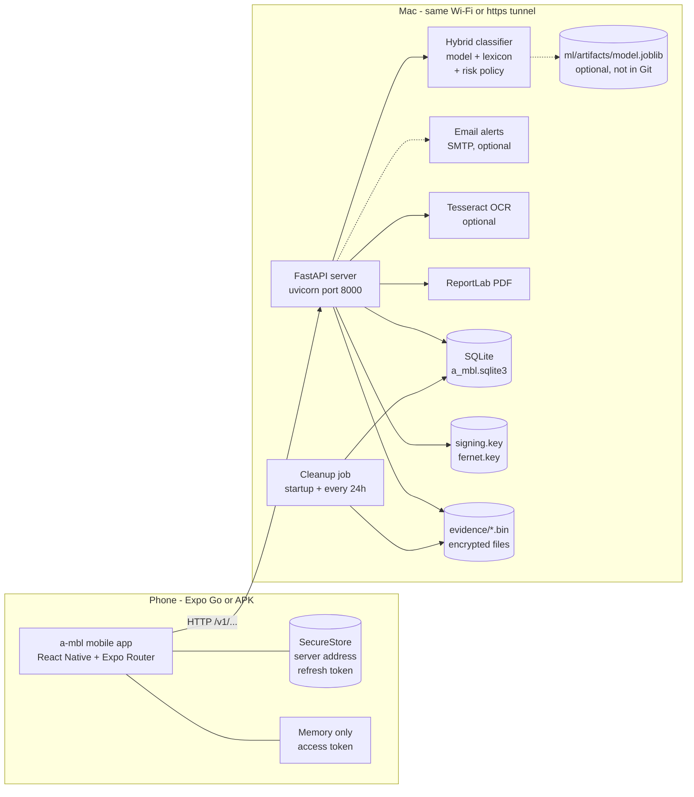
```mermaid
flowchart LR
    subgraph Phone["Phone - Expo Go or APK"]
        App["a-mbl mobile app<br/>React Native + Expo Router"]
        SS[("SecureStore<br/>server address<br/>refresh token")]
        Mem["Memory only<br/>access token"]
    end
    subgraph Mac["Mac - same Wi-Fi or https tunnel"]
        API["FastAPI server<br/>uvicorn port 8000"]
        CLS["Hybrid classifier<br/>model + lexicon<br/>+ risk policy"]
        MODEL[("ml/artifacts/model.joblib<br/>optional, not in Git")]
        MAIL["Email alerts<br/>SMTP, optional"]
        OCR["Tesseract OCR<br/>optional"]
        PDF["ReportLab PDF"]
        JOB["Cleanup job<br/>startup + every 24h"]
        DB[("SQLite<br/>a_mbl.sqlite3")]
        KEYS[("signing.key<br/>fernet.key")]
        EV[("evidence/*.bin<br/>encrypted files")]
    end
    App -- "HTTP /v1/..." --> API
    API --> CLS
    CLS -.-> MODEL
    API -.-> MAIL
    API --> OCR
    API --> PDF
    API --> DB
    API --> KEYS
    API --> EV
    JOB --> DB
    JOB --> EV
    App --- SS
    App --- Mem
```

> **Why a server on a Mac, and not everything on the phone?**
> The roadmap locked this choice: a Python server can run OCR (Tesseract), make
> PDFs (ReportLab), and run a Python machine-learning model
> (scikit-learn). Those are hard or impossible inside Expo Go. Putting all the
> rules on the server also means **the phone cannot cheat** — permissions are
> checked on the server, not in the app screens.

> **Why "same Wi-Fi" and plain HTTP?**
> It is a **local demo**. No cloud, no domain name, no HTTPS certificate. The
> price is that it is **not secure for real data** — which is why the app
> shows warnings to use made-up content only. For a tester who is not on your
> Wi-Fi, a temporary Cloudflare quick tunnel (`cloudflared`) gives port 8000 a
> public `https://…trycloudflare.com` address (§16.5); the server itself still
> speaks plain HTTP on the Mac.

### 3.3 The technology, in one table

| Part | Technology | Simple meaning |
| --- | --- | --- |
| Mobile app | Expo SDK 57, React Native 0.86, React 19.2, TypeScript 6 | Write the app once in TypeScript, run it on Android and iPhone |
| Mobile navigation | Expo Router 57 | Each file in `src/app/` becomes a screen |
| Mobile checks | TypeScript (`tsc`), ESLint (`eslint-config-expo`), `expo-doctor`, import-casing check (`scripts/check-casing.mjs`) | Catch mistakes before the app runs |
| Home charts | Plain React Native `View`s (`components/charts.tsx`) | Bar charts with no chart library, so nothing new is needed in Expo Go |
| Android build | Expo prebuild + Gradle (`npm run build:apk`) | One command makes a standalone APK that testers install without Expo Go |
| Server | Python 3.11, FastAPI, Uvicorn (`run.sh` on macOS, `run.ps1` on Windows) | A fast web API; Uvicorn is the program that serves it |
| Database | SQLite (Python's built-in `sqlite3`) | One single file on disk holds all tables |
| Encryption | `cryptography` → Fernet | Scrambles case text and screenshots so only the server can read them |
| Passwords | PBKDF2-HMAC-SHA256 (Python standard library) | Slow, salted password hashing |
| Classifier | Hybrid: trained TF-IDF + logistic regression (scikit-learn + joblib, `tfidf-logreg-0.2.0`) merged with word lists + rules (`lexicon-0.1.0`) | The model judges the wording; the word lists look for known harmful phrases and supply the words to mask |
| Model training | `ml/train.py` (pandas, scikit-learn, matplotlib) on Jigsaw `train.csv` | Builds `ml/artifacts/model.joblib` and its test results |
| Email alerts | Python `smtplib` (`emailer.py`), optional | Sends a content-free email to guardians / school admins when SMTP is configured |
| OCR | Tesseract + `pytesseract` + Pillow | Reads text out of a screenshot |
| PDF | ReportLab | Builds the report file in memory |
| Tests | pytest + FastAPI TestClient (httpx2) | 120 automatic backend tests |

---

## 4. Words you need to know (glossary)

| Word | Meaning in this project |
| --- | --- |
| **Analysis** | One check of one text. Always creates one row in `analysis_events` (with only the result — never the text). |
| **Primary label** | The main result: `normal`, `offensive`, `harassment`, `hate_speech`, `threat`. |
| **Body Shaming tag** | An extra yes/no flag. It can appear together with any label. It is **not** a sixth label. |
| **Confidence** | A number from 0 to 1 that says how sure the classifier is. With the trained model it is the model's probability for the chosen label (or the lexicon's number, if that is higher or more severe); with the lexicon alone it is a **heuristic** (a rule-of-thumb number), not a real probability. |
| **Severity** | How serious: `safe` (normal), `caution` (offensive), `high` (harassment / hate speech / any body shaming), `critical` (threat). |
| **Needs review** | `true` when confidence is **below 0.70**. The app then says "this result is uncertain". |
| **Case** (flagged case) | A saved harmful analysis. Holds the **encrypted** text. Expires after **30 days**. |
| **Evidence** | One screenshot the owner **chose** to attach to a case. Stored **encrypted** as a file. |
| **Review** | A human's opinion on a case (a label and/or a note). It never changes the original model result. |
| **Guardian link** | A connection between a User and a Guardian. It lets the guardian see the user's cases. |
| **Link code** | A one-time 8-character code (valid 24 h) that a User gives a Guardian to create a link. |
| **Pending** (`pending_guardian`) | A 13–17 user who is waiting for a guardian to approve. They cannot analyze yet. |
| **Organization** | A school. School admins belong to it. |
| **Share** | A User's decision to let one organization see one case. Can be taken back (revoked). |
| **Alert** | A row in the in-app inbox telling someone "a high-risk case exists". Never contains message text. |
| **Scope** | The set of cases an account is allowed to see (own / linked / shared). |
| **Masking** | Hiding a message's words so only their first letters show, e.g. `you are an idiot` → `y•• a•• a• i••••`, and cutting the text to 80 characters. |
| **Access token** | A short "pass" (15 min) sent with every request. Lives only in phone memory. |
| **Refresh token** | A longer "pass" (7 days) used to get a new access token. Stored in SecureStore. |
| **Rotation** | Every time a refresh token is used, it is replaced by a new one and the old one dies. |
| **Retention** | How long data is kept. Cases: 30 days. |
| **Audit event** | A log row: "who did what, when". Never contains message text or secrets. |
| **OCR** | Optical Character Recognition — reading text from an image. |
| **Lexicon** | A list of words and phrases. |
| **Trained model** | `ml/artifacts/model.joblib`: a TF-IDF + logistic-regression pipeline learned from labelled comments by `ml/train.py`. Not in Git. |
| **Hybrid / severity-max** | Both detectors judge the text; the more severe label wins, so the model can only add detections. |
| **Leet speak** | Writing words with numbers/symbols, like `1d10t` for `idiot`. |
| **IDOR** | "Insecure Direct Object Reference" — trying to open someone else's data by guessing its ID. The tests prove this does not work. |
| **Expo Go** | A free app from the store that can run this project without building a real app. |
| **Metro / bundler** | The program `npx expo start` runs on the Mac; it sends the app's JavaScript to the phone. |
| **APK** | An Android app file. `npm run build:apk` builds one that testers install directly ("sideload"), with no Expo Go, no bundler and no app store. |
| **Quick tunnel** | `cloudflared tunnel --url http://localhost:8000` gives the Mac's server a temporary public `https://…trycloudflare.com` address, so a tester anywhere can reach it. |

---

## 5. Every file in the repository

### 5.1 The full tree (every tracked file, with what it does)

```text
a-mbl/
├── README.md                         Front page: what the app is, quick start, APK route, safety limits
├── PROJECT_GUIDE.md                  ← this guide
├── CLIENT_GUIDE.md                   Non-technical guide for clients and testers (diagrams, screenshots, test script)
├── .gitignore                        Tells Git what must NEVER be saved (data, keys, datasets, model artifacts, node_modules, APKs…)
├── .gitattributes                    Line endings: LF in Git, CRLF kept for *.ps1/*.bat/*.cmd, images/PDF/DB marked binary
│
├── backend/                          THE SERVER (Python + FastAPI)
│   ├── __init__.py                   Empty. Makes "backend" a Python package (so "backend.app.main" works)
│   ├── requirements.txt              Python libraries to install (13 lines; scikit-learn + joblib only to LOAD the trained model)
│   ├── run.sh                        Start script: prints the Mac's Wi-Fi address, then starts the server
│   ├── run.ps1                       Windows PowerShell twin of run.sh: LAN addresses, firewall-rule hint, .venv or conda
│   ├── app/
│   │   ├── __init__.py               Empty package marker
│   │   ├── main.py                   Builds the FastAPI app, adds routers, runs cleanup at start + daily (a failed run is logged, never fatal)
│   │   ├── config.py                 Every tunable number in one place (token times, limits, thresholds)
│   │   ├── db.py                     All 14 database tables, the connection, small time/id helpers, audit()
│   │   ├── security.py               Password hashing, access tokens, refresh tokens, link codes, encryption
│   │   ├── errors.py                 One standard error body {code, message, fieldErrors?, requestId}
│   │   ├── deps.py                   "Who is calling?" and "which cases may they see?" (case_scope)
│   │   ├── rate_limit.py             "Too many requests" protection (in memory, per minute)
│   │   ├── lexicon.py                The word/phrase lists the classifier looks for
│   │   ├── classifier.py             The hybrid classifier (trained model if present + lexicon) + text masking + model version registration
│   │   ├── emailer.py                Optional SMTP alert emails (A_MBL_SMTP_*), sent on a background thread, never any message text
│   │   ├── policy.py                 Rules: severity, needs-review, create case?, alert?, advice text
│   │   ├── ocr.py                    Screenshot safety checks + Tesseract text reading with variants (finds Tesseract on PATH or in Windows install folders)
│   │   ├── pdf.py                    Builds the masked PDF report in memory
│   │   ├── retention.py              Deletes expired cases (files first), old codes and old tokens
│   │   ├── schemas.py                The exact shape of every JSON request and response
│   │   └── routers/                  One file per group of URLs
│   │       ├── __init__.py           Empty package marker
│   │       ├── health.py             GET /v1/health  (is the server alive? which model? is OCR installed?)
│   │       ├── auth.py               register, login, refresh, logout, GET/PATCH /v1/me
│   │       ├── links.py              guardian link codes/preview/accept/revoke, organizations, members
│   │       ├── analysis.py           POST /v1/analyses, GET /v1/analyses/{id}, POST /v1/ocr, alert helper (+ alert emails)
│   │       ├── cases.py              case list/detail/edit/delete, reviews, evidence, shares
│   │       ├── alerts.py             alert inbox + mark as read
│   │       ├── reports.py            summary numbers (incl. byWeekday, topSenders) + masked PDF
│   │       └── privacy.py            export my data + delete my account
│   ├── scripts/
│   │   ├── __init__.py               Empty package marker
│   │   ├── create_admin.py           The ONLY way to create a School Administrator (run on the Mac)
│   │   └── seed_demo.py              Fills the database with fake demo accounts and cases
│   ├── tests/
│   │   ├── __init__.py               Empty package marker
│   │   ├── conftest.py               Shared test helpers ("fixtures"): fresh DB per test, register, login…; pins the lexicon, clears SMTP settings
│   │   ├── test_health_and_auth.py   20 tests: health, age gate, login, tokens, errors, keys, schema, limiter
│   │   ├── test_guardian_links.py    10 tests: link codes, approval, revocation
│   │   ├── test_analyses.py          12 tests: analysis, "normal text is never stored", flagging
│   │   ├── test_cases_and_shares.py  20 tests: who sees which case, reviews, evidence, sharing, members, list order
│   │   ├── test_alerts.py            10 tests: when alerts appear/disappear, no content in them
│   │   ├── test_reports.py           10 tests: summary counts, top senders + weekday, role scope, PDF masking and crashes
│   │   ├── test_ocr.py               13 tests: upload validation, dark mode, rotation, noise
│   │   ├── test_classifier.py        14 tests: labels on fixtures, leet speak, obfuscation confidence, masking
│   │   ├── test_email_alerts.py       3 tests: off by default, guardian emailed without content, no re-send
│   │   └── test_retention_and_privacy.py 8 tests: 30-day cleanup (and its daily loop), export, account deletion
│   └── data/                         (created when the server runs — NOT in Git) database, keys, evidence
│
├── mobile/                           THE PHONE APP (Expo + React Native + TypeScript)
│   ├── package.json                  App name, version 0.2.0, npm scripts (incl. build:apk, check, check:casing), every JS library
│   ├── package-lock.json             Exact versions of every installed library (auto-generated)
│   ├── app.json                      Expo settings: name, version 0.2.0, icon, splash, permissions text, Android package + versionCode 2, plugins
│   ├── tsconfig.json                 TypeScript settings: strict mode, "@/..." path shortcuts
│   ├── eslint.config.js              ESLint flat config (eslint-config-expo) used by `npm run lint`
│   ├── README.md                     How to run the app, build the APK, folder structure, checks
│   ├── .gitignore                    Mobile-specific ignores (node_modules, .expo, ios/, android/…)
│   ├── .claude/settings.json         Enables the Expo plugin for Claude Code
│   ├── .vscode/extensions.json       Recommends the "Expo Tools" VS Code extension
│   ├── .vscode/settings.json         VS Code: fix/organize imports on save
│   ├── scripts/
│   │   ├── build-apk.sh              Builds the installable Android APK → dist/a-mbl-<version>.apk (§16.6)
│   │   └── check-casing.mjs          Fails if a local import's upper/lower case differs from the file on disk (§16.7)
│   ├── assets/
│   │   └── images/                   a-mbl icon set: white speech bubble + purple shield with a check
│   │       ├── icon.png                       USED  app icon (the mark on a purple gradient)
│   │       ├── android-icon-foreground.png    USED  Android adaptive icon layer (the mark)
│   │       ├── android-icon-background.png    USED  Android adaptive icon layer (purple gradient)
│   │       ├── android-icon-monochrome.png    USED  Android themed icon
│   │       ├── favicon.png                    USED  web favicon
│   │       └── splash-icon.png                USED  splash image (the mark, on the purple splash colour)
│   │           (unused template images were removed 2026-09-10; the Expo template icons were replaced,
│   │            and the template's iOS assets/expo.icon/ bundle and MIT LICENSE removed, 2026-10-05)
│   └── src/
│       ├── app/                      SCREENS (Expo Router: each file = one screen / URL)
│       │   ├── _layout.tsx           Root: wraps everything in AuthProvider, declares the screen stack
│       │   ├── index.tsx             Boot screen: decides where to send you (connect/welcome/pending/tabs)
│       │   ├── connect.tsx           Enter, clean up and test the server address (http:// on Wi-Fi or https:// link)
│       │   ├── pending.tsx           "Waiting for guardian" screen for 13–17 users
│       │   ├── reports.tsx           Summary with date filters, weekly chart, alias grouping, PDF
│       │   ├── members.tsx           School admins manage organization members
│       │   ├── (auth)/               Screens before sign-in ( "(auth)" is a group, not part of the URL)
│       │   │   ├── welcome.tsx       First screen: explain the app, create account / sign in
│       │   │   ├── age.tsx           Birth month + year; under 13 stops here
│       │   │   ├── register.tsx      Name, email, password, role (User or Guardian)
│       │   │   └── login.tsx         Email + password
│       │   ├── (tabs)/               The 5 bottom tabs after sign-in
│       │   │   ├── _layout.tsx       Defines the tab bar; redirects if not signed in / pending
│       │   │   ├── index.tsx         Home / Overview: 30-day summary numbers + charts (per week, by weekday, repeat senders)
│       │   │   ├── analyze.tsx       Type text or scan a screenshot, see the result
│       │   │   ├── cases.tsx         List of cases with severity filters
│       │   │   ├── alerts.tsx        Alert inbox (auto-refresh every 60 s while open)
│       │   │   └── profile.tsx       Account, guardian links, privacy (export / delete), app version + server, sign-out
│       │   └── case/[id].tsx         One case: reveal text, reviews, context, sharing, evidence, delete
│       ├── components/
│       │   ├── ui.tsx                Small UI kit: Screen (keyboard-aware), Card, Button, Field, Banner, chips, Loading…
│       │   └── charts.tsx            ColumnChart + BarRows: View-based bar charts for the Home dashboard (no chart library)
│       └── lib/
│           ├── api.ts                Talks to the server: address clean-up, tokens, auto refresh, timeouts, errors
│           ├── auth.tsx              Sign-in state for the whole app (AuthProvider + useAuth)
│           ├── types.ts              TypeScript copies of the server's JSON shapes
│           ├── theme.ts              Colours, severity icons/labels, date and % formatting
│           └── images.ts             Screenshot → JPEG (no metadata, max 2000 px) → upload FormData; evidence bytes → data URI
│
├── ml/
│   ├── README.md                     The hybrid classifier, measured test results, how to retrain
│   ├── requirements.txt              Training-only libraries: pandas, scikit-learn, joblib, matplotlib
│   ├── train.py                      Trains tfidf-logreg-0.2.0 from ml/data/train.csv → ml/artifacts/ (§10.8)
│   ├── data/                         (NOT in Git) train.csv, the downloaded Jigsaw training data
│   └── artifacts/                    (NOT in Git) model.joblib (~15 MB), metrics.json, confusion_matrix.png
│
├── docs/
│   ├── ARCHITECTURE.md               System diagram, module map, key flows, data model
│   ├── FLOWS.md                      Screen flow diagrams for every role + error states
│   ├── HOW_TO_RUN.md                 Setup, start commands, demo accounts, troubleshooting
│   ├── DEVICE_TESTING.md             Expo Go on your phone, the Android APK (+ cloudflared tunnel), iPhone options, emulator check
│   ├── IMPLEMENTATION_NOTES.md       What version 0.2.0 contains, every deviation from the roadmap and why, dated change logs
│   ├── MOBILE_APP_ROADMAP.md         The full product plan (862 lines): scope, policy, API, 14-week plan
│   ├── REPORT_RECONCILIATION.md      Proposal vs. what was built, with paste-ready wording for the TM471 report
│   └── images/guide/                 17 emulator screenshots (01-connect.png … 17-evidence.png) used by CLIENT_GUIDE.md
│
└── tests/
    └── fixtures/labeled_samples.jsonl   37 example messages with the expected label (used by classifier tests)
```

Files that exist on disk but are **not** in Git (on purpose): `backend/data/`
(database, keys, evidence), `ml/data/` (the downloaded `train.csv`, ~69 MB),
`ml/artifacts/` (the trained `model.joblib`, `metrics.json`,
`confusion_matrix.png`), `__pycache__/`, `.pytest_cache/`,
`mobile/node_modules/`, `mobile/.expo/` (Expo's local cache), `mobile/android/`
(generated by `expo prebuild` during an APK build), `dist/` (built APKs),
`.DS_Store`, `desktop.ini`, and `.claude/settings.local.json` (lets Claude Code run
`conda run` commands). Everything else — including the 21 files added on
2026-10-05 and the 9 added by the 2026-10-07 merge — is tracked.

> **Why so many empty `__init__.py` files?**
> In Python, a folder with `__init__.py` is a **package**. Because `backend/`,
> `backend/app/`, `backend/app/routers/`, `backend/scripts/` and
> `backend/tests/` are packages, you can run things **from the repository root**
> as `python -m backend.scripts.seed_demo` or `uvicorn backend.app.main:app`, and
> files can import each other with dots (`from ..db import get_db`).

### 5.2 How big is each part? (chart)

Lines of text per area (counted with `wc -l` on 2026-10-07; images,
`package-lock.json`, the ignored `ml/data/` and `ml/artifacts/`, and this guide excluded):

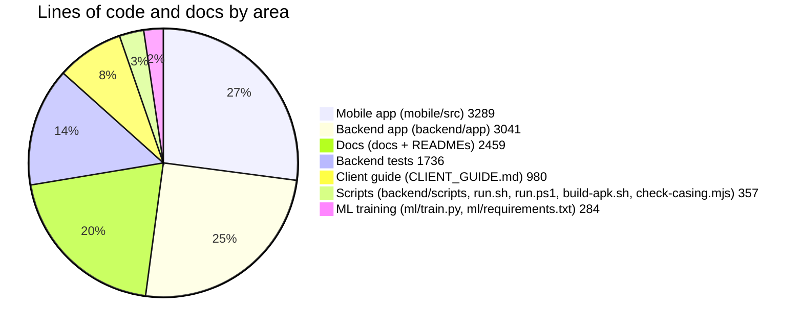
```mermaid
pie title Lines of code and docs by area
    "Mobile app (mobile/src) 3289" : 3289
    "Backend app (backend/app) 3041" : 3041
    "Docs (docs + READMEs) 2459" : 2459
    "Backend tests 1736" : 1736
    "Client guide (CLIENT_GUIDE.md) 980" : 980
    "Scripts (backend/scripts, run.sh, run.ps1, build-apk.sh, check-casing.mjs) 357" : 357
    "ML training (ml/train.py, ml/requirements.txt) 284" : 284
```

| Biggest files | Lines | Why it is big |
| --- | ---: | --- |
| `CLIENT_GUIDE.md` | 980 | Non-technical walkthrough of the whole app: 22 sections, 13 Mermaid diagrams, 17 screenshots |
| `docs/MOBILE_APP_ROADMAP.md` | 862 | The full product specification |
| `mobile/src/app/case/[id].tsx` | 427 | The case screen has 5 cards (content, context, reviews, sharing, evidence) |
| `docs/IMPLEMENTATION_NOTES.md` | 395 | Deviations table + dated logs of every completion and fix |
| `backend/app/routers/cases.py` | 343 | Cases have the most endpoints (9) |
| `mobile/src/app/(tabs)/profile.tsx` | 325 | Profile holds account, links, privacy, and app settings |
| `backend/tests/test_cases_and_shares.py` | 323 | The most important security tests (who can see what) |
| `mobile/src/components/ui.tsx` | 279 | Every shared component, plus the keyboard and safe-area handling in `Screen` |
| `ml/train.py` | 278 | The whole training pipeline: labels, split, rebalance, features, threshold search, gates, artifacts |
| `backend/app/schemas.py` | 275 | Every request/response shape |
| `backend/app/classifier.py` | 273 | Lexicon rules, model loading, severity-max merge, masking |

---

## 6. How the backend starts and how one request travels

### 6.1 Starting the server

You run `./backend/run.sh` → it runs
`uvicorn backend.app.main:app --host 0.0.0.0 --port 8000` inside the `a-mbl`
conda environment. On Windows, `.\backend\run.ps1` does the same from the
repository's `.venv` (or the conda env) — see §16.1.

- `--host 0.0.0.0` means "listen on **every** network card", so the phone on the
  Wi-Fi can reach it (the default `127.0.0.1` would only accept the Mac itself).
- `--port 8000` is the door number.

What happens inside [main.py](backend/app/main.py):

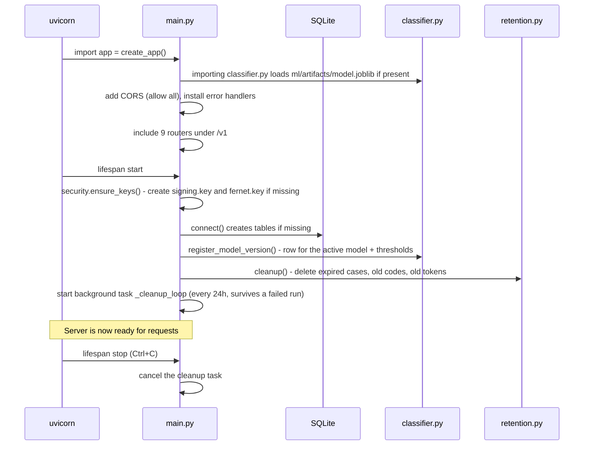
```mermaid
sequenceDiagram
    participant U as uvicorn
    participant M as main.py
    participant DB as SQLite
    participant C as classifier.py
    participant R as retention.py
    U->>M: import app = create_app()
    M->>C: importing classifier.py loads ml/artifacts/model.joblib if present
    M->>M: add CORS (allow all), install error handlers
    M->>M: include 9 routers under /v1
    U->>M: lifespan start
    M->>M: security.ensure_keys() - create signing.key and fernet.key if missing
    M->>DB: connect() creates tables if missing
    M->>C: register_model_version() - row for the active model + thresholds
    M->>R: cleanup() - delete expired cases, old codes, old tokens
    M->>M: start background task _cleanup_loop (every 24h, survives a failed run)
    Note over U,M: Server is now ready for requests
    U->>M: lifespan stop (Ctrl+C)
    M->>M: cancel the cleanup task
```

> **Why run cleanup at start AND every 24 hours?**
> The roadmap (§16.2) asks for both. A laptop server is often switched off. If
> cleanup only ran every 24 h, a server that is restarted often might never
> reach the 24-hour mark. Running it at start catches up immediately.

> **Why does the daily loop catch every error?** Before 2026-10-05, one
> exception in a daily run (a locked database, a full disk) ended the
> background task for good, and retention silently stopped until the next
> restart. Now [`_cleanup_loop()`](backend/app/main.py#L36) calls
> `_run_cleanup()` inside `try/except`, logs the error (logger `"a-mbl"`) and
> tries again 24 hours later. Stopping the server still cancels the task,
> because `asyncio.CancelledError` is not an `Exception`
> (test: `test_cleanup_loop_survives_a_failed_run`).

> **Why is CORS "allow everything"?**
> CORS is a browser rule. Phones in Expo Go don't really need it, but the Expo
> **web** preview does. Because this is a local demo on a trusted Wi-Fi, the
> simple "allow all" is accepted (the comment in the code says so).

> **Why `create_app()` as a function instead of just `app = FastAPI()`?**
> Tests call `create_app()` to get a **fresh app** for every test, with a fresh
> temporary data folder. The demo seeder also calls it.

### 6.2 How one request travels through the backend

Example: the phone sends `POST /v1/analyses` with the text "i will kill you".

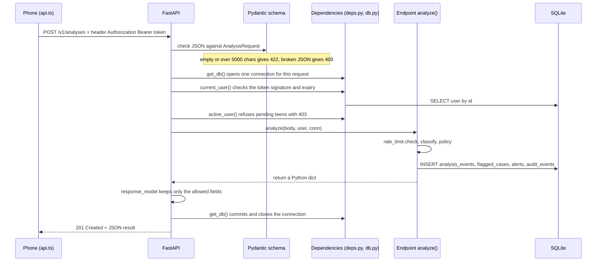
```mermaid
sequenceDiagram
    participant P as Phone (api.ts)
    participant F as FastAPI
    participant V as Pydantic schema
    participant D as Dependencies (deps.py, db.py)
    participant H as Endpoint analyze()
    participant S as SQLite
    P->>F: POST /v1/analyses + header Authorization Bearer token
    F->>V: check JSON against AnalysisRequest
    Note over V: empty or over 5000 chars gives 422, broken JSON gives 400
    F->>D: get_db() opens one connection for this request
    F->>D: current_user() checks the token signature and expiry
    D->>S: SELECT user by id
    F->>D: active_user() refuses pending teens with 403
    F->>H: analyze(body, user, conn)
    H->>H: rate_limit.check, classify, policy
    H->>S: INSERT analysis_events, flagged_cases, alerts, audit_events
    H-->>F: return a Python dict
    F->>F: response_model keeps only the allowed fields
    F->>D: get_db() commits and closes the connection
    F-->>P: 201 Created + JSON result
```

If **anything** goes wrong inside, an exception is raised:

- `ApiError(...)` → becomes the standard error JSON (see §7.4).
- Any other crash → becomes `500 internal_error` with **no** details (no stack
  trace, no file paths).
- Because the exception skips `conn.commit()`, the connection is closed
  **without saving** → SQLite automatically **rolls back** everything this
  request did. So a request is "all or nothing".

> **Why one database connection per request?**
> It is the simplest safe pattern with SQLite: each request does its work, then
> commits once at the end. If it fails halfway, nothing half-done is saved.

---

## 7. Backend, file by file

### 7.1 `config.py` — every setting in one place

[backend/app/config.py](backend/app/config.py)

| Setting | Value | What it controls | Why this value |
| --- | --- | --- | --- |
| `APP_NAME` | `"a-mbl"` | The name | — |
| `API_PREFIX` | `"/v1"` | Every URL starts with `/v1` | Versioning: a future `/v2` can live next to it without breaking old apps |
| `ACCESS_TOKEN_MINUTES` | `15` | Life of the access token | If stolen, it only works for 15 minutes |
| `REFRESH_TOKEN_DAYS` | `7` | Life of the refresh token | You stay signed in for a week without typing your password |
| `GUARDIAN_CODE_HOURS` | `24` | Life of a guardian link code | Enough time to tell a parent, short enough to be safe |
| `CASE_RETENTION_DAYS` | `30` | Life of a harmful case | Data minimization: keep sensitive text only as long as useful |
| `MAX_TEXT_CHARS` | `5_000` | Longest text you can analyze | Keeps work per request small; matches the roadmap |
| `MAX_IMAGE_BYTES` | `10 MB` | Largest screenshot | Stops huge uploads from filling memory |
| `MAX_IMAGE_DIMENSION` | `6_000` px | Largest image width/height | Stops "decompression bombs" (tiny file, gigantic image) |
| `NEEDS_REVIEW_BELOW` | `0.70` | Below this confidence → "uncertain" | From roadmap §6.3 |
| `ALERT_CONFIDENCE_AT_LEAST` | `0.80` | Alerts need at least this confidence | From roadmap §6.3 — fewer false alarms to parents/schools |
| `MIN_PASSWORD_CHARS` | `8` | Shortest password | Basic password strength |

Two functions:

- `data_dir()` — returns the data folder. It uses the environment variable
  `A_MBL_DATA_DIR` if set, otherwise `backend/data/`. It **creates** the folder
  and `evidence/` inside it if missing.
- `db_path()` — `data_dir()/a_mbl.sqlite3`.

> **Why an environment variable for the data folder?**
> The tests set `A_MBL_DATA_DIR` to a **temporary folder** for each test. So
> tests never touch your real demo database, and every test starts empty.

### 7.2 `db.py` — the database

[backend/app/db.py](backend/app/db.py)

This file holds:

1. **`SCHEMA`** — the SQL that creates all **14 tables** (explained fully in §9).
2. **`_MIGRATIONS`** — 5 `ALTER TABLE ... ADD COLUMN` lines for columns that were
   added later.
3. **`connect()`** — opens the database.
4. **`get_db()`** — the per-request connection used by FastAPI.
5. Small helpers: `new_id()`, `utc_now()`, `iso()`, `now_iso()`, `in_future()`, `audit()`.

**What `connect()` does, line by line** ([db.py:179](backend/app/db.py#L179)):

| Step | Code | Why |
| --- | --- | --- |
| 1 | `sqlite3.connect(path, timeout=10, check_same_thread=False)` | `timeout=10`: if another request is writing, wait up to 10 s instead of failing. `check_same_thread=False`: FastAPI may run the dependency and the endpoint on different worker threads; each request still uses its connection one step at a time, so this is safe. |
| 2 | `row_factory = sqlite3.Row` | Rows can be read by column name: `user["email"]` instead of `user[1]`. |
| 3 | `PRAGMA foreign_keys = ON` | **SQLite turns foreign keys OFF by default!** Without this line, deleting a user would NOT delete their cases. This line makes `ON DELETE CASCADE` work. |
| 4 | `executescript(SCHEMA)` — **only the first time** this process opens this database file (remembered in `_schema_ready`), or when the file is missing | `CREATE TABLE IF NOT EXISTS` — creates missing tables, does nothing if they exist. Running it once instead of on every request saves work; re-running it for a missing file means a database deleted while the server runs gets its tables back. |
| 5 | run each `_MIGRATIONS` line, ignore errors (same "first time" rule) | On an **old** database the new column is added. On a **new** database the column already exists, so SQLite says "duplicate column" — that error is expected and ignored. |

> **Why this "migration" trick instead of a real migration tool (Alembic)?**
> The roadmap asked for SQLAlchemy + Alembic. The prototype chose plain
> `sqlite3` to keep things simple (one file, no extra layer). The ALTER-and-ignore
> trick means **old developer databases upgrade automatically** without being
> deleted. It is documented as a deviation in IMPLEMENTATION_NOTES.

**`get_db()`** ([db.py:200](backend/app/db.py#L200)):

```python
conn = connect()
try:
    yield conn        # the endpoint runs here
    conn.commit()     # only reached if the endpoint did NOT raise
finally:
    conn.close()      # always; closing without commit = rollback
```

**Helpers:**

| Helper | Returns | Why it exists |
| --- | --- | --- |
| `new_id()` | 32 random hex characters (UUID4) | IDs are **random**, not 1, 2, 3… so nobody can guess other people's case IDs. |
| `utc_now()` | current time in UTC | One timezone for everything avoids confusion. |
| `iso(dt)` | e.g. `2026-07-13T10:22:05+00:00` (no microseconds) | Same exact format everywhere → **comparing the text is the same as comparing the times**. That is why SQL like `expires_at > ?` works on text columns. |
| `now_iso()` | `iso(utc_now())` | Shortcut |
| `in_future(days=30)` | ISO time 30 days ahead | Used for expiries |
| `audit(conn, actor, action, type, id)` | inserts an `audit_events` row | A tiny history log. **Never** gets message text or secrets. |

### 7.3 `security.py` — passwords, tokens, keys, encryption

[backend/app/security.py](backend/app/security.py)

#### Passwords

- `hash_password(pw)` → `pbkdf2$210000$<salt hex>$<digest hex>`
  - A **random 16-byte salt** per password, so two people with the same password
    get different hashes.
  - **210,000 iterations** of SHA-256 make guessing very slow.
  - The algorithm and iteration count are **written inside the string**, so the
    method can be upgraded later (to Argon2) while old hashes still verify.
- `verify_password(pw, stored)` → recomputes and compares with
  `hmac.compare_digest` (a **timing-safe** compare, so an attacker can't learn
  anything from how long the comparison takes).

> **Why PBKDF2 and not Argon2 like the roadmap says?**
> PBKDF2 is inside Python's standard library — no native dependency to install.
> It is a documented deviation.

#### Keys (made automatically at startup)

- `signing.key` — 32 random bytes; signs access tokens.
- `fernet.key` — a Fernet key; encrypts case text, review notes, evidence.
- `ensure_keys()` creates both **when the server starts**, before any request.
  `_key_file()` uses an **exclusive create** (`O_CREAT | O_EXCL`, mode `600` —
  only your macOS user can read): if the file already exists it is only read,
  never overwritten.

> **Why exclusive create?** The old code did "if the file doesn't exist,
> write it". Two requests at the very first moment could both see "missing" and
> write **two different keys**; anything encrypted with the overwritten key
> would be unreadable forever. With `O_EXCL` only one writer can ever win.

> **Why generate keys automatically?** Nobody has to set up secrets by hand for
> a demo. **Why in `backend/data/`?** That folder is in `.gitignore`, so keys can
> never be pushed to GitHub. If you delete `backend/data/`, all old encrypted
> data becomes unreadable — which is exactly what a "fresh start" should do.

#### Access tokens (the 15-minute pass)

A home-made, JWT-like token:

```text
   eyJ1aWQiOiAiYWJjLi4uIiwgImV4cCI6ICIyMDI2LTA3LTEzVDEwOjM3OjA1KzAwOjAwIn0 . 5f2c9a...e81
   └──────────── base64url( {"uid": "<user id>", "exp": "<ISO time>"} ) ─┘   └ HMAC-SHA256 hex ┘
```

- `make_access_token(user_id)` — builds the JSON, base64-encodes it, signs it
  with `signing.key`.
- `read_access_token(token)` — splits at the dot, recomputes the signature,
  compares safely, checks `exp` is still in the future, returns the user id — or
  `None` for anything wrong (bad format, bad signature, expired).

> **Why is the access token not stored in the database?**
> It doesn't need to be: the **signature** proves the server made it. Changing
> even one character (for example the user id) breaks the signature. A test
> (`test_tampered_access_tokens_rejected`) proves this.

#### Refresh tokens and link codes

- `new_refresh_token()` — 32 random bytes, URL-safe text.
- `new_link_code()` — 4 random bytes as 8 **uppercase hex** characters
  (e.g. `3FA91C0B`) — "easy to read aloud".
- `sha256_hex(value)` — the database stores **only the SHA-256 hash** of refresh
  tokens and link codes.

> **Why store only hashes?** If someone copies the database file, they still
> cannot use the tokens or codes — they only have hashes, and you can't reverse
> a hash.

#### Encryption (Fernet)

- `encrypt_text` / `decrypt_text`, `encrypt_bytes` / `decrypt_bytes`.
- Fernet = AES encryption **plus** an HMAC signature. So the data is both
  **secret** and **tamper-proof**. If the data was changed or the key is wrong,
  `decrypt_bytes` returns `None` (and `decrypt_text` returns `""`) instead of crashing.

### 7.4 `errors.py` — one error format for everything

[backend/app/errors.py](backend/app/errors.py)

Every non-success answer looks like this:

```json
{
  "code": "validation_error",
  "message": "The request could not be processed.",
  "fieldErrors": { "text": "Value error, Text must not be empty." },
  "requestId": "a1b2c3d4e5f6"
}
```

- `ApiError(status, code, message, field_errors)` — the exception the code raises.
- `install_handlers(app)` registers four handlers:
  1. `ApiError` → its own status/code/message.
  2. `RequestValidationError` (bad input) → **400 `bad_request`** if the body is
     not valid JSON at all, otherwise **422 `validation_error`** with a
     `fieldErrors` map (field name → message).
  3. Starlette HTTP errors (e.g. unknown URL) → mapped to a code (`not_found`, …).
  4. **Any other exception** → **500 `internal_error`**, "An internal error
     occurred." — nothing else leaks.

> **Why?** The mobile app can handle every error the same way: show `message`,
> and put `fieldErrors` under the right input box. And a crash never reveals
> file paths, stack traces, tokens, or message text (roadmap §10.5).

**Every error code in the project:**

| HTTP | `code` | When |
| ---: | --- | --- |
| 400 | `bad_request` | Body is not valid JSON |
| 401 | `unauthorized` | No token / bad token / expired token / user gone |
| 401 | `invalid_credentials` | Wrong email or password (login, account deletion) |
| 401 | `invalid_refresh` | Refresh token unknown, reused, or expired |
| 403 | `account_pending` | A pending 13–17 user tries something that needs an active account |
| 403 | `age_not_supported` | Registration under 13 |
| 403 | `guardian_must_be_adult` | Guardian registration under 18 |
| 403 | `forbidden` | Wrong role (e.g. a user trying guardian actions, non-owner editing a case) |
| 404 | `not_found` | Not there **or you are not allowed to see it** (same answer on purpose) |
| 404 | `code_invalid` | Link code wrong, used, or expired |
| 405 | `method_not_allowed` | Wrong HTTP method |
| 409 | `email_in_use` | Email already registered |
| 409 | `already_linked` | Guardian already linked to that user |
| 409 | `already_shared` | Case already shared with that organization |
| 409 | `already_member` | Admin already in that organization |
| 409 | `not_admin_account` | Trying to add a non-admin account to an organization |
| 409 | `cannot_remove_self` | Admin tries to remove their own membership |
| 409 | `evidence_exists` | Case already has a screenshot |
| 413 | `file_too_large` | Screenshot over 10 MB |
| 422 | `validation_error` | Bad values (short password, bad email, bad date…) |
| 422 | `invalid_image` | Not JPEG/PNG, broken image, too big/small in pixels |
| 429 | `rate_limited` | Too many requests per minute |
| 500 | `internal_error` | Unexpected crash |
| 503 | `ocr_unavailable` | Tesseract not installed |
| 503 | `cleanup_retry` | An evidence file could not be deleted; try again |

The mobile app adds codes of its own that never come from the server:
`no_server` (no address saved), `timeout` (no answer in time) and
`unreachable` (network failure), all with status `0`, plus `error` when an
error answer carries no readable `code`.

### 7.5 `deps.py` — who is calling, and what may they see?

[backend/app/deps.py](backend/app/deps.py)

This is **the most important security file**. In FastAPI, a "dependency" is a
function that runs **before** the endpoint and hands it something (here: the
signed-in user).

| Function | What it does |
| --- | --- |
| `current_user` ([L22](backend/app/deps.py#L22)) | Reads the `Authorization: Bearer <token>` header, checks it with `read_access_token`, loads the user. Any problem → **401**. Used by endpoints that pending teens may still use (link codes, `/me`, export, delete account, logout-free paths). |
| `active_user` ([L35](backend/app/deps.py#L35)) | Same as above **plus** `status == "active"`, else **403 `account_pending`**. Used by almost everything else. |
| `user_organizations` | The organizations where this user has an **active** membership in an **active** org. |
| `permissions_for` ([L52](backend/app/deps.py#L52)) | Five yes/no flags for the app (`canAnalyze`, `canCreateLinkCode`, `canApproveLinkCode`, `canShareCases`, `canManageMembers`). **Advisory only** — see "Why" below. |
| `user_out` | Turns a user row into the JSON profile (camelCase + organizations + permissions). |
| `case_scope` ([L80](backend/app/deps.py#L80)) | Builds the SQL `WHERE` piece that limits cases to what this role may see. |
| `load_case` ([L101](backend/app/deps.py#L101)) | Loads one case **through** `case_scope`; if not visible → **404**. |
| `require_case_owner` | Only the owner may edit/delete/share/attach → else **403**. |

**The heart: `case_scope(user)`** — in plain words:

```text
Every role:           the case is NOT expired   (expires_at > now)
   AND
 User:                the case is mine
 Guardian:            the case is mine, OR its owner is linked to me with an ACTIVE link
 School admin:        the case is mine, OR it is shared (not revoked) with an organization
                      where I have an ACTIVE membership
```

The real SQL for a guardian:

```sql
fc.expires_at > ? AND
(fc.owner_id = ? OR fc.owner_id IN (
    SELECT user_id FROM guardian_links WHERE guardian_id = ? AND status = 'active'))
```

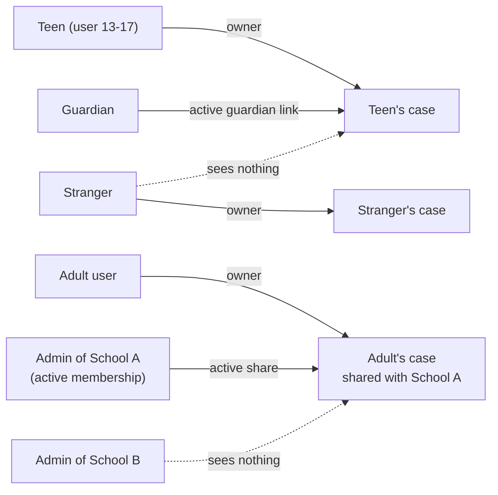
```mermaid
flowchart LR
    Teen["Teen (user 13-17)"] -- owner --> C1["Teen's case"]
    Guardian -- "active guardian link" --> C1
    Adult["Adult user"] -- owner --> C2["Adult's case<br/>shared with School A"]
    AdminA["Admin of School A<br/>(active membership)"] -- "active share" --> C2
    AdminB["Admin of School B"] -. "sees nothing" .-> C2
    Stranger -. "sees nothing" .-> C1
    Stranger -- owner --> C3["Stranger's case"]
```

> **Why is permission checking done in SQL and not in the app?**
> Roadmap §5.4: *"Hiding a screen in the mobile client is not an authorization
> control."* Anyone can call the API directly (e.g. with `curl`). So **every**
> case, report, PDF, evidence, and analysis query goes through the **same**
> `case_scope` function. One place to get right, one place to test.

> **Why 404 and not 403 when you can't see a case?**
> A 403 would tell an attacker "this case ID exists, you just can't see it".
> A 404 reveals nothing (roadmap: existence is not revealed).

> **Why also filter `expires_at > now` if a cleanup job deletes expired cases?**
> "Belt and braces": the job runs only at start and every 24 hours. Between
> expiry and the next cleanup, the case already **disappears from every
> screen**. A test proves this (`test_expired_cases_are_hidden_then_deleted`).

> **Why are the `permissions` flags "advisory"?**
> They only help the app decide which buttons to show. The **real** protection
> is still the SQL scope. If the app showed a wrong button, the server would
> still refuse.

> **Is building SQL with f-strings dangerous (SQL injection)?**
> Here, no: the f-strings only glue together **fixed pieces written by the
> developer** (`case_scope` text). Every value that comes from a user (ids,
> filters, dates) is passed as a `?` **parameter**, which SQLite escapes safely.

### 7.6 `rate_limit.py` — "please slow down"

[backend/app/rate_limit.py](backend/app/rate_limit.py)

A **sliding window**: for each key (like `login:alice@test.io`) it keeps the
times of recent requests in a queue. Before a new request it removes times older
than 60 s. If the queue is already full → **429 `rate_limited`**.

```text
   time ──────────────────────────────────────────────►
   window = last 60 seconds          [ x  x   x  x x  x x x ]  ← 8 events
   9th login attempt inside the window → 429 "Too many requests"
```

| Key | Limit per 60 s | Protects against |
| --- | ---: | --- |
| `register:<email>` | 5 | Spamming registrations |
| `login:<email>` | 8 | Password guessing |
| `link-code:<user id>` | 5 | Code spamming |
| `link-preview:<guardian id>` | 10 | Guessing link codes |
| `link-accept:<guardian id>` | 10 | Guessing link codes |
| `member-add:<admin id>` | 10 | Membership spam |
| `analyze:<user id>` | 30 | Overloading the classifier |
| `ocr:<user id>` | 10 | OCR is CPU-heavy |
| `evidence:<user id>` | 10 | Upload spam |

`reset()` empties everything (used by tests). Every 1,000 checks, `_sweep()`
removes keys that have been idle for an hour, so the dictionary doesn't grow
forever (one key per email/user would otherwise stay until restart).

> **Why in memory?** Simple, no extra service. The limits reset when the server
> restarts, and only work for one server process — fine for a local demo.

### 7.7 `lexicon.py` + `classifier.py` — see §10 (it has its own big section).

### 7.8 `policy.py` — the rules after classification

[backend/app/policy.py](backend/app/policy.py)

**Severity** (`severity_for`, [L21](backend/app/policy.py#L21)):

| Primary label | Base severity | If Body Shaming tag is also on |
| --- | --- | --- |
| `normal` | `safe` | → at least `high` |
| `offensive` | `caution` | → `high` |
| `harassment` | `high` | stays `high` |
| `hate_speech` | `high` | stays `high` |
| `threat` | `critical` | stays `critical` |

(In practice a `normal` label never has the Body Shaming tag, because any
body-shaming word makes the label at least `offensive`.)

**Other rules:**

| Function | Rule | Why |
| --- | --- | --- |
| `needs_review(pred)` | `confidence < 0.70` | Low confidence → tell the user "this is uncertain, a person should look" |
| `creates_case(severity)` | `severity != "safe"` | Only harmful results are kept. Normal text is thrown away. |
| `alert_eligible(pred, severity)` | label is harassment / hate speech / threat **AND** severity high/critical **AND** confidence ≥ 0.80 | Only serious **and** confident results bother guardians and schools. **Offensive** and **Body-Shaming-only** never alert (roadmap §6.3, §14.1, §19). |
| `advice_for(pred, uncertain)` | Picks calm advice lines for the label; adds a body-shaming line; puts "This result is uncertain…" first if uncertain; always ends with "Classifications are automated estimates, not judgments…" | Roadmap §12.4: say "may contain … signals", never "this person is a bully". |

Example advice for a **threat**:

1. "The submitted text may contain threatening language."
2. "If someone may be in immediate danger, contact a trusted person or an appropriate local service now."
3. "Consider keeping this evidence and involving a trusted adult as soon as possible."
4. "Classifications are automated estimates, not judgments about a person or incident."

### 7.9 `ocr.py` — reading screenshots

[backend/app/ocr.py](backend/app/ocr.py)

**Step 1 — `validate_image(data)`** ([L64](backend/app/ocr.py#L64)) — runs on every upload, OCR installed or not:

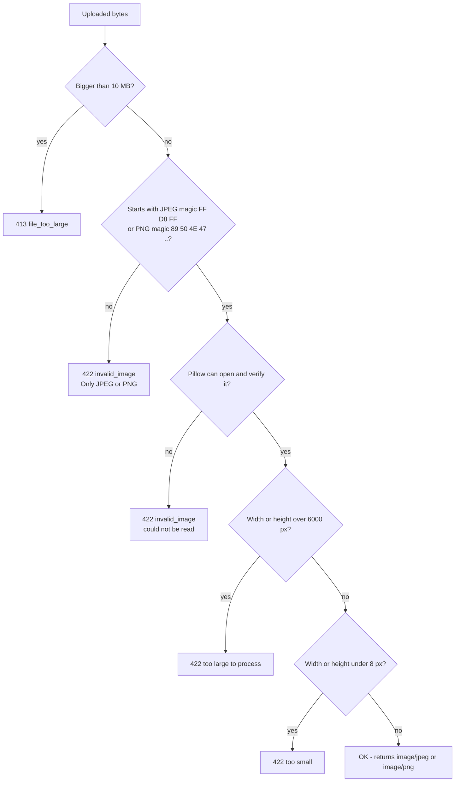
```mermaid
flowchart TD
    A["Uploaded bytes"] --> B{"Bigger than 10 MB?"}
    B -- yes --> X1["413 file_too_large"]
    B -- no --> C{"Starts with JPEG magic FF D8 FF<br/>or PNG magic 89 50 4E 47 ..?"}
    C -- no --> X2["422 invalid_image<br/>Only JPEG or PNG"]
    C -- yes --> D{"Pillow can open and verify it?"}
    D -- no --> X3["422 invalid_image<br/>could not be read"]
    D -- yes --> E{"Width or height over 6000 px?"}
    E -- yes --> X4["422 too large to process"]
    E -- no --> F{"Width or height under 8 px?"}
    F -- yes --> X5["422 too small"]
    F -- no --> OK["OK - returns image/jpeg or image/png"]
```

> **Why check "magic bytes" instead of the file name or the Content-Type?**
> Names and content types are **chosen by the sender** and can lie
> (`fake.png` that is really a GIF). The first bytes of the file itself tell the
> truth. A test (`test_spoofed_extension_rejected`) proves this.

**Step 2 — `available()`** — true only if the `tesseract` program is found
**and** the `pytesseract` library imports. `_tesseract_cmd()` looks on `PATH`
first, then in the Windows installers' default folders
(`%LOCALAPPDATA%\Programs\Tesseract-OCR`, `%ProgramFiles%\Tesseract-OCR`,
`%ProgramFiles(x86)%\Tesseract-OCR`), because those installers do not add
Tesseract to `PATH`; the path found is handed to `pytesseract`. `/v1/health`
reports this as `ocrReady`, and the app only shows the scan buttons when it is
`true`.

**Step 3 — `extract_text(data)`** ([L98](backend/app/ocr.py#L98)):

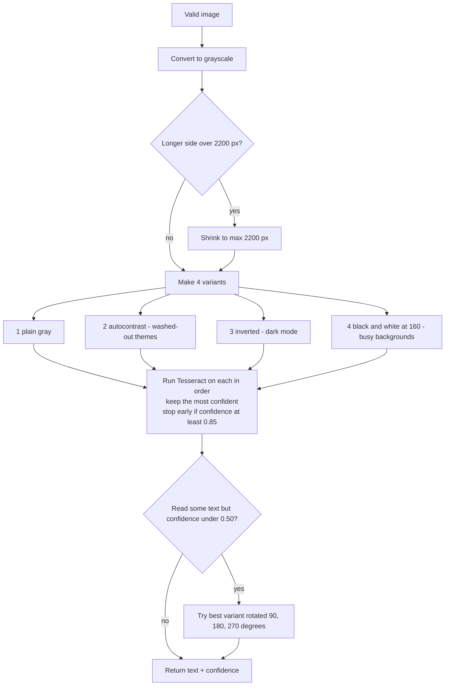
```mermaid
flowchart TD
    A["Valid image"] --> B["Convert to grayscale"]
    B --> C{"Longer side over 2200 px?"}
    C -- yes --> D["Shrink to max 2200 px"]
    C -- no --> E
    D --> E["Make 4 variants"]
    E --> V1["1 plain gray"]
    E --> V2["2 autocontrast - washed-out themes"]
    E --> V3["3 inverted - dark mode"]
    E --> V4["4 black and white at 160 - busy backgrounds"]
    V1 --> R["Run Tesseract on each in order<br/>keep the most confident<br/>stop early if confidence at least 0.85"]
    V2 --> R
    V3 --> R
    V4 --> R
    R --> Q{"Read some text but confidence under 0.50?"}
    Q -- yes --> ROT["Try best variant rotated 90, 180, 270 degrees"]
    Q -- no --> OUT["Return text + confidence"]
    ROT --> OUT
```

- `_read(image)` runs Tesseract twice: once for the text, once for per-word
  confidences; it returns the **mean** confidence (0–1).
- Everything happens **in memory** — no temporary files are written.

> **Why the 2200 px cap?** Tesseract time grows with the number of pixels. A
> 6000×6000 upload could keep a CPU core busy for a long time. Text is still
> readable at 2200 px.
> **Why only rotate when "some text but poor"?** Pure noise reads **nothing**,
> so it never pays for 3 extra rotation passes (a test counts the passes).

### 7.10 `pdf.py` — the masked report

[backend/app/pdf.py](backend/app/pdf.py) — `build_report(...)` makes an A4 PDF **in memory** (no temp files):

```text
┌──────────────────────────────────────────────────────────────────┐
│ a-mbl — masked case report                                        │
│ Scope: guardian — Demo Guardian                                   │
│ Date range: 2026-06-13 to 2026-07-13                              │
│ Generated: 2026-07-13T10:22:05+00:00                              │
│                                                                   │
│ Total cases: 3 — reviewed 1, pending 2                            │
│ By category: threat: 1, harassment: 2                             │
│ By severity: critical: 1, high: 2                                 │
│ By sender alias (as entered by users, unverified): anon_17: 2     │
│                                                                   │
│ Case │ Date │ Category │ Conf. │ Body shaming │ Severity │ Status │ Masked preview and reviews │
│ 1a2b…│ 07-12│ threat   │ 83%   │ no           │ critical │ new    │ i w••• k••••••• t•••••••   │
│                                        Review by Demo Guardian — threat: Checked with school │
│                                                                   │
│ Classifications in this report are automated estimates …          │
└──────────────────────────────────────────────────────────────────┘
```

- All user-typed text (names, previews, notes, aliases) is passed through
  `escape()`. **Why?** ReportLab's `Paragraph` reads its text as mini-XML. A
  name like `<b>Mark & Up` used to crash the whole report with a 500 error. (Fixed; test exists.)
- At most **5 reviews per case**, each note cut to **240 characters**. **Why?**
  A table row must fit on one page; an endless note made ReportLab raise
  `LayoutError` → 500. (Fixed; test exists.)
- The report includes at most **500 cases**, newest first (limit and order are
  in the SQL in `reports.py`, §8.8).

### 7.11 `retention.py` — the cleaner

[backend/app/retention.py](backend/app/retention.py)

`cleanup(conn)` does three things and returns counts:

1. For every case whose `expires_at <= now`: **first** delete its evidence
   files; **only if that worked**, delete the case row (the database then
   cascades: evidence rows, shares, reviews, alerts).
2. Delete guardian link codes that are **expired or already used**.
3. Delete refresh tokens that are **expired**.

`delete_case_evidence_files(conn, case_id)` — deletes `evidence/<id>.bin` for
each evidence row; if a delete fails it writes an audit row
`evidence_cleanup_failed` (without the file path) and returns `False`.

> **Why files first, row second?** If the row were deleted first and the file
> delete failed, the encrypted file would stay on disk **forever** with nothing
> pointing to it. Keeping the row means the next cleanup **tries again**
> (roadmap §11, §16.2).

### 7.12 `schemas.py` — the JSON contract

[backend/app/schemas.py](backend/app/schemas.py) — Pydantic models. FastAPI uses them to **check input**
and **shape output**.

| Model | Used for | Special rules |
| --- | --- | --- |
| `RegisterRequest` | POST /auth/register | email lower-cased + regex check; password 8–128; name 1–60; `role` only `"user"` or `"guardian"`; birth year 1900–2100; month 1–12 |
| `LoginRequest`, `RefreshRequest` | login / refresh / logout | — |
| `UserOut` | profile everywhere | includes `organizations` and `permissions` |
| `AuthResponse` | login/register/refresh | tokens + user + (for teens) `linkCode`, `linkCodeExpiresAt` |
| `PatchMeRequest` | PATCH /me | display name 1–60 |
| `CreateLinkCodeResponse`, `AcceptLinkRequest` (code 4–16), `LinkPreviewOut`, `GuardianLinkOut` | guardian links | — |
| `AnalysisRequest` | POST /analyses | text trimmed, not empty, ≤ 5000; `sourceType` text/screenshot; platform/alias ≤ 60; `flagForReview` default false |
| `AnalysisResult` | analysis answer | `primaryLabel` and `severity` are fixed choices (Literal) |
| `CaseSummary`, `CaseDetail`, `CaseListResponse` | cases | detail adds `text`, `maskedPreview`, `reviews`, `shares`, `evidence` |
| `PatchCaseRequest` | PATCH /cases/{id} | platform, alias, `requestReview` |
| `ReviewRequest` | POST reviews | `humanLabel` must be one of the 5 labels; note ≤ 2000 |
| `ShareRequest`, `ShareOut`, `EvidenceOut`, `ReviewOut` | — | — |
| `OrganizationOut`, `MemberOut`, `AddMemberRequest` | orgs & members | email validated |
| `AlertOut`, `PatchAlertRequest` | alerts | — |
| `OcrResponse` | OCR | `text`, `meanConfidence`, `lowConfidence` |
| `SummaryReport`, `PdfRequest` | reports | `bySender` = unverified aliases; `byWeekday` = 7 counts Monday→Sunday; `topSenders` = top 5 `{alias, count}` |
| `DeleteAccountRequest` | delete account | password |
| `HealthResponse` | health | — |

> **Why camelCase names like `displayName` in Python?**
> Because these names **are** the JSON the phone reads. JavaScript uses
> camelCase. Keeping the same names on both sides avoids a translation layer.
> The phone copy lives in `mobile/src/lib/types.ts`.

> **How is "school_admin can't register" enforced?**
> `role: Literal["user", "guardian"]`. Sending `"school_admin"` fails
> validation → 422. Nothing else is needed. (Test: `test_school_admin_is_not_a_public_role`.)

### 7.13 `main.py` — covered in §6.1.

### 7.14 The routers — covered endpoint by endpoint in §8.

### 7.15 `emailer.py` — optional alert emails

[backend/app/emailer.py](backend/app/emailer.py) — functional requirement
FR5, switched **off** unless the person running the server sets environment
variables before starting it:

| Variable | Default | Meaning |
| --- | --- | --- |
| `A_MBL_SMTP_HOST` | — (required) | Mail server, e.g. `smtp.gmail.com` |
| `A_MBL_SMTP_FROM` | — (required) | Sender address |
| `A_MBL_SMTP_PORT` | `587` | Port |
| `A_MBL_SMTP_USER` / `A_MBL_SMTP_PASSWORD` | empty | Login, if the server needs one (Gmail: an app password) |
| `A_MBL_SMTP_STARTTLS` | `1` | `0` only for a local test relay |

- `available()` is true only when both required variables are set.
- `send_case_alerts(recipients, severity, primary_label, subject_name)` starts
  a **daemon thread** (`_spawn`) and returns at once; `_deliver` builds one
  plain-text email per recipient — subject `a-mbl alert: <severity>-severity
  case involving <name>`, a body with the category, the severity, "this email
  contains no message content" and the "automated estimates" reminder.
- `_send_one` opens `smtplib.SMTP` (15 s timeout), STARTTLS, optional login,
  send. Any exception is **printed** (`[emailer] could not send alert to …`)
  and swallowed.
- Who is emailed is decided in `create_alerts_for_case` (§8.5): only
  **non-owner** recipients whose alert row was **newly inserted**.

> **Why a background thread and swallowed errors?** A slow or broken mail
> server must never slow down or fail the analysis or share request that
> raised the alert. In-app alerts are always created first and stay the
> reliable channel.
> **Why no message text in the email?** The module's rule: alert emails
> carry the same fields as alert rows — severity, category, subject name — and
> never any message content (roadmap §14.1).

---

## 8. Every API endpoint

### 8.1 Master table (all 34 endpoints)

"Who" column: **none** = no sign-in needed · **signed-in** = `current_user` (pending
teens allowed) · **active** = `active_user` (pending teens refused with 403).

| # | Method | Path | Who | Rate limit | What it does |
| ---: | --- | --- | --- | --- | --- |
| 1 | GET | `/v1/health` | none | — | Server alive? Model version? OCR installed? |
| 2 | POST | `/v1/auth/register` | none | 5/min per email | Create a User or Guardian account |
| 3 | POST | `/v1/auth/login` | none | 8/min per email | Get tokens |
| 4 | POST | `/v1/auth/refresh` | none (refresh token in body) | — | Swap the refresh token for new tokens |
| 5 | POST | `/v1/auth/logout` | none (refresh token in body) | — | Kill the refresh token |
| 6 | GET | `/v1/me` | signed-in | — | My profile + organizations + permissions |
| 7 | PATCH | `/v1/me` | signed-in | — | Change my display name |
| 8 | POST | `/v1/guardian-links` | signed-in, role user | 5/min | Create a one-time link code |
| 9 | POST | `/v1/guardian-links/preview` | active guardian | 10/min | See **who** a code belongs to (does not use it up) |
| 10 | POST | `/v1/guardian-links/accept` | active guardian | 10/min | Approve the code → create link, activate teen |
| 11 | GET | `/v1/guardian-links` | signed-in | — | My links (as user or as guardian) |
| 12 | DELETE | `/v1/guardian-links/{id}` | signed-in, either side | — | Revoke a link |
| 13 | GET | `/v1/organizations` | active | — | All active organizations (to choose where to share) |
| 14 | GET | `/v1/organizations/{id}/members` | active admin of that org | — | List members |
| 15 | POST | `/v1/organizations/{id}/members` | active admin of that org | 10/min | Add an existing admin account by email |
| 16 | DELETE | `/v1/organizations/{id}/members/{memberId}` | active admin of that org | — | Remove a member (not yourself) |
| 17 | POST | `/v1/analyses` | active | 30/min | **Classify text**, maybe create a case and alerts |
| 18 | GET | `/v1/analyses/{id}` | active (owner or scoped viewer) | — | Read a past result |
| 19 | POST | `/v1/ocr` | active | 10/min | Read text from a screenshot |
| 20 | GET | `/v1/cases` | active | — | List visible cases (filters: severity, label, status; pages) |
| 21 | GET | `/v1/cases/{id}` | active (scoped) | — | Case detail with decrypted text |
| 22 | PATCH | `/v1/cases/{id}` | active owner | — | Edit platform / sender alias, request review |
| 23 | DELETE | `/v1/cases/{id}` | active owner | — | Delete case + evidence file |
| 24 | POST | `/v1/cases/{id}/reviews` | active (anyone who can see it) | — | Add a human review |
| 25 | POST | `/v1/cases/{id}/evidence` | active owner | 10/min | Attach one screenshot (encrypted) |
| 26 | GET | `/v1/cases/{id}/evidence/{evidenceId}` | active (scoped) | — | Download the decrypted screenshot |
| 27 | POST | `/v1/cases/{id}/shares` | active owner | — | Share case with an organization |
| 28 | DELETE | `/v1/cases/{id}/shares/{shareId}` | active owner | — | Unshare |
| 29 | GET | `/v1/alerts` | active | — | My alert inbox (newest 200) |
| 30 | PATCH | `/v1/alerts/{id}` | active recipient | — | Mark read |
| 31 | GET | `/v1/reports/summary` | active | — | Counts for a date range, in my scope |
| 32 | POST | `/v1/reports/pdf` | active | — | Masked PDF for my scope |
| 33 | GET | `/v1/privacy/export` | signed-in | — | Download all my data as JSON |
| 34 | DELETE | `/v1/privacy/account` | signed-in + password | — | Delete my account and everything I own |

FastAPI also gives you, for free: **`/docs`** (interactive Swagger page),
`/redoc`, and `/openapi.json` (the machine-readable contract).

### 8.2 `routers/health.py`

Returns `{status: "ok", modelVersion: <classifier.MODEL_VERSION>, modelReady: true, ocrReady: <bool>, time}`.
`modelVersion` is `"tfidf-logreg-0.2.0"` when `ml/artifacts/model.joblib` was
loaded at start (as on this Mac) and `"lexicon-0.1.0"` without it (fresh clone,
`A_MBL_FORCE_LEXICON=1`, or a file that failed to load).
The phone calls it on the Connect screen and on the Analyze screen, and only
trusts an answer whose `status` is `"ok"` and whose `modelVersion` is a string
(§12.6), so another web page that happens to answer is never saved as the server.
`modelReady` is always `true`: the model (if any) is loaded at import, before
the first request, and the lexicon needs no loading.
On this Mac Tesseract 5.5.3 is installed in the `a-mbl` conda env, so `ocrReady` is `true`.

### 8.3 `routers/auth.py` — accounts and sessions

[backend/app/routers/auth.py](backend/app/routers/auth.py)

**Register** ([L50](backend/app/routers/auth.py#L50)):

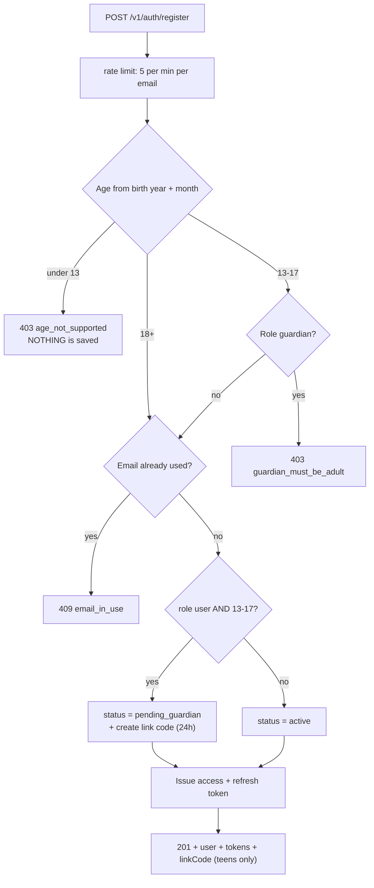
```mermaid
flowchart TD
    A["POST /v1/auth/register"] --> RL["rate limit: 5 per min per email"]
    RL --> AGE{"Age from birth year + month"}
    AGE -- "under 13" --> X1["403 age_not_supported<br/>NOTHING is saved"]
    AGE -- "13-17" --> G1{"Role guardian?"}
    AGE -- "18+" --> EM
    G1 -- yes --> X2["403 guardian_must_be_adult"]
    G1 -- no --> EM{"Email already used?"}
    EM -- yes --> X3["409 email_in_use"]
    EM -- no --> S{"role user AND 13-17?"}
    S -- yes --> P["status = pending_guardian<br/>+ create link code (24h)"]
    S -- no --> ACT["status = active"]
    P --> T["Issue access + refresh token"]
    ACT --> T
    T --> R["201 + user + tokens + linkCode (teens only)"]
```

- Age = `this year − birth year − (1 if this month < birth month)`.
- Only the **age band** (`13-17` or `18+`) is saved — **never** the birth month/year.
- A pending teen still gets tokens, so they can use `/me` and create new link codes.

> **Why check age before anything else?** Roadmap §7.1: under-13 sign-up must
> stop **without creating an account**. The test
> `test_under_13_is_refused_and_no_account_exists` counts the users table and
> expects 0.

**Login** ([L84](backend/app/routers/auth.py#L84)) — lower-cases the email, checks the password,
issues tokens. Unknown email **and** wrong password give the **same** message
("Email or password is incorrect.").

> **Why the same message?** A different message for "no such email" would let
> anyone test which emails have accounts.

**Refresh** ([L98](backend/app/routers/auth.py#L98)) — token rotation with theft detection:

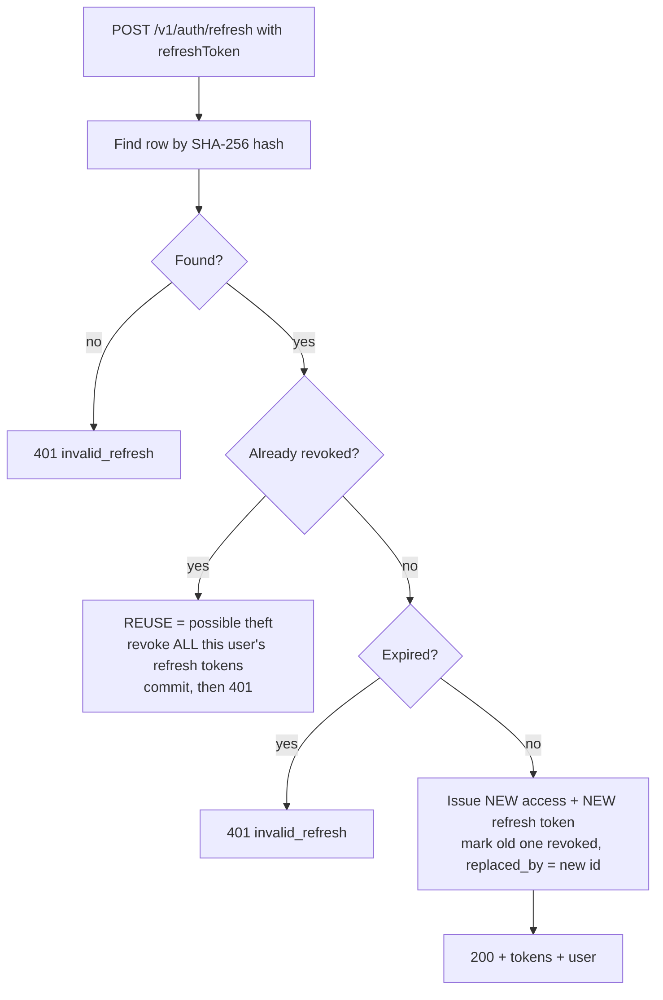
```mermaid
flowchart TD
    A["POST /v1/auth/refresh with refreshToken"] --> H["Find row by SHA-256 hash"]
    H --> N{"Found?"}
    N -- no --> X1["401 invalid_refresh"]
    N -- yes --> RV{"Already revoked?"}
    RV -- yes --> STEAL["REUSE = possible theft<br/>revoke ALL this user's refresh tokens<br/>commit, then 401"]
    RV -- no --> EXP{"Expired?"}
    EXP -- yes --> X2["401 invalid_refresh"]
    EXP -- no --> NEW["Issue NEW access + NEW refresh token<br/>mark old one revoked, replaced_by = new id"]
    NEW --> OK["200 + tokens + user"]
```

> **Why "revoke everything" on reuse?** A used refresh token should never come
> back. If it does, either an attacker stole it or something is badly wrong.
> Killing every session forces a fresh password sign-in (standard "refresh token
> rotation" defense). The code calls `conn.commit()` **before** raising the
> error — otherwise the per-request rollback would undo the revocation.

**Logout** ([L131](backend/app/routers/auth.py#L131)) — needs **only the refresh token** in the body, no access
token. Always answers 204.

> **Why no access token?** It may already be expired (15 min). Signing out must
> still work (test: `test_logout_works_without_access_token`).

**`GET /me`, `PATCH /me`** — read profile; change display name.

### 8.4 `routers/links.py` — guardians, organizations, members

[backend/app/routers/links.py](backend/app/routers/links.py)

| Endpoint | Rules | Why |
| --- | --- | --- |
| `POST /guardian-links` | Only role `user` (pending or active). New 8-char code, 24 h, hash stored. | The **user** decides to create a link — it is their consent. |
| `POST /guardian-links/preview` | Only active guardians. Code must be unused and unexpired. Returns name + age band. Does **not** use the code. | Roadmap §7.1 step 7: the guardian sees **who** before approving. |
| `POST /guardian-links/accept` | Only active guardians. Code valid. Not already linked (409). Creates the link, marks the code used, sets the teen `active`, writes an audit row. | One code = one link (single use). |
| `GET /guardian-links` | Guardians see links where they are the guardian; everyone else where they are the user. | — |
| `DELETE /guardian-links/{id}` | Either side. Sets `revoked`, and **deletes the guardian's alerts** about that user's cases. The teen stays `active`. | Alerts contain the user's name and severity; once the link ends, the guardian must not see those any more. |
| `GET /organizations` | Any active account; lists **all** active organizations. | A user needs the list to choose a school to share with. |
| `GET/POST/DELETE /organizations/{id}/members` | Caller must be a `school_admin` with an **active** membership in that org. Add: the target must already be a `school_admin` account. Remove: not yourself; also removes the ex-member's alerts that came only from this org's shares. | School admins manage their own org only (§5.3). A `suspended` membership grants nothing. |

Codes are compared after `strip().upper()`, so `3fa91c0b ` works the same as `3FA91C0B`.

### 8.5 `routers/analysis.py` — the main feature

[backend/app/routers/analysis.py](backend/app/routers/analysis.py)

**`POST /v1/analyses`** ([L87](backend/app/routers/analysis.py#L87)):

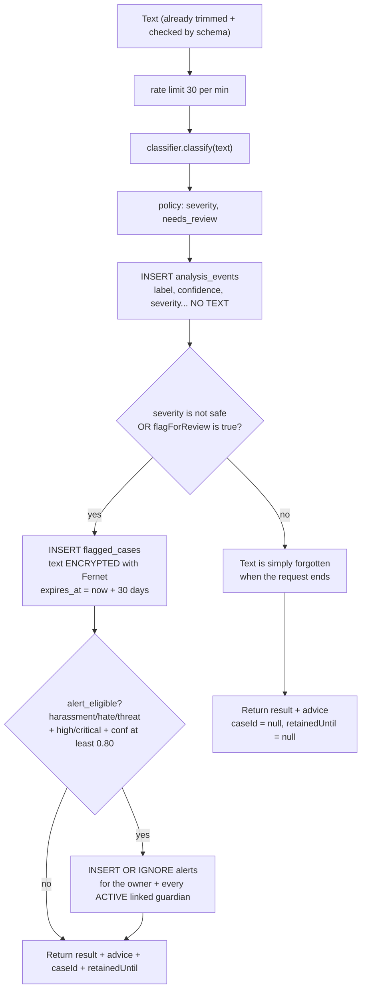
```mermaid
flowchart TD
    A["Text (already trimmed + checked by schema)"] --> RL["rate limit 30 per min"]
    RL --> C["classifier.classify(text)"]
    C --> P["policy: severity, needs_review"]
    P --> AE["INSERT analysis_events<br/>label, confidence, severity... NO TEXT"]
    AE --> Q{"severity is not safe<br/>OR flagForReview is true?"}
    Q -- no --> DROP["Text is simply forgotten<br/>when the request ends"]
    Q -- yes --> FC["INSERT flagged_cases<br/>text ENCRYPTED with Fernet<br/>expires_at = now + 30 days"]
    FC --> AL{"alert_eligible?<br/>harassment/hate/threat<br/>+ high/critical + conf at least 0.80"}
    AL -- yes --> ALR["INSERT OR IGNORE alerts<br/>for the owner + every ACTIVE linked guardian"]
    AL -- no --> RES
    ALR --> RES["Return result + advice + caseId + retainedUntil"]
    DROP --> RES2["Return result + advice<br/>caseId = null, retainedUntil = null"]
```

- `flagForReview: true` keeps **any** result, even Normal, as a case with
  `review_requested = 1` (roadmap §6.3: a user may manually flag any result).
  A flagged **Normal** result never alerts anyone (Normal is not alert-eligible).
- `create_alerts_for_case()` uses `INSERT OR IGNORE` + a `UNIQUE (recipient_id, case_id)`
  rule, so the **same person never gets two alerts for the same case**.
- Alert rows copy only: severity, label, the owner's display name, time.
- **Alert emails** (optional, §7.15): `create_alerts_for_case()` notes every
  recipient whose row was **really inserted** (`cursor.rowcount == 1`) and who
  is **not the owner**; if `emailer.available()`, it looks up their email and
  display name and calls `emailer.send_case_alerts(...)`. A repeated share
  therefore never re-sends, while an unshare (which deletes those alert rows)
  followed by a new share does email again. The same helper serves shares
  (§8.6), so school admins are emailed the same way.
- `analysis_events.model_version` stores `prediction.model_version`, so every
  result records which classifier produced it.

> **Why does the owner also get an alert?** The permission matrix says Users
> "receive scoped alerts: own results". So the owner has a record in their inbox too.
> (The owner is never *emailed*: they have just seen the result.)

**`GET /v1/analyses/{id}`** ([L135](backend/app/routers/analysis.py#L135)) — the owner can always read it. Others only if a
**case** exists **and** that case is in their scope. A Normal result has no case,
so it stays private to the owner (test: `test_guardian_reads_linked_harmful_analysis_but_not_normal`).

**`POST /v1/ocr`** ([L159](backend/app/routers/analysis.py#L159)):

1. Rate limit 10/min.
2. Read **at most 10 MB + 1 byte** of the upload; always close the upload (`finally`).
3. `validate_image()` (checks in §7.9).
4. If Tesseract is missing → **503 `ocr_unavailable`**.
5. Run `extract_text` **in a thread pool**.
6. Return `{text, meanConfidence, lowConfidence}` where `lowConfidence = confidence < 0.6 or text is empty`.

> **Why read "10 MB + 1"?** If the server can read one byte more than the
> limit, it knows the file is too big — without ever reading the whole huge file.
> **Why a thread pool?** Tesseract is slow and "blocking". Running it in the main
> event loop would freeze **every other request** until it finished.
> **Why is OCR text not saved?** The user must **review and correct** the text
> first; only the confirmed text is analyzed (roadmap §7.3).

### 8.6 `routers/cases.py` — cases, reviews, evidence, shares

[backend/app/routers/cases.py](backend/app/routers/cases.py)

| Endpoint | Who | What happens | Why |
| --- | --- | --- | --- |
| `GET /cases` | active | Scoped list, newest first (`ORDER BY fc.created_at DESC, fc.rowid DESC`). Filters: `severity`, `label`, `status`. `page` ≥ 1, `pageSize` 1–100 (default 20). Returns `items`, `total`, `page`, `pageSize`. | Pagination keeps answers small. Times have one-second resolution, so `rowid` (insertion order) keeps cases made in the same second newest-first. |
| `GET /cases/{id}` | scoped | Full detail: **decrypted text**, `maskedPreview`, reviews (oldest first, same `rowid` tie-breaker; notes decrypted), evidence list. `shares` are shown **only to the owner**. | Guardians/admins don't need to know which other schools have the case. |
| `PATCH /cases/{id}` | owner | Update platform/alias (empty string → cleared). `requestReview: true` → `review_requested = 1` + audit. | Owner adds context after the fact (§7.4). |
| `DELETE /cases/{id}` | owner | Delete evidence files first; if that fails → the `evidence_cleanup_failed` audit row is **committed**, then **503 `cleanup_retry`** and the case row is kept. Else delete the row (cascade). | Same "files first" safety as retention. The commit matters: without it the error would roll back the record of the failure too. |
| `POST /cases/{id}/reviews` | anyone who can see the case | Needs a label **or** a note (else 422). Note is **encrypted**. Case → `status = reviewed`, `review_requested = 0`. The answer's `createdAt` is the value that was stored. | The original model result is **never changed** — reviews are separate rows (§6.3). |
| `POST /cases/{id}/evidence` | owner | Only **one** screenshot per case (409 otherwise). Validated like OCR. Saved as `evidence/<id>.bin`, **encrypted**. The DB keeps size, MIME type and a SHA-256 hash of the original. The answer's `createdAt` is the stored value. | Screenshots are kept only when the user **explicitly** attaches one (§16.1). The hash can later prove the file wasn't changed. |
| `GET /cases/{id}/evidence/{eid}` | scoped | Decrypts and returns the image bytes with the right MIME type. Missing/undecryptable → 404. | The app downloads it with `apiBinary` and shows it from memory (see §13.13). |
| `POST /cases/{id}/shares` | owner | Organization must be active; not already shared (409). Creates a `case_shares` row. If the case is alert-eligible (checked with the **same** `policy.alert_eligible` used at analysis time, via `stored_prediction()`) → alerts for every **active** member of that org. The answer's `sharedAt` is the stored value. | Explicit, per-case, per-school consent (§7.4). One rule in one place. |
| `DELETE /cases/{id}/shares/{sid}` | owner | Sets `revoked_at`. Deletes that org's members' alerts for this case — **except** for the owner, active guardians, and **active** members of **another** org that still has an active share. | Access ends **immediately** (the scope checks `revoked_at IS NULL`), but people who still have a right to the alert keep it. A suspended membership gives no right. |

**Masked preview** — `masked_preview(text)` ([L34](backend/app/routers/cases.py#L34)) re-runs the classifier on the
decrypted text and censors the matched words. It is computed **every time**, never stored.
If the verdict is **not normal but there are no matched terms** — possible only
when the trained model flagged a message the word lists did not — it returns
the fixed text **"Content withheld — open the case to view it."** instead
(the detail view still decrypts the full text behind **Reveal**).

> **Why compute it every time?** The database then holds **only ciphertext**
> — never a half-masked plaintext copy that could leak.

### 8.7 `routers/alerts.py`

`GET /alerts` → your newest 200 alerts (newest first; `rowid` breaks
same-second ties, as for cases). `PATCH /alerts/{id}` with `{read: true}` →
sets `read_at` (only your own alerts; others → 404). The `subjectName` is the
case owner's **current** display name (joined from `users`), so a rename shows
up in old alerts too; the name saved on the alert row is only a fallback.

> **Why no content in alerts?** Roadmap §14.2: an alert list could be seen over
> someone's shoulder. It shows only severity, category, whose case, and time.
> Opening it loads the case **through the normal scope check** again.

### 8.8 `routers/reports.py`

[backend/app/routers/reports.py](backend/app/routers/reports.py)

- `_parse_range(from, to)`: dates as `YYYY-MM-DD`. Default: **the last 30 days up
  to today (UTC)**. `from` after `to` → 422. The end day is included (the code
  uses "next day at 00:00" as an exclusive end).
- `_summary_data(...)`: counts, **inside your scope**, by label, by severity, by
  sender alias (only when one was typed), reviewed vs pending, and per **week**
  (weeks start on Monday). Two more fields feed the Home charts (§13.8):
  `byWeekday` — a list of **7 counts, Monday to Sunday**, from each case's
  creation date; and `topSenders` — the **top 5** typed sender aliases as
  `{alias, count}`, sorted by count (then alias), blank aliases skipped.
- `GET /reports/summary` → those numbers as JSON.
- `POST /reports/pdf` → same numbers + up to 500 cases (masked previews + review
  notes of cases in your scope) → PDF download named `a-mbl-report-<date>.pdf`.
  Cases are listed newest first and review notes oldest first, both with
  `rowid` as the same-second tie-breaker.

> **Why UTC dates?** Case times are saved in UTC. Using local dates would
> "lose" today's cases for several hours in time zones west of UTC (the comment
> in the code explains this).

### 8.9 `routers/privacy.py`

- **Export** — JSON with: your profile, all your analysis results (metadata),
  your cases **with decrypted text**, your guardian links, your alerts.
- **Delete account** ([L56](backend/app/routers/privacy.py#L56)):

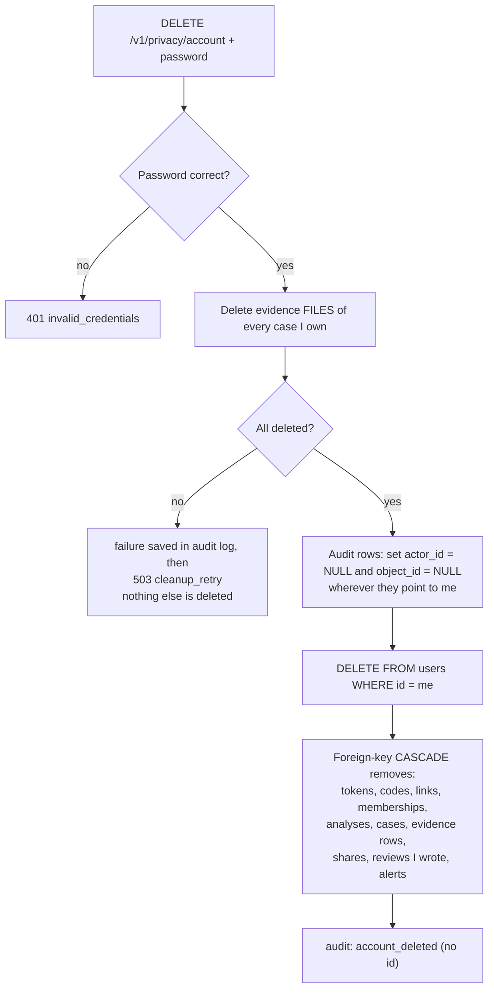
```mermaid
flowchart TD
    A["DELETE /v1/privacy/account + password"] --> P{"Password correct?"}
    P -- no --> X["401 invalid_credentials"]
    P -- yes --> F["Delete evidence FILES of every case I own"]
    F --> OK{"All deleted?"}
    OK -- no --> R["failure saved in audit log, then<br/>503 cleanup_retry<br/>nothing else is deleted"]
    OK -- yes --> AU["Audit rows: set actor_id = NULL and object_id = NULL<br/>wherever they point to me"]
    AU --> DU["DELETE FROM users WHERE id = me"]
    DU --> CAS["Foreign-key CASCADE removes:<br/>tokens, codes, links, memberships,<br/>analyses, cases, evidence rows,<br/>shares, reviews I wrote, alerts"]
    CAS --> LOG["audit: account_deleted (no id)"]
```

> **Why keep audit rows at all?** Roadmap §7.5: "only de-identified aggregate
> counters may remain". The rows still say *"a login happened at 10:22"*, but no
> longer *who*.

> **Side effect worth knowing:** if a **guardian** deletes their account, the
> reviews they wrote on the teen's case disappear too (cascade), but the case
> itself stays and its status stays `reviewed` (tested).

---

## 9. The database in depth

One SQLite file: `backend/data/a_mbl.sqlite3`. **14 tables.** Foreign keys **on**.
IDs are random 32-hex strings. Times are ISO-8601 UTC text.

### 9.1 Diagram of all tables

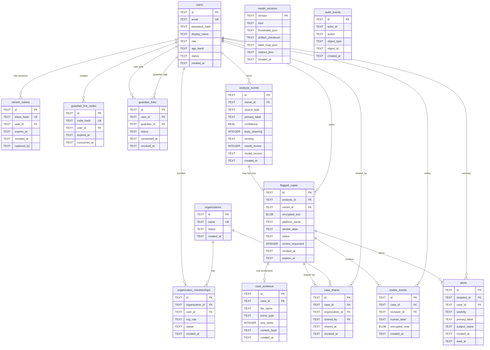
```mermaid
erDiagram
    users ||--o{ refresh_tokens : "has sessions"
    users ||--o{ guardian_link_codes : "creates"
    users ||--o{ guardian_links : "user side"
    users ||--o{ guardian_links : "guardian side"
    users ||--o{ organization_memberships : "member"
    organizations ||--o{ organization_memberships : "has"
    users ||--o{ analysis_events : "owns"
    analysis_events ||--o| flagged_cases : "may become"
    users ||--o{ flagged_cases : "owns"
    flagged_cases ||--o| case_evidence : "one screenshot"
    flagged_cases ||--o{ case_shares : "shared via"
    organizations ||--o{ case_shares : "receives"
    users ||--o{ case_shares : "shared_by"
    flagged_cases ||--o{ review_events : "reviews"
    users ||--o{ review_events : "writes"
    flagged_cases ||--o{ alerts : "about"
    users ||--o{ alerts : "receives"

    users {
        TEXT id PK
        TEXT email UK
        TEXT password_hash
        TEXT display_name
        TEXT role
        TEXT age_band
        TEXT status
        TEXT created_at
    }
    organizations {
        TEXT id PK
        TEXT name UK
        TEXT status
        TEXT created_at
    }
    organization_memberships {
        TEXT id PK
        TEXT organization_id FK
        TEXT user_id FK
        TEXT org_role
        TEXT status
        TEXT created_at
    }
    guardian_links {
        TEXT id PK
        TEXT user_id FK
        TEXT guardian_id FK
        TEXT status
        TEXT consented_at
        TEXT revoked_at
    }
    guardian_link_codes {
        TEXT id PK
        TEXT code_hash UK
        TEXT user_id FK
        TEXT expires_at
        TEXT consumed_at
    }
    refresh_tokens {
        TEXT id PK
        TEXT token_hash UK
        TEXT user_id FK
        TEXT expires_at
        TEXT revoked_at
        TEXT replaced_by
    }
    analysis_events {
        TEXT id PK
        TEXT owner_id FK
        TEXT source_type
        TEXT primary_label
        REAL confidence
        INTEGER body_shaming
        TEXT severity
        INTEGER needs_review
        TEXT model_version
        TEXT created_at
    }
    flagged_cases {
        TEXT id PK
        TEXT analysis_id FK
        TEXT owner_id FK
        BLOB encrypted_text
        TEXT platform_name
        TEXT sender_alias
        TEXT status
        INTEGER review_requested
        TEXT created_at
        TEXT expires_at
    }
    case_evidence {
        TEXT id PK
        TEXT case_id FK
        TEXT file_name
        TEXT mime_type
        INTEGER size_bytes
        TEXT content_hash
        TEXT created_at
    }
    case_shares {
        TEXT id PK
        TEXT case_id FK
        TEXT organization_id FK
        TEXT shared_by FK
        TEXT shared_at
        TEXT revoked_at
    }
    review_events {
        TEXT id PK
        TEXT case_id FK
        TEXT reviewer_id FK
        TEXT human_label
        BLOB encrypted_note
        TEXT created_at
    }
    alerts {
        TEXT id PK
        TEXT recipient_id FK
        TEXT case_id FK
        TEXT severity
        TEXT primary_label
        TEXT subject_name
        TEXT created_at
        TEXT read_at
    }
    model_versions {
        TEXT version PK
        TEXT kind
        TEXT thresholds_json
        TEXT artifact_checksum
        TEXT label_map_json
        TEXT metrics_json
        TEXT created_at
    }
    audit_events {
        TEXT id PK
        TEXT actor_id
        TEXT action
        TEXT object_type
        TEXT object_id
        TEXT created_at
    }
```

### 9.2 Every table in plain words

| Table | One row means… | Important rules | Never contains |
| --- | --- | --- | --- |
| `users` | One account | `role` ∈ user/guardian/school_admin; `age_band` ∈ 13-17/18+; `status` ∈ pending_guardian/active; email unique | Plain password, birth date |
| `organizations` | One school | name unique; `status` default active | — |
| `organization_memberships` | "This admin belongs to this school" | unique (org, user); `status` must be `active` to grant anything | — |
| `guardian_links` | "This guardian is linked to this user" | `status` active/revoked; `consented_at`; `revoked_at` | — |
| `guardian_link_codes` | One one-time code | only the **hash** is stored; `consumed_at` set when used | The code itself |
| `refresh_tokens` | One sign-in session | only the **hash**; `revoked_at`; `replaced_by` = the next token in the chain | The token itself |
| `analysis_events` | One analysis result | label, confidence, severity, flags, model version | **The text — never** |
| `flagged_cases` | One saved harmful case | 1:1 with an analysis; text **encrypted**; `status` new/reviewed; `review_requested`; `expires_at` = +30 days | Plain text |
| `case_evidence` | One attached screenshot | file on disk `evidence/<id>.bin` (**encrypted**); hash, MIME, size | The image or a file path |
| `case_shares` | "Case X shared with school Y" | `revoked_at` NULL = active | — |
| `review_events` | One human review | `human_label` + **encrypted** note | Plain note |
| `alerts` | One inbox item for one person | unique (recipient, case) → no duplicates; `subject_name` is a fallback — the API shows the owner's current name | Message text, screenshots |
| `model_versions` | Which model was used + its thresholds | one row per model that has been active (`lexicon-0.1.0` or `tfidf-logreg-0.2.0`; this Mac's database holds the `tfidf-logreg-0.2.0` row with its per-class thresholds); checksum/label map/metrics stay NULL (not filled yet) | — |
| `audit_events` | "Someone did X at time T" | actor/object ids are nulled when that account is deleted | Content, secrets |

`ON DELETE CASCADE` is on every foreign key, so deleting a **user** removes
everything that belongs to them, and deleting a **case** removes its evidence
rows, shares, reviews and alerts. (Files on disk are deleted by code *before*,
because the database cannot delete files.)

### 9.3 Where every piece of data lives, how long, and who can see it

| Data | Where | Encrypted? | How long | Who can see it |
| --- | --- | --- | --- | --- |
| Password | `users.password_hash` | Hashed (PBKDF2) | Until account deleted | Nobody (not even the server can reverse it) |
| Birth month/year | Nowhere | — | Used once, then forgotten | — |
| Normal message text | Nowhere | — | Forgotten at end of request | Only the result screen, once |
| Harmful message text | `flagged_cases.encrypted_text` | **Yes** (Fernet) | 30 days or until deleted | Owner, active linked guardians, admins of orgs it is shared with |
| Result metadata | `analysis_events` | No (no content) | Until account deleted | Owner (+ scoped viewers if a case exists) |
| Screenshot for OCR | Server memory only | — | Seconds | Nobody |
| Attached screenshot | `evidence/<id>.bin` | **Yes** | Same as the case | Same as the case |
| Attached screenshot, when viewed on a phone | Phone memory only (a `data:` URI) | — | While the case screen is open | The viewer |
| Review note | `review_events.encrypted_note` | **Yes** | Same as the case | Same as the case |
| Platform / sender alias | `flagged_cases` | No | Same as the case | Same as the case |
| Alert | `alerts` | No (no content) | Same as the case | The recipient |
| Refresh token | Phone SecureStore + hash in DB | Hash only in DB | 7 days | The phone |
| Access token | Phone memory only | — | 15 minutes | The phone |
| Server address | Phone SecureStore | — | Until changed | The phone |

---

## 10. The classifier ("the AI") in depth

Files: [classifier.py](backend/app/classifier.py) (the logic, both detectors
and the merge), [lexicon.py](backend/app/lexicon.py) (the word lists), and
[ml/train.py](ml/train.py) (builds the trained model). There are **two
detectors**:

| Detector | Version / kind | Where it comes from | Present? |
| --- | --- | --- | --- |
| Trained model | `tfidf-logreg-0.2.0` / `tfidf-logreg` | `ml/artifacts/model.joblib`, made by `ml/train.py` (§10.8) | Only where the file exists — **yes on the development Mac**, no in a fresh clone (not in Git) |
| Lexicon baseline | `lexicon-0.1.0` / `lexicon-baseline` | `lexicon.py` + the rules below (§10.1–§10.4) | Always |

`classify(text)` always runs the lexicon. If the model is loaded, it also runs
the model and **merges the two, severity-max** (§10.7):

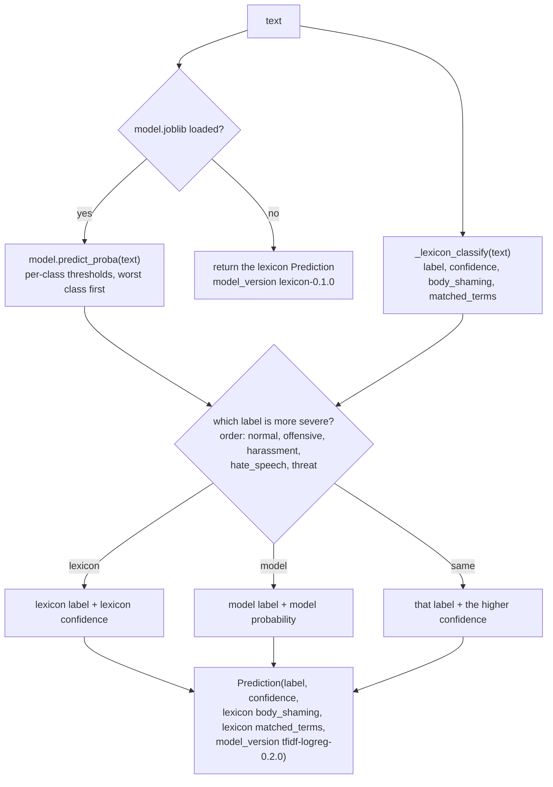
```mermaid
flowchart TD
    T["text"] --> L["_lexicon_classify(text)<br/>label, confidence, body_shaming, matched_terms"]
    T --> Q{"model.joblib loaded?"}
    Q -- no --> OUT1["return the lexicon Prediction<br/>model_version lexicon-0.1.0"]
    Q -- yes --> M["model.predict_proba(text)<br/>per-class thresholds, worst class first"]
    M --> MERGE{"which label is more severe?<br/>order: normal, offensive, harassment,<br/>hate_speech, threat"}
    L --> MERGE
    MERGE -- "lexicon" --> A["lexicon label + lexicon confidence"]
    MERGE -- "model" --> B["model label + model probability"]
    MERGE -- "same" --> C["that label + the higher confidence"]
    A --> OUT2["Prediction(label, confidence,<br/>lexicon body_shaming, lexicon matched_terms,<br/>model_version tfidf-logreg-0.2.0)"]
    B --> OUT2
    C --> OUT2
```

> **Why a hybrid and not only the model?** The model can catch wording that
> is in no list ("I will find out where you live" → threat 0.95, §10.9), but
> the lexicon still does three jobs the model cannot: it returns
> the **exact matched words** that masking needs (§10.5), it sets the **Body
> Shaming tag** (no public dataset labels body shaming), and it is
> **deterministic**, so the test suite can assert exact outputs (the tests pin
> it with `A_MBL_FORCE_LEXICON=1`, §15.1). Severity-max means a lexicon catch
> is **never downgraded** — the model only ever *adds* detections.

> **Why keep the lexicon as the whole classifier when the file is missing?**
> `model.joblib` is ~15 MB and gitignored, so a fresh clone has no model. The
> lexicon is an **honest, deterministic baseline**: it always gives the same
> answer for the same text, it can explain itself (it knows which words
> matched), and it needs no CPU-heavy libraries. Both detectors sit behind the
> same small interface (`classify(text) → Prediction`), so nothing else in the
> backend knows or cares which one is active.

### 10.1 The word lists

| List | Examples | Count | Used for |
| --- | --- | ---: | --- |
| `THREAT_PHRASES` | "kill you", "kys", "watch your back", "i know where you live", "you should die" | 43 | → `threat` |
| `HATE_PHRASES` | "go back to your country", "your kind", "subhuman", "vermin" | 11 | → `hate_speech` |
| `IDENTITY_TERMS` | "muslims", "jews", "immigrants", "gay", "women", "disabled" | 35 | Only counts when **paired** with an attack term |
| `IDENTITY_ATTACK_TERMS` | "hate", "trash", "criminals", "are stupid", "cant be trusted" | 21 | Paired with identity terms → `hate_speech` |
| `HARASSMENT_PHRASES` | "nobody likes you", "everyone hates you", "you're worthless", "waste of space" | 36 | → `harassment` |
| `OFFENSIVE_TERMS` | "idiot", "stupid", "loser", "shut up", swear words | 35 | → `offensive` (or harassment when targeted) |
| `BODY_SHAMING_TERMS` | "fat", "whale", "skinny", "lose some weight", "double chin" | 20 | → Body Shaming tag |

> **Why do identity words need a partner?** "i am proud to be gay and happy
> today" must stay **Normal** (it's in the test fixtures). Only identity + attack
> together ("muslims are trash") is a strong hate signal.

### 10.2 Step 1 — make "search forms" of the text (`variants`)

People hide insults: `1d1ot`, `l00ser`, `looooser`, `idiot!!`. So the text is
turned into up to **9 search forms** (3 bases × 3 repeat versions, duplicates
removed), and each form is searched **separately**. A phrase matches if **any**
form contains it as whole words.

The three bases:

| Base | How | Catches |
| --- | --- | --- |
| A. plain | lowercase | `kill you!` (punctuation stays punctuation) |
| B. leet | lowercase + leet map (0→o 1→i 3→e 4→a 5→s 7→t @→a $→s !→i) | `1d1ot`, `$hit`, `st!upid` |
| C. leet, symbols at word end dropped first | remove `!@$` that end a word, then leet map | `k1ll you!`, `l00ser!!` |

```text
input: "you are a l00ooser"
                        │
      ┌─────────────────┴──────────────────┐
      ▼                                    ▼
  A. lowercase                         B. lowercase + leet fix
                                          (0→o 1→i 3→e 4→a 5→s 7→t @→a $→s !→i)
  "you are a l00ooser"                 "you are a looooser"
      │                                    │
      ├─ as is        "l00ooser"           ├─ as is              "looooser"
      ├─ 3+ same → 2  "l00ooser"           ├─ 3+ same → 2        "looser"
      └─ 2+ same → 1  "l0oser"             └─ 2+ same → 1        "loser"  ✅ matches "loser"
```

Real output of `variants("i will k1ll you!")` (checked by running it):
`['i will k1ll you!', 'i wil k1l you!', 'i will kill youi', 'i wil kil youi', 'i will kill you', 'i wil kil you']`
— base B turns the final `!` into `i` (`youi`), so "kill you" can't match
there; base C drops that `!` first and gives `i will kill you` ✅.

> **Why base C?** Before the 2026-09-10 fix only bases A and B existed, and
> `i will k1ll you!` was classified **Normal** — a threat thrown away with no
> alert (finding **F2** in §19). Symbols **inside** a word (`$hit`, `st!upid`)
> are still treated as letters, because C only drops symbols at a word's end.

> **Why keep the plain lowercase form too?** The leet map turns `!` into `i`.
> Without the plain form, `"kill you!"` would become `"kill youi"` and the
> phrase "kill you" would **not** match. This was a real bug; the test
> `test_punctuation_does_not_defeat_detection` guards it.
>
> **Why search each form separately (not glued together)?** An old version
> glued forms with a newline; `\s+` could jump across it, so `"you never got hurt"`
> + `"you..."` accidentally matched "hurt you". The test
> `test_no_phantom_matches_across_normalization_variants` guards it.

Every phrase becomes a regex with **word boundaries** (`\b`) and flexible spaces
(`\s+`), so "hurt you" does not match inside "hurt yourself-less" words and
"kill   you" still matches.

A separate check, `_TARGETING`, looks for "you / your / u / ur / yourself…".
If found, the text is **targeted** (aimed at someone).

### 10.3 Step 2 — decide the label (first match wins, strongest first)

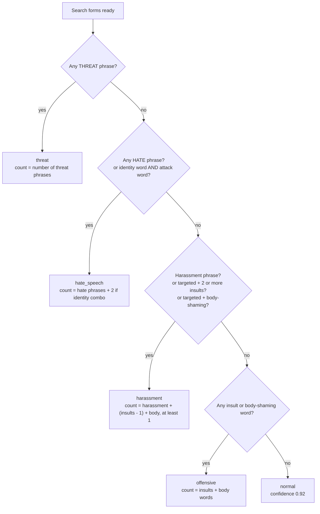
```mermaid
flowchart TD
    A["Search forms ready"] --> T{"Any THREAT phrase?"}
    T -- yes --> LT["threat<br/>count = number of threat phrases"]
    T -- no --> H{"Any HATE phrase?<br/>or identity word AND attack word?"}
    H -- yes --> LH["hate_speech<br/>count = hate phrases + 2 if identity combo"]
    H -- no --> R{"Harassment phrase?<br/>or targeted + 2 or more insults?<br/>or targeted + body-shaming?"}
    R -- yes --> LR["harassment<br/>count = harassment + (insults - 1) + body, at least 1"]
    R -- no --> O{"Any insult or body-shaming word?"}
    O -- yes --> LO["offensive<br/>count = insults + body words"]
    O -- no --> LN["normal<br/>confidence 0.92"]
```

The **Body Shaming tag** is set whenever any body-shaming term is found — no
matter which label wins.

### 10.4 Step 3 — confidence (a rule of thumb, not a probability)

```text
confidence = base(label) + 0.13 × count + (0.08 if targeted) + (0.10 if obfuscated) ,  capped at 0.97, rounded to 2 decimals

base: threat 0.62 · hate_speech 0.60 · harassment 0.58 · offensive 0.55      (normal is always 0.92)
```

**Obfuscated** means at least one matched term does **not** appear in the plain
lowercase text — it only surfaced after leet translation or repeat collapsing
(`l0ser`, `loooser`). So with the lexicon alone `loser` → offensive **0.68**
(needs review), but `l0ser` → offensive **0.78** (no review flag).

> **Why does a disguised word raise confidence?** Deliberate masking is
> evidence of intent: someone dodging a filter knows the word is harmful. The
> test `test_obfuscation_raises_confidence` checks that `l0ser` scores higher
> than `loser` and clears the needs-review bar.

**Worked examples** (lexicon alone, computed by hand from the code, matching
the tests; with the trained model loaded the final confidence can be higher,
see §10.9):

| Text | Label | count | targeted | Confidence | Severity | Needs review (<0.70) | Alert? (≥0.80 & serious) |
| --- | --- | ---: | :---: | ---: | --- | :---: | :---: |
| `idiot` | offensive | 1 | no | 0.55+0.13 = **0.68** | caution | **yes** | no |
| `you are an idiot` | offensive | 1 | yes | 0.55+0.13+0.08 = **0.76** | caution | no | no (offensive never alerts) |
| `lose some weight fatty` | offensive + body tag | 2 | no | 0.55+0.26 = **0.81** | **high** (body floor) | no | no (label is offensive) |
| `i will kill you` | threat | 1 | yes | 0.62+0.13+0.08 = **0.83** | critical | no | **yes** |
| `i hate all immigrants they are criminals` | hate_speech | 0+2 | no | 0.60+0.26 = **0.86** | high | no | **yes** |
| `you are such an idiot and a loser, everyone hates you` | harassment | 1+(2−1) = 2 | yes | 0.58+0.26+0.08 = **0.92** | high | no | **yes** |
| `See you at practice tomorrow!` | normal | — | — | **0.92** | safe | no | no |

> **Important honesty note:** these lexicon numbers are **not measured
> accuracy**. They are a simple formula so that "more evidence → more
> confident". (The trained model's accuracy *is* measured — §10.8.) The UI always
> says results are estimates. Metadata (platform, sender alias) is **never**
> used as input (roadmap §12.2) — so the result can't be biased by who sent it.

### 10.5 Masking (`mask_text`)

Used for previews and PDFs.

1. For each matched term (longest first), build a **tolerant** pattern that
   also finds leet and repeated letters in the **original** text. For `idiot`:
   `[i1!]+d+[i1!]+[o0]+[t7]+`. No word boundaries on purpose.
2. Replace each hit with **first letter + bullets**: `idiot` → `i••••`,
   `1d1ot` → `1••••`, `kill you` → `k•••••••` (the whole phrase, including the space).
3. Then censor **every remaining word** the same way.
4. Replace newlines with spaces and cut to **80 characters** (`…` at the end).

Real outputs (checked by running the code):

| Original | Masked preview |
| --- | --- |
| `i will kill you, meet me at the park` | `i w••• k•••••••, m••• m• a• t•• p•••` |
| `you are a l0ser and an 1d1ot` | `y•• a•• a l•••• a•• a• 1••••` |
| `totally fine message` (flagged Normal) | `t•••••• f••• m••••••` |

> **Why do the matched terms go first if every word is censored anyway?**
> Obfuscated spellings contain symbols that split a "word": `$hit` would become
> `$h••`, showing more than it should. Masking the whole matched phrase first
> gives `$•••`.

> **Why censor every word, not just the bad ones?** Before the 2026-09-10 fix,
> only matched words were hidden, so `…meet me at the park` stayed readable in
> case previews and PDFs (finding **F1**). A preview's job is to show the
> *shape* of a message without its content; the full text is still one tap
> away behind **Reveal** for people allowed to see the case.

> **Why "no word boundaries" in the tolerant pattern?** Over-masking (hiding a
> little too much) is safer than leaking.

**When there is nothing to mask.** Masking needs the lexicon's matched terms.
If the trained model flags a message that contains **no** listed word (for
example `I will find out where you live`), `masked_preview` in `cases.py`
does not show a first-letter mask at all; it returns **"Content withheld —
open the case to view it."** (§8.6). The PDF report takes its previews from
the same `masked_preview`, so it shows that sentence too.

### 10.6 `register_model_version`

At startup it inserts (or keeps — `INSERT OR IGNORE`) a `model_versions` row
for the **active** model:

| Active model | Row |
| --- | --- |
| Lexicon only | `lexicon-0.1.0`, `lexicon-baseline`, thresholds `{"needsReviewBelow": 0.7, "alertConfidenceAtLeast": 0.8}` |
| Trained model loaded (this Mac) | `tfidf-logreg-0.2.0`, `tfidf-logreg`, the same two thresholds **plus** `"classThresholds": {"threat": 0.1, "hate_speech": 0.45, "harassment": 0.4, "offensive": 0.5}` |

The `artifact_checksum`, `label_map_json` and `metrics_json` columns stay
**NULL** in both cases — the code does not fill them yet (§18.3).

> **Why?** Roadmap §6.3: thresholds must be **stored with the model version**.
> Each model gets its own row — no schema change needed.

### 10.7 The trained model at run time (`_load_trained_model` + `classify`)

**Loading** — runs once, when `classifier.py` is imported:

1. If `A_MBL_FORCE_LEXICON=1` → stop (lexicon only). The test suite sets it.
2. Path = `A_MBL_MODEL_PATH` if set, else `ml/artifacts/model.joblib` at the
   repository root. No file → stop.
3. `joblib.load()` the bundle `{pipeline, labels, severity, thresholds,
   modelVersion}`; set `MODEL_VERSION` (e.g. `tfidf-logreg-0.2.0`) and
   `MODEL_KIND = "tfidf-logreg"`.
4. **Any** exception (broken file, missing scikit-learn) prints
   `[classifier] could not load <path>: … — using lexicon baseline` and the
   API keeps running on the lexicon.

**Deciding** — `predict_proba` gives one probability per class. The classes are
checked **worst first** (`threat → hate_speech → harassment → offensive`); the
first whose probability reaches its **own threshold** wins, otherwise
`normal`. The confidence is that class's probability. Then the severity-max
merge from the diagram above. `body_shaming` and `matched_terms` always come
from the lexicon.

| Class | Threshold (tuned on validation, this Mac) |
| --- | ---: |
| threat | **0.10** |
| hate_speech | 0.45 |
| harassment | 0.40 |
| offensive | 0.50 |

> **Why is the threat bar so low?** Missing a real threat costs far more than
> a false alarm. A low bar catches more threats; the cost is lower-confidence
> threat verdicts, which `needs_review` (< 0.70) then sends to a human
> (`k*ll yourself` → threat **0.17**, flagged for review — §10.9).
> **Why worst first instead of the highest probability?** With "highest
> probability wins", every class has the same implicit bar and the rare
> classes (threat) almost never win against `normal`.

### 10.8 Training it (`ml/train.py`) and the measured results

```bash
conda activate a-mbl
pip install -r ml/requirements.txt     # pandas, scikit-learn, joblib, matplotlib
python ml/train.py                     # a few minutes on this Mac
```

Input: `ml/data/train.csv` — the **Jigsaw Toxic Comment** training file
(159,571 Wikipedia talk-page comments, six yes/no flags). On this Mac it was
downloaded from the Hugging Face mirror
<https://huggingface.co/datasets/thesofakillers/jigsaw-toxic-comment-classification-challenge>
(`train.csv`, CC-BY-SA-3.0, same columns as Kaggle's; no account needed); the
Kaggle copy works too. Output: `ml/artifacts/model.joblib` (~15 MB),
`metrics.json`, `confusion_matrix.png`. All of `ml/data/` and `ml/artifacts/`
are gitignored.

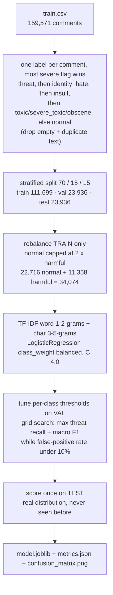
```mermaid
flowchart TD
    A["train.csv<br/>159,571 comments"] --> B["one label per comment, most severe flag wins<br/>threat, then identity_hate, then insult,<br/>then toxic/severe_toxic/obscene, else normal<br/>(drop empty + duplicate text)"]
    B --> C["stratified split 70 / 15 / 15<br/>train 111,699 · val 23,936 · test 23,936"]
    C --> D["rebalance TRAIN only<br/>normal capped at 2 x harmful<br/>22,716 normal + 11,358 harmful = 34,074"]
    D --> E["TF-IDF word 1-2-grams + char 3-5-grams<br/>LogisticRegression class_weight balanced, C 4.0"]
    E --> F["tune per-class thresholds on VAL<br/>grid search: max threat recall + macro F1<br/>while false-positive rate under 10%"]
    F --> G["score once on TEST<br/>real distribution, never seen before"]
    G --> H["model.joblib + metrics.json + confusion_matrix.png"]
```

Label counts after collapsing: normal **143,346** · offensive **7,940** ·
harassment **6,500** · hate_speech **1,307** · threat **478**.

**Measured on this Mac** (`ml/artifacts/metrics.json`, test set of 23,936
comments at the real ~90% normal distribution):

| Gate | Target | Result | |
| --- | --- | ---: | :---: |
| Accuracy | ≥ 0.85 | **0.903** | ✅ PASS |
| False-positive rate (normal wrongly flagged) | < 0.10 | **0.053** | ✅ PASS |
| Threat recall | ≥ 0.80 | **0.718** | ❌ FAIL |
| Macro F1 (all 5 classes equally) | ≥ 0.75 | **0.558** | ❌ FAIL |

| Class (test) | Precision | Recall | Support |
| --- | ---: | ---: | ---: |
| normal | 0.98 | 0.95 | 21,503 |
| offensive | 0.30 | 0.42 | 1,191 |
| harassment | 0.56 | 0.62 | 975 |
| hate_speech | 0.49 | 0.47 | 196 |
| threat | 0.28 | 0.72 | 71 |

An earlier run on another machine recorded 0.906 / 0.048 / 0.66 / 0.57 with a
threat threshold of 0.15; small differences like this come from library
versions. The numbers above are the ones that match the model this Mac loads.

> **Why four gates and not just accuracy?** About 90% of the data is normal, so
> a model that answers "normal" every time scores ≈ 0.90 accuracy and catches
> nothing. Threat recall and macro F1 show whether the rare, serious classes
> are really found. Two gates fail — honestly reported, mainly because threats
> are scarce (478 of 159,571) and Wikipedia comments are not teen chat.
> **Why rebalance only the training split?** Validation and test must keep the
> real-world mix, or the reported numbers would look better than reality.

### 10.9 Real outputs with the model loaded (this Mac)

| Text | Label | Confidence | Notes |
| --- | --- | ---: | --- |
| `see you at practice tomorrow!` | normal | 0.93 | safe, discarded |
| `great job on the test` | normal | 0.97 | safe, discarded |
| `you are such a loser, nobody likes you` | harassment | 0.94 | |
| `I will find out where you live` | threat | 0.95 | no listed phrase — the model's catch; preview withheld |
| `k*ll yourself` | threat | 0.17 | below 0.70 → **needs review** |
| `you're so fat lol` | harassment | 0.89 | **Body Shaming** tag (from the lexicon) |

---

## 11. Security and privacy — every layer

### 11.1 Layers, from the phone to the disk

```text
 Phone ─────────────────────────────────────────────────────────────── Mac disk
  │ refresh token in SecureStore (OS keychain/keystore), access token only in RAM
  │ screenshots re-encoded to JPEG → EXIF/GPS metadata removed before upload
  │ attached screenshots are viewed from memory, never written to the phone's storage
  ▼
 HTTP (local Wi-Fi — NOT encrypted in transit: demo data only!)
   or, for remote testers, an https quick tunnel that ends on the Mac
  ▼
 FastAPI
  │ 1. Pydantic validation  (types, lengths, allowed values)
  │ 2. Rate limiting        (per email / per user)
  │ 3. Token check          (HMAC signature + expiry) → current_user / active_user
  │ 4. Role + scope in SQL  (case_scope) — 404 for anything not yours
  │ 5. Owner checks         (edit/delete/share/attach = owner only)
  │ 6. Safe error bodies    (no stack traces / paths / content)
  ▼
 Storage
  │ Normal text: never written.   Harmful text, notes, screenshots: Fernet-encrypted.
  │ Passwords: PBKDF2 hashes.     Refresh tokens + link codes: SHA-256 hashes.
  │ Keys in backend/data/ (chmod 600, gitignored).  Expiry: 30 days + cleanup job.
```

### 11.2 Threats and how the code defends

| Threat | Defense | Proven by test |
| --- | --- | --- |
| Guessing someone's case ID (IDOR) | Random IDs + `case_scope` on every query + 404 | `test_case_idor_protection` |
| Admin of School B reads School A's case | Scope requires an **active** share **and** active membership | `test_admin_from_other_org_sees_nothing` |
| Guardian keeps access after link removed | Scope requires `status = 'active'`; alerts deleted | `test_guardian_sees_linked_cases_until_revoked`, `test_link_revocation_removes_guardian_alerts` |
| Forging/editing an access token | HMAC signature check | `test_tampered_access_tokens_rejected` |
| Stolen refresh token | Rotation + "reuse revokes everything" | `test_refresh_rotation_and_reuse_detection` |
| Password guessing | 8 logins/min per email + slow PBKDF2 | `test_login_rate_limited` |
| Fake image files | Magic bytes + Pillow verify | `test_spoofed_extension_rejected`, `test_corrupt_image_with_valid_magic_rejected` |
| Huge uploads | 10 MB read cap, 6000 px cap, 2200 px OCR cap | `test_oversized_upload_rejected`, `test_oversized_evidence_rejected` |
| Database file copied | Only ciphertext + hashes inside | `test_harmful_text_is_stored_encrypted_only`, `test_evidence_is_encrypted_on_disk` |
| Normal text leaking | Never written; tests scan raw DB **bytes** | `test_normal_raw_text_is_not_retained_anywhere` |
| Alerts leaking content | Alerts store no content | `test_alert_preview_contains_no_raw_content` |
| Alert emails leaking content | Emails carry only severity, category and the owner's name; owner never emailed | `test_guardian_gets_email_without_content` |
| Preview leaking a model-only catch | No matched term → "Content withheld — open the case to view it." | — (no test; the suite pins the lexicon) |
| PDF crash via markup | `escape()` + caps | `test_pdf_survives_markup_in_names_and_case_text`, `test_pdf_survives_many_long_review_notes` |
| Under-13 data collection | Refused before any insert | `test_under_13_is_refused_and_no_account_exists` |

### 11.3 What is NOT protected (by design, because it is a local demo)

- **No HTTPS** — anyone on the same Wi-Fi could read traffic.
- **CORS allows everything.**
- Rate limits reset on restart and are per-process.
- Keys sit on the same disk as the data.
- When using a tunnel (DEVICE_TESTING.md), **anyone with the URL** can register.
- The APK allows plain `http://` for every address (`usesCleartextTraffic`, so it
  can reach `http://<mac-ip>:8000`) and is signed with React Native's standard
  debug keystore — fine for sideloaded test builds, not for an app store.

That is why every screen and doc says: **made-up content only**.

---

## 12. The mobile app

### 12.1 React Native, Expo and Expo Go — in simple words

- **React Native** lets you write a phone app in JavaScript/TypeScript using
  React. It draws **real native** buttons and text on Android and iPhone.
- **Expo** is a toolkit around React Native: ready-made modules (camera,
  secure storage, file system, sharing…) and tools (`npx expo start`).
- **Expo Go** is a free app from the store. It already contains all Expo native
  code, so it can run this project **without building your own app**: the Mac
  runs the **bundler (Metro)**, the phone scans a QR code, downloads the
  JavaScript, and runs it. Change code → the phone reloads.
- **The APK** is the other way to run it: `npm run build:apk` turns the same
  code into a standalone Android app with the JavaScript bundled inside, for
  testers who should not need Expo Go or your bundler (§16.6).
- **TypeScript** = JavaScript + types, so mistakes are found before running.
  The project uses **strict** mode, and `tsc --noEmit` passes with **0 errors**.
  **ESLint** (`npm run lint`, rules from `eslint-config-expo`) reports **0 problems**.

### 12.2 Libraries (`package.json`) — which are really used?

| Library | Version | Status | Used for |
| --- | --- | --- | --- |
| `expo` | ~57.0.26 | used | The Expo SDK core (57.0.4 → 57.0.26 on 2026-10-05, which fixes a Hermes V1 memory regression that `expo-doctor` flagged) |
| `react`, `react-native` | 19.2.3, 0.86.3 | used | UI framework |
| `expo-router` | ~57.0.24 | used (imported in 17 files) | File-based navigation (`main: "expo-router/entry"`) |
| `react-native-safe-area-context` | ~5.7.0 | used | Keep content away from the notch / home bar |
| `expo-secure-store` | ~57.0.4 | used | Save refresh token + server address safely |
| `expo-image-picker` | ~57.0.20 | used | Camera / gallery |
| `expo-image-manipulator` | ~57.0.20 | used | Re-encode screenshots to JPEG, resize |
| `expo-file-system` | ~57.0.7 | used | Write the PDF to the cache folder; the `File` part of screenshot uploads (§12.8) |
| `expo-sharing` | ~57.0.22 | used | Open the share sheet for the PDF |
| `expo-constants` | ~57.0.20 | used | Profile shows the app version (`Constants.expoConfig?.version`); expo-router needs it too |
| `expo-status-bar` | ~57.0.1 | used (+ `app.json` plugin) | Dark status bar icons |
| `expo-splash-screen` | ~57.0.9 | used via `app.json` plugin | Splash screen colour/image |
| `expo-build-properties` | ~57.0.22 | used via `app.json` plugin only | Sets `android.usesCleartextTraffic: true`, so the APK may call `http://<mac-ip>:8000` |
| `react-native-screens`, `expo-linking` | ~4.26.0, ~57.0.11 | needed indirectly by expo-router | Native screens, deep links |
| `react-native-gesture-handler`, `react-native-reanimated`, `react-native-worklets` | ~2.32.0, 4.5.1, 0.10.1 | indirect (navigation gestures/animations) | — |
| `expo-system-ui` | ~57.0.4 | indirect | Needed on Android for `userInterfaceStyle` |
| `react-dom`, `react-native-web` | 19.2.3, ~0.21.0 | only for `npm run web` | Web preview |
| `@expo/ui`, `expo-glass-effect`, `expo-symbols` | ~57.0.21, ~57.0.4, ~57.0.3 | not imported by our code, but **dependencies of expo-router itself** | Must stay (checked in `node_modules/expo-router/package.json`) |
| `expo-font` | ~57.0.4 | not imported by our code; used by `expo` and `expo-symbols` | Must stay |
| ~~`expo-web-browser`, `expo-device`, `expo-image`~~ | — | **removed 2026-09-10** — nothing used them | Expo template leftovers (finding F12) |
| `typescript` ~6.0.3, `@types/react` ~19.2.2 | dev | used | Type checking |
| `eslint` ^9.39.5, `eslint-config-expo` ~57.0.2 | dev | used | `npm run lint` (flat config in `mobile/eslint.config.js`) |

Versions are the ranges written in `package.json`; `package-lock.json` pins
what is installed (for example `react-native-screens` 4.26.2).

npm scripts: `start` (`expo start`), `android`, `ios`, `web`, `lint` (`expo lint`,
which runs ESLint with `eslint.config.js`: the `eslint-config-expo/flat` rules,
ignoring `dist/`, `android/`, `ios/` and `.expo/`), `build:apk`
(`./scripts/build-apk.sh`, §16.6), `check:casing` (`node
scripts/check-casing.mjs`, §16.7) and `check` (the casing check, then
`tsc --noEmit`). The package `version` is `0.2.0`, the same as in `app.json`.

### 12.3 `app.json` — the app's settings

| Key | Value | Meaning / why |
| --- | --- | --- |
| `name`, `slug`, `version` | a-mbl, a-mbl, 0.2.0 | Display name and project id; `version` also names the APK file (`a-mbl-0.2.0.apk`) |
| `orientation` | portrait | Phone held upright only |
| `scheme` | `ambl` | Deep links like `ambl://case/123` would open the app |
| `userInterfaceStyle` | `light` | No dark mode — the pastel theme is designed for light |
| `icon` | `icon.png` | The a-mbl icon: a white speech bubble holding a purple shield with a check, on the app purple. It replaced the Expo template icon on 2026-10-05; the template's `ios.icon` (`assets/expo.icon`) was removed, so iOS uses `icon` too |
| `ios.bundleIdentifier` | `com.ambl.app` | The iOS app id, used by native iOS builds (e.g. TestFlight) |
| `android.package`, `android.versionCode` | `com.ambl.app`, `2` | The Android app id, and the build number to raise for every new APK you send (the first APK sent out, 0.1.0, was `1`) |
| `android.adaptiveIcon` | background `#6C5FC7` + 3 layers | Android launcher icon (the app's primary purple) |
| `android.predictiveBackGestureEnabled` | false | Keep classic Android back behaviour |
| `web.output` | static | For `expo export --platform web` |
| plugin `expo-splash-screen` | bg `#7C6FD0`, image `splash-icon.png`, width 120 | Purple splash with the a-mbl mark |
| plugin `expo-image-picker` | two permission texts | What iOS shows when asking for camera/photos: *"a-mbl needs photo access only when you choose a screenshot to analyze."* |
| plugins `expo-router`, `expo-secure-store`, `expo-sharing`, `expo-status-bar` | — | Native setup for those modules |
| plugin `expo-build-properties` | `android.usesCleartextTraffic: true` | Release Android builds block plain `http://` by default; this lets the APK reach `http://<mac-ip>:8000` on the same Wi-Fi |
| `experiments.typedRoutes` | false | Route strings like `"/case/123"` are not type-checked |
| `experiments.reactCompiler` | true | The React Compiler automatically memoizes components (fewer useless re-renders) |

`tsconfig.json`: extends Expo's base config, `strict: true`, and defines path
shortcuts `@/*` → `src/*` and `@/assets/*` → `assets/*` (defined but the code
uses relative imports like `../../lib/api`).

### 12.4 How navigation works (Expo Router)

With Expo Router, **the file path is the screen address**:

| File | Address (URL) | Notes |
| --- | --- | --- |
| `src/app/index.tsx` | `/` | Boot screen |
| `src/app/connect.tsx` | `/connect` | |
| `src/app/(auth)/welcome.tsx` | `/welcome` | `(auth)` is a **group**: the brackets mean "not part of the URL", it only organizes files |
| `src/app/(tabs)/analyze.tsx` | `/analyze` | Inside the tab bar |
| `src/app/case/[id].tsx` | `/case/abc123` | `[id]` is a **dynamic** part; read with `useLocalSearchParams()` |
| `src/app/_layout.tsx` | — | A **layout** wraps the screens next to it (here: a Stack) |
| `src/app/(tabs)/_layout.tsx` | — | Layout for the tab bar |

**Map of all screens:**

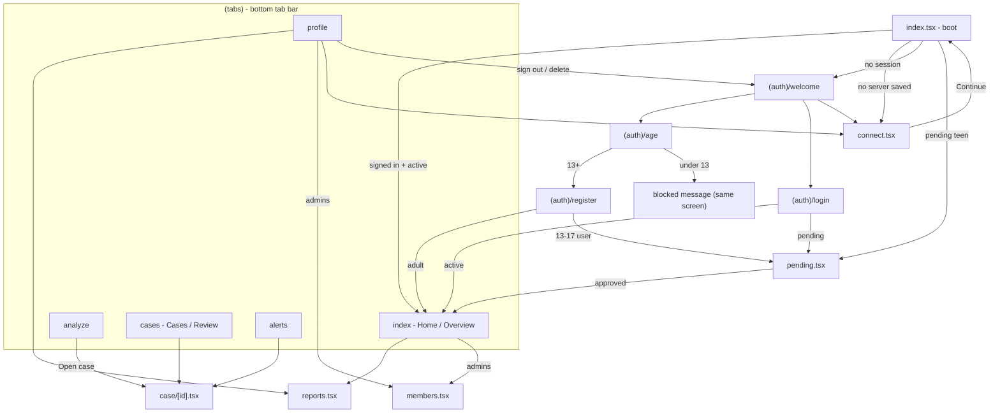
```mermaid
flowchart TD
    Boot["index.tsx - boot"] -->|"no server saved"| Connect["connect.tsx"]
    Boot -->|"no session"| Welcome["(auth)/welcome"]
    Boot -->|"pending teen"| Pending["pending.tsx"]
    Boot -->|"signed in + active"| Home

    Connect -->|"Continue"| Boot
    Welcome --> Age["(auth)/age"]
    Welcome --> Login["(auth)/login"]
    Welcome --> Connect
    Age -->|"13+"| Register["(auth)/register"]
    Age -->|"under 13"| Blocked["blocked message (same screen)"]
    Register -->|"13-17 user"| Pending
    Register -->|"adult"| Home
    Login -->|"pending"| Pending
    Login -->|"active"| Home
    Pending -->|"approved"| Home

    subgraph Tabs["(tabs) - bottom tab bar"]
        Home["index - Home / Overview"]
        Analyze["analyze"]
        CasesTab["cases - Cases / Review"]
        AlertsTab["alerts"]
        Profile["profile"]
    end

    Home --> Reports["reports.tsx"]
    Home -->|"admins"| Members["members.tsx"]
    Analyze -->|"Open case"| Case["case/[id].tsx"]
    CasesTab --> Case
    AlertsTab --> Case
    Profile --> Reports
    Profile -->|"admins"| Members
    Profile --> Connect
    Profile -->|"sign out / delete"| Welcome
```

`src/app/_layout.tsx` declares a **Stack** (screens slide on top of each other)
with titles: "Server connection", "Before you start", "Create account", "Sign in",
"Guardian approval" (back button hidden), "Case detail", "Reports",
"Organization members". Welcome, boot and the tab group hide the header.

### 12.5 Boot logic (`src/app/index.tsx`)

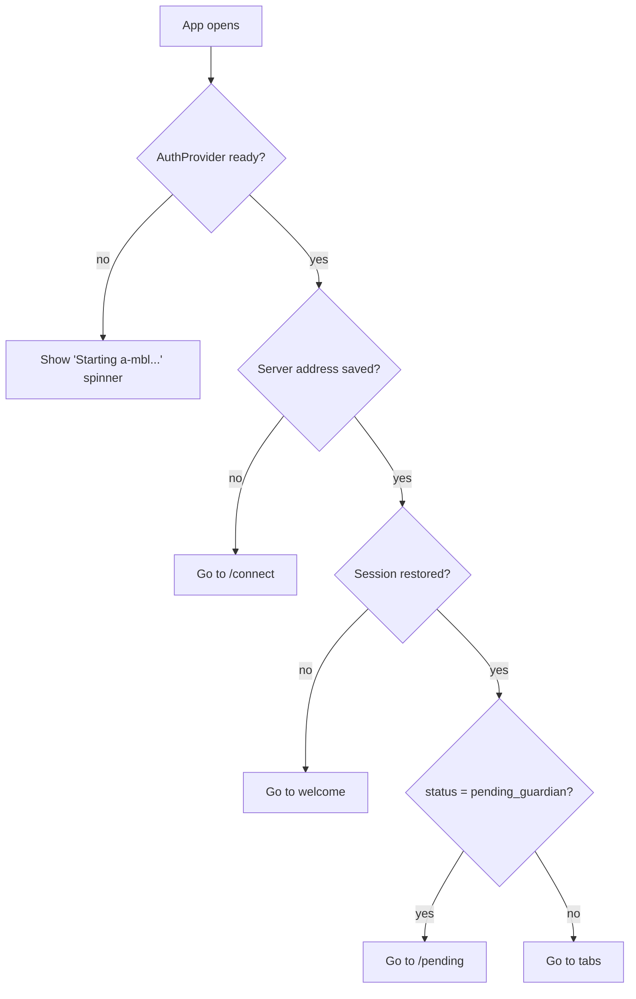
```mermaid
flowchart TD
    S["App opens"] --> R{"AuthProvider ready?"}
    R -- no --> L["Show 'Starting a-mbl...' spinner"]
    R -- yes --> H{"Server address saved?"}
    H -- no --> C["Go to /connect"]
    H -- yes --> U{"Session restored?"}
    U -- no --> W["Go to welcome"]
    U -- yes --> P{"status = pending_guardian?"}
    P -- yes --> PE["Go to /pending"]
    P -- no --> T["Go to tabs"]
```

While "not ready", `AuthProvider` reads the saved server address and, if there
is one, calls `refreshSession()` using the saved refresh token. Success = you are
signed in again without typing a password.

### 12.6 `lib/api.ts` — how the app talks to the server

[mobile/src/lib/api.ts](mobile/src/lib/api.ts)

**What is stored where:**

| Thing | Where | Why |
| --- | --- | --- |
| Server address | SecureStore key `ambl.apiUrl` (+ in a variable) | Survives restarts; can be changed on the Connect screen |
| Refresh token | SecureStore key `ambl.refreshToken` | Long-lived secret → OS-protected storage (Keychain / Keystore), **never** AsyncStorage (roadmap §16.3) |
| Access token | A JavaScript variable only | Short-lived; never written to disk, so it can't be stolen from storage |
| Default address | `EXPO_PUBLIC_API_URL` (build-time env var, normalized like a typed address) | Development shortcut to pre-fill the address |

**Functions:**

| Function | What it does |
| --- | --- |
| `ApiError` | Error class with `status`, `code`, `message`, `fieldErrors` — same shape as the server's error body |
| `safeGet` / `safeSet` | SecureStore read/write that never crashes (e.g. on web, where SecureStore doesn't exist) |
| `normalizeServerUrl(input)` | Cleans a typed address down to `scheme://host[:port]`: trims it, drops whitespace, adds `http://` when there is no scheme, strips trailing `/` and a trailing `/v1/health`, `/v1` or `/docs`. So `192.168.1.20:8000` and a pasted `https://….trycloudflare.com/docs` both work |
| `getApiUrl` / `setApiUrl` | Read/save the server address (`setApiUrl` saves the normalized form) |
| `storeSession` / `clearSession` / `storedRefreshToken` | Token helpers |
| `withTimeout(ms)` | An `AbortController` that cancels a request after `ms` (default **12 s**) |
| `rawRequest` | `fetch` + timeout; a request that ran out of time becomes `ApiError(0, "timeout", "The server took too long to answer…")`, any other network failure `ApiError(0, "unreachable", "Could not reach the a-mbl server…")` |
| `refreshSession()` | **Single-flight** refresh (see below) |
| `authFailure(response, retryOn401)` | For a 401, reads the error body so the caller can see **which** 401 it is |
| `api<T>(path, options)` | The main helper: adds `Authorization`, sends JSON or `FormData`; on a **401 with code `unauthorized`** (token expired/invalid) refreshes once and retries once; any other 401 (e.g. `invalid_credentials` = wrong password) is thrown straight away; turns errors into `ApiError`, returns parsed JSON (or nothing for 204) |
| `apiBinary(path, options)` | Same, but returns raw bytes (for the PDF and evidence screenshots), default timeout **30 s** |
| `checkHealth(url)` | Calls `/v1/health` on the normalized address with a **10 s** timeout (a tunnelled https address can be slow to answer first); accepts the answer only if `status` is `"ok"` and `modelVersion` is a string. Used by the Connect and Analyze screens |

**The single-flight refresh — why it matters:**

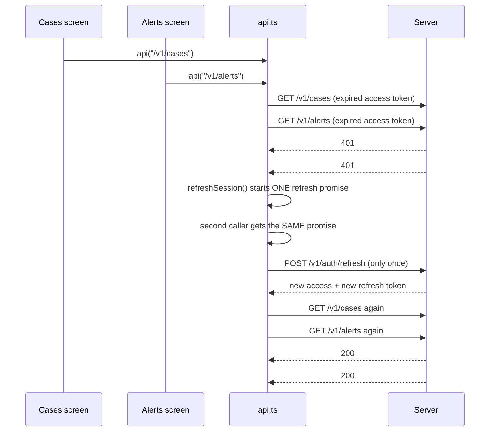
```mermaid
sequenceDiagram
    participant A as Cases screen
    participant B as Alerts screen
    participant API as api.ts
    participant S as Server
    A->>API: api("/v1/cases")
    B->>API: api("/v1/alerts")
    API->>S: GET /v1/cases (expired access token)
    API->>S: GET /v1/alerts (expired access token)
    S-->>API: 401
    S-->>API: 401
    API->>API: refreshSession() starts ONE refresh promise
    API->>API: second caller gets the SAME promise
    API->>S: POST /v1/auth/refresh (only once)
    S-->>API: new access + new refresh token
    API->>S: GET /v1/cases again
    API->>S: GET /v1/alerts again
    S-->>API: 200
    S-->>API: 200
```

> **Why single-flight?** The server **rotates** refresh tokens and treats a
> reused one as **theft** (it revokes every session). If two screens refreshed
> at the same time with the same old token, the second refresh would look like
> theft and **sign the user out everywhere**. Sharing one in-flight promise
> prevents that. (This was a real bug, fixed on 2026-07-12.)

> **Why is the token only cleared on 401?** If the server is just off or the
> Wi-Fi drops, the refresh fails with a network error — the token is still
> good. Clearing it would force a new sign-in for nothing.

> **Why refresh only on `unauthorized`?** Some 401s are answers, not session
> problems. A wrong password on **Delete account** returns
> `invalid_credentials`. The old code refreshed on *every* 401, which rotated
> the refresh token for nothing and then failed the same way (finding **F3**,
> fixed 2026-09-10).

### 12.7 `lib/auth.tsx` — sign-in state for the whole app

[mobile/src/lib/auth.tsx](mobile/src/lib/auth.tsx) — a React **Context**. Any screen calls `useAuth()` to get:

| Value | Meaning |
| --- | --- |
| `ready` | Boot restore finished |
| `hasServer` | A server address is saved |
| `user` | The signed-in profile (or `null`) |
| `signIn(email, password)` | POST login → store tokens → set user |
| `register(payload)` | POST register → store tokens → set user → returns the full answer (with `linkCode`) |
| `signOut()` | POST logout with the refresh token (errors ignored) → clear tokens → user = null |
| `reloadUser()` | GET `/v1/me` → update user (used after edits and on the Profile/Pending screens) |
| `markServerConfigured()` | Called by the Connect screen after a successful check |

### 12.8 `lib/types.ts`, `lib/theme.ts`, `lib/images.ts`

- **`types.ts`** — TypeScript copies of every server JSON shape (`User`, `AuthResponse`,
  `Health`, `AnalysisResult`, `CaseSummary`, `CaseDetail`, `Review`, `Share`,
  `Evidence`, `CaseList`, `AppAlert`, `GuardianLink`, `LinkCode`, `Organization`,
  `Member`, `LinkPreview`, `OcrResult`, `SummaryReport` — which includes
  `byWeekday: number[]` and `topSenders: {alias, count}[]` for the Home
  charts). Written by hand; the server's `/docs` is the source of truth.
- **`theme.ts`** — colours and meanings:

| Severity | Icon | Label | Text colour | Background | Description |
| --- | :---: | --- | --- | --- | --- |
| safe | ✓ | Safe | `#1E6B27` | `#E7F4E8` | No clear harmful-language signal detected. |
| caution | ! | Caution | `#7A5E00` | `#FFF3D1` | The text may contain offensive language. |
| high | ▲ | High | `#9A3D00` | `#FFE7D6` | The text may contain targeted or identity-based abuse signals. |
| critical | ⚠ | Critical | `#A32018` | `#FCE1DF` | The text may contain threatening language. |

  Main palette: background `#F6F4FB`, surface white, primary `#6C5FC7` (purple),
  text `#2A2740`, muted `#666181`, danger `#B3261E`. Plus `labelText`
  (`hate_speech` → "Hate speech"), `formatDate`, `formatDateTime`, `confidencePercent` (0.83 → "83%").

  > **Why icon + word + colour?** Roadmap §8.5: never show risk with colour
  > alone — colour-blind users must still understand it.

- **`images.ts`** — three pieces:
  - `normalizeScreenshot(asset)` (internal): if the picker didn't report the
    size, measure it; if the longest side is over **2000 px**, resize;
    **always** re-save as **JPEG at 80 % quality**. Returns the new file's `uri`.
  - [`screenshotFormData(asset)`](mobile/src/lib/images.ts#L61): normalizes the
    picked image, then builds the multipart body with one part named `file`
    holding an `expo-file-system` `File` for that JPEG. Used for `POST /v1/ocr`
    and for attaching evidence.
  - [`imageDataUri(buffer, mimeType)`](mobile/src/lib/images.ts#L47): turns
    downloaded image bytes into a `data:` URI (base64 via `String.fromCharCode`
    in 8 KB chunks + `btoa`), so the case screen can show evidence from memory.

  > **Why always re-encode?** Re-saving as JPEG **removes EXIF metadata** (which
  > can contain GPS location and phone model) and "bakes in" the rotation.
  > **Why 2000 px?** Smaller upload, and always under the server's 6000 px limit.

  > **Why a `File` part and not `{uri, name, type}`?** Expo SDK 57 installs
  > `expo/fetch` as the global `fetch`, and its FormData encoder rejects React
  > Native's `{uri, name, type}` file objects before the request leaves the
  > phone. Until 2026-10-05 that broke **both** screenshot OCR and evidence
  > attach, with a misleading "could not reach the server" message (found by
  > driving the APK on an emulator). An `expo-file-system` `File` is a real
  > `Blob` (name, type, bytes), which `expo/fetch` accepts.
  > **Why chunks?** Passing a whole screenshot's bytes to `String.fromCharCode`
  > in one call can exceed the JavaScript engine's argument limit.

### 12.9 `components/ui.tsx` — the small UI kit

| Component | What it looks like / does |
| --- | --- |
| `Screen` | Safe-area page with a scroll view (padding 16, gap 12). `scroll={false}` for fixed pages. `safeTop` adds the status-bar inset — only for header-less screens (welcome, boot). Keeps a focused field above the keyboard: on Android a `KeyboardAvoidingView` (`behavior="padding"`, offset = the screen's measured top in the window), on iOS the scroll view's `automaticallyAdjustKeyboardInsets` |
| `Card` | White rounded box with a border; `tone="danger"` (red border) or `"info"` (lavender) |
| `Title`, `Subtitle`, `Body` | Text styles; `Title` is announced as a **header** to screen readers |
| `Button` | `primary` (purple), `secondary` (lavender), `danger` (red), `ghost` (text only). `loading` shows a spinner; min height **48** |
| `Field` | Label + text input + red error line; multiline version is 130 tall |
| `Banner` | Coloured message with icon: `info` ℹ, `warn` !, `error` ⚠; marked as an `alert` for screen readers |
| `SeverityChip` | Pill with icon + label, e.g. "⚠ Critical" |
| `FilterChip` | Selectable pill (min height 44); used for filters, months, years, roles, labels, orgs |
| `EmptyState`, `Loading`, `ErrorNotice` (banner + "Try again"), `Row` (label left, value right) | Common states |

Accessibility built in: `accessibilityRole`, `accessibilityLabel`,
`accessibilityState`, and `maxFontSizeMultiplier` caps (headings 1.5×, controls
1.8×, body 2×) so big system fonts **grow** the text but don't **break** the layout.

> **Why a home-made kit instead of a UI library?** Fewer dependencies, full
> control over touch sizes, contrast and screen-reader labels.

> **Why `safeTop` and the keyboard wrapper?** Two layout bugs fixed on
> 2026-10-05. Every `Screen` used to add the status-bar inset, but a screen
> with a navigation header already sits below the status bar, so titled
> screens showed an empty band under the header. And Android now draws edge
> to edge, so the window no longer shrinks for the keyboard: a focused field
> low on the screen (password, sender nickname, link code, review note) sat
> under it. The internal [`KeyboardAware`](mobile/src/components/ui.tsx#L48)
> wrapper pads the screen by the keyboard overlap, which shrinks the scroll
> view so Android scrolls the field back into view. The keyboard is reported
> in window coordinates, so the offset is the screen's own top (the height of
> any header above it).

### 12.10 `components/charts.tsx` — the Home dashboard charts

[mobile/src/components/charts.tsx](mobile/src/components/charts.tsx) — two
chart components built from plain `View`s:

| Component | Draws | Details |
| --- | --- | --- |
| `ColumnChart({data, unit})` | Vertical bars (one per item) | Bar height scales to the largest value (max 72 px, at least 4 px when not zero); the value is printed above the bar, the label below; zero shows no bar |
| `BarRows({rows, unit})` | Horizontal bars, one row per item | Label left, a track filled in proportion to the largest value, the count right |

Both use one colour (the app purple), start from zero, and give **every bar its
own accessibility label** (e.g. `Mon: 2 cases`), because touch screens have no
hover tooltip.

> **Why no chart library?** Anything with native code would have to exist in
> Expo Go; plain `View`s need nothing new and stay readable at large font
> sizes. The counts are small, so printed values beat an axis.

---

## 13. Every screen of the mobile app

Sketches are simplified. Each screen lists **what you see**, **which API it calls**, and **why**.

### 13.1 Connect (`connect.tsx`)

```text
┌──────────────────────────────────────┐
│ ‹ Server connection                  │
│ Connect to the a-mbl server          │
│ a-mbl checks messages with a small   │
│ server. Enter the address you were...│
│ ┌──────────────────────────────────┐ │
│ │ Server address                   │ │
│ │ [ http://192.168.1.20:8000     ] │ │
│ │ [      Check connection        ] │ │
│ └──────────────────────────────────┘ │
│ ┌ Connected ✓ ─────────────────────┐ │
│ │ Model: tfidf-logreg-0.2.0        │ │
│ │ Screenshot text extraction:      │ │
│ │ available                        │ │
│ │ [          Continue            ] │ │
│ └──────────────────────────────────┘ │
│ ! This test server is for practice   │
│   with made-up content only          │
└──────────────────────────────────────┘
```

- The text explains both kinds of address: an `http://` address when the phone
  is on the same Wi-Fi as the server, or an `https://` link when testing from
  anywhere (a quick tunnel, §16.5).
- **Check connection** first cleans the address with `normalizeServerUrl`
  (`192.168.1.20:8000` → `http://192.168.1.20:8000`; a pasted `…/v1/health` or
  `…/docs` link is cut back to the server), then calls `GET /v1/health` (10 s).
  **Only if an a-mbl server answers** (`status: "ok"` and a model version) is
  the address saved — and the cleaned form is written back into the field.
- The **Model** line shows `/v1/health.modelVersion`: `tfidf-logreg-0.2.0`
  against this Mac (model loaded), `lexicon-0.1.0` against a server without
  `model.joblib`.
- On failure: red banner + a list of common fixes (server still running, copy
  the address exactly, and for `http://` the same Wi-Fi, port 8000 and the
  server's firewall — naming the Windows "a-mbl API" firewall rule and, on
  macOS, allowing Python).
- **Why:** roadmap §9.3 — the Mac's IP changes; you must be able to fix it without
  editing code. Remote testers also need to paste an https link they were sent.

### 13.2 Welcome (`(auth)/welcome.tsx`)

Title "a-mbl", a calm explanation, three promises (estimates not judgments;
ordinary messages not kept, harmful ones encrypted 30 days; nothing shared unless
you choose), buttons **Create an account**, **I already have an account**,
**Change server address**, and the safety line "If someone may be in immediate
danger, contact a trusted person…". No API calls. It has no navigation header,
so it (like the boot spinner) uses `<Screen safeTop>` to stay below the status bar.

### 13.3 Age (`(auth)/age.tsx`)

```text
┌──────────────────────────────────────┐
│ When were you born?                  │
│ Only the month and year — ...        │
│ Birth month                          │
│ (Jan)(Feb)(Mar)(Apr)(May)(Jun) ...   │
│ Birth year                           │
│ (2026)(2025)(2024) ... 80 years      │
│ [            Continue              ] │
└──────────────────────────────────────┘
```

- Age is computed **on the phone**. Under 13 → a kind message "Thanks for
  telling us… Nothing you entered was saved." + advice to talk to a trusted adult.
- 13+ → goes to Register with `year` and `month` in the URL params.
- **Why chips and not a date picker?** Neutral, no default that "suggests" an
  answer (roadmap §7.1), and only month + year are asked.
- The server checks the age **again** (never trust the phone alone).

### 13.4 Register (`(auth)/register.tsx`)

- If the age params are missing → "Please answer the age question first".
- Choose **"A user checking messages"** or **"A parent or guardian"**. A note
  says school staff accounts can't be created here.
- Display name, email, password (8+).
- `POST /v1/auth/register`. Field errors from the server appear under the right field.
- Result: pending teen → `/pending` (with the link code); otherwise → tabs.

### 13.5 Login (`(auth)/login.tsx`)

Email + password → `POST /v1/auth/login` → pending → `/pending`, else tabs.
Wrong password shows the server's "Email or password is incorrect."

### 13.6 Pending (`pending.tsx`) — for 13–17 users

```text
┌──────────────────────────────────────┐
│ Guardian approval                    │
│ One more step                        │
│ Because you're under 18, a parent... │
│ ┌ Your link code ──────────────────┐ │
│ │        3 F A 9 1 C 0 B           │ │
│ │ The code works once and expires  │ │
│ │ after 24 hours.                  │ │
│ │ [     Create a new code        ] │ │
│ └──────────────────────────────────┘ │
│ [ I've been approved — check again ] │
│   Sign out                           │
└──────────────────────────────────────┘
```

- The text tells the teen that the guardian enters the code "under **Profile →
  Linked users**" — the real title of the guardian's section (until 2026-10-05
  it wrongly said "Guardian links", which is the *user's* section).
- New code → `POST /v1/guardian-links`. Check → `GET /v1/me`; if `active` → tabs.
- The code is read aloud letter by letter by screen readers ("Link code 3 F A 9…").
- The back button is hidden (you can't skip approval).

### 13.7 Tabs (`(tabs)/_layout.tsx`)

| Tab | Icon | User | Guardian | School admin |
| --- | :---: | --- | --- | --- |
| index | ⌂ | Home | Overview | Overview |
| analyze | ✎ | Analyze | Analyze | Analyze |
| cases | ▤ | Cases | Cases | **Review** |
| alerts | ◉ | Alerts | Alerts | Alerts |
| profile | ◐ | Profile | Profile | Profile |

If you are not signed in → welcome; if pending → `/pending`.

> **Why one tab bar for all roles?** The roadmap wanted different tab sets per
> role. The prototype uses one set whose **titles and content change by role**.
> Less navigation code, same information — and the server enforces access
> anyway. (Documented deviation.)

### 13.8 Home / Overview (`(tabs)/index.tsx`)

```text
┌──────────────────────────────────────┐
│ Hi Demo User 👋                      │
│ Cases below cover only your own ...  │
│ ┌ Last 30 days ────────────────────┐ │
│ │ [  4  ]   [  0   ]   [   4   ]   │ │
│ │ Harmful   Reviewed   Pending     │ │
│ │ ! Caution: 1  ▲ High: 2          │ │
│ │ ⚠ Critical: 1                    │ │
│ │ • Offensive: 1 • Harassment: 2...│ │
│ └──────────────────────────────────┘ │
│ ┌ Cases per week ──────────────────┐ │
│ │        2                         │ │
│ │   1    █    1                    │ │
│ │   █    █    █                    │ │
│ │ 21 Sep 28 Sep 5 Oct              │ │
│ └──────────────────────────────────┘ │
│ ┌ By day of week ──────────────────┐ │
│ │ (7 columns, Mon … Sun)           │ │
│ └──────────────────────────────────┘ │
│ ┌ Repeat senders ──────────────────┐ │
│ │ anon_17   ████████████   2       │ │
│ └──────────────────────────────────┘ │
│ ┌ How a-mbl works ─────────────────┐ │
│ │ You choose what to check...      │ │
│ └──────────────────────────────────┘ │
│ [       Analyze a message          ] │
│ [     Reports and PDF export       ] │
│ [   Organization members (admins)  ] │
│ ℹ If someone may be in immediate ... │
└──────────────────────────────────────┘
```

- `GET /v1/reports/summary` (default last 30 days) **every time the tab gets
  focus** (so coming back from Analyze already shows the new case), plus pull
  down to refresh.
- The scope line changes by role ("your own" / "you and your linked users" / "only what was shared with your school").
- **Charts** (§12.10), only once the range has at least one case:
  **Cases per week** (`ColumnChart` of `weekly`, labelled with each week's
  Monday as a short date), **By day of week** (`ColumnChart` of `byWeekday`,
  Mon…Sun) and **Repeat senders** (`BarRows` of `topSenders`, with the note
  "Sender names are what you typed when saving a case."). With cases but no
  typed aliases, the Repeat senders card instead says "Add a sender alias when
  analyzing a message to see repeat senders here."

> **Why "repeat senders" from typed aliases only?** The app cannot know who
> really sent a message; the alias is the user's own unverified note, counted
> **within the viewer's scope** — an aid for the conversation, not a verdict.

### 13.9 Analyze (`(tabs)/analyze.tsx`) — the main screen

```text
┌──────────────────────────────────────┐
│ (Enter text) (Scan screenshot)       │
│ ┌ Screenshot → text ───────────────┐ │   ← only in "Scan screenshot" mode
│ │ [ Camera ]  [ Gallery ]          │ │     and only if server says ocrReady
│ │ ℹ Text extracted (reader         │ │
│ │   confidence 91%). Review it...  │ │
│ └──────────────────────────────────┘ │
│ ┌──────────────────────────────────┐ │
│ │ Message text                     │ │
│ │ [ you are such an idiot and a  ] │ │
│ │ [ loser, everyone hates you    ] │ │
│ │                4948 characters left│
│ │ Platform (optional, as you ...)  │ │
│ │ Sender nickname (optional, ...)  │ │
│ │ [            Analyze           ] │ │
│ └──────────────────────────────────┘ │
│ ┌ Result ──────────────────────────┐ │
│ │ ▲ High                           │ │
│ │ Harassment · confidence 92%      │ │
│ │ • The submitted text may contain │ │
│ │   harassment signals. ...        │ │
│ │ Saved as a private case until    │ │
│ │ Aug 12, 2026 (30 days)...        │ │
│ │ [          Open case           ] │ │
│ └──────────────────────────────────┘ │
└──────────────────────────────────────┘
```

(The sketch shows the lexicon's 92%; with the trained model loaded, as on this
Mac, the same message scores 100%.)

What happens:

1. On open, it calls `checkHealth` to learn `ocrReady`. States: `checking`,
   `ready`, `unavailable` (Tesseract not installed), `unreachable`.
   The Camera/Gallery buttons appear **only** when `ready`.
2. **Camera**: asks camera permission first (if refused: a message suggesting
   the gallery). **Gallery**: opens the picker. Both with `exif: false`.
3. The image goes through `screenshotFormData` (JPEG re-encode + an
   `expo-file-system` `File` part, §12.8) → `POST /v1/ocr` (30 s timeout) → the
   extracted text **fills the text box** → `sourceType` becomes `"screenshot"`.
   A warning appears if confidence is low.
4. **Analyze** → `POST /v1/analyses`. The text limit (5000) is enforced while
   typing, and a counter shows how many characters are left.
5. **Result card**: severity chip, label + confidence, body-shaming line,
   uncertain warning, advice lines. If a case was created: "Saved as a private
   case until …" + **Open case**. If not: "Nothing was saved" + **Keep for human
   review anyway** (with a clear warning that keeping it stores the text for 30
   days and that linked guardians can open it).
6. **Editing any field clears the result.**

> **Why clear the result when you type?** So an old result can never be read as
> belonging to new text, and "Keep for review" can never save the wrong text.
> The app remembers the exact payload that produced the visible result
> (`analyzed`) and re-sends **exactly that** when you flag it.

> **Why does "Keep for review" send the text again?** Because the server
> **already forgot** the Normal text (privacy!). The only way to keep it is for
> the phone to send it once more with `flagForReview: true`. (This creates a
> second `analysis_events` row — see finding F9.)

> **Why not the usual React Native `{uri, name, type}` upload object?** The
> code used to append one (with an `as unknown as Blob` cast for TypeScript),
> but under Expo SDK 57's global `expo/fetch` that object is rejected before
> the request is sent, so scanning failed. `screenshotFormData` appends a real
> `Blob` instead (§12.8); no cast is needed any more.

### 13.10 Cases (`(tabs)/cases.tsx`)

Filter chips **All / Caution / High / Critical** → `GET /v1/cases?pageSize=100&severity=…`.
Reloads every time the tab gets focus. Each row shows: severity chip, date,
label (+ "body-shaming tag"), "Your submission" or "From <name>", platform,
"reviewed"/"pending review", 📎 if a screenshot is attached. Tap → case detail.
Empty messages differ by role (e.g. admins: "Cases appear here only after someone
explicitly shares them with your school.").

### 13.11 Alerts (`(tabs)/alerts.tsx`)

- `GET /v1/alerts` when the tab gets focus, when the app comes back to the
  foreground, **every 60 seconds** while the tab is open, and on pull-to-refresh.
- Unread alerts have a purple border and a ● dot.
- Tap → `PATCH /v1/alerts/{id}` (mark read, best-effort) → open the case (the
  server checks access again).

> **Why polling and not push notifications?** Push and SMS are explicitly
> out of scope (roadmap §4.2) and Expo Go can't do real remote push for this
> setup. Polling every 60 s only while the inbox is open is "light" (§14.2).
> The only channel outside the app is the optional, content-free alert email
> (§7.15), which the server sends — the app itself never notifies.

### 13.12 Profile (`(tabs)/profile.tsx`)

Sections (they depend on the role):

| Section | Who sees it | What it does |
| --- | --- | --- |
| Account card | everyone | Email, role, age band, member since, organizations, **Edit display name** (`PATCH /v1/me`) |
| Guardian links (user) | role `user` | **Create a link code** (`POST /v1/guardian-links`), list of links with **Remove link** (confirmation dialog) |
| Linked users (guardian) | role `guardian` | Type a code → **Review code** (`/preview`) → banner "This code links you to X (age band 13-17)…" → **Approve link to X** (`/accept`) or **Not now**; list of links with **Remove link** |
| Organization | school admin | Buttons to **Manage members** and **Reports** |
| Privacy | everyone | **Export my data** (`GET /v1/privacy/export` → native share sheet with the JSON), **Delete my account…** → password field → **Delete my account permanently** (`DELETE /v1/privacy/account`) → sign out |
| App | everyone | Rows **App version** (`Constants.expoConfig?.version`, today 0.2.0) and **Server** (the saved address), then **Change server address**, **Sign out** |

On every focus it reloads links and `/v1/me`, and re-reads the saved server
address (it may just have been changed on the Connect screen). The banner at
the bottom says "a-mbl is a prototype for practice with made-up content.
Results are estimates, not judgments."

> **Why does `loadLinks` depend on `role` and not `user`?** `reloadUser()`
> replaces the `user` object on every call. If the focus effect depended on
> `user`, it would reload → new object → reload again → **forever**. Depending
> on the stable string `role` breaks that loop (the code comment explains this).

### 13.13 Case detail (`case/[id].tsx`)

```text
┌──────────────────────────────────────┐
│ ‹ Case detail                        │
│ ┌──────────────────────────────────┐ │
│ │ ⚠ Critical        Jul 13, 10:22  │ │
│ │ Threat                           │ │
│ │ Model confidence           83%   │ │
│ │ Model version    lexicon-0.1.0   │ │
│ │ From                        You  │ │
│ │ Deletes automatically Aug 12 2026│ │
│ └──────────────────────────────────┘ │
│ ┌ Message content ─────────────────┐ │
│ │ i w••• k•••••••                  │ │
│ │ [     Reveal full content      ] │ │
│ └──────────────────────────────────┘ │
│ ┌ Context and review (owner) ──────┐ │
│ │ [Edit context (platform, sender)]│ │
│ │ [   Request a human review     ] │ │
│ └──────────────────────────────────┘ │
│ ┌ Human review ────────────────────┐ │
│ │ Demo Guardian (guardian) — says: │ │
│ │ Threat  “Checked with school”    │ │
│ │ [         Add a review         ] │ │
│ └──────────────────────────────────┘ │
│ ┌ Sharing with a school (owner) ───┐ │
│ │ [Share with an organization… ]   │ │
│ └──────────────────────────────────┘ │
│ ┌ Screenshot evidence ─────────────┐ │
│ │ [      Attach screenshot       ] │ │
│ └──────────────────────────────────┘ │
│ [        Delete this case          ] │
└──────────────────────────────────────┘
```

| Card | Who | API |
| --- | --- | --- |
| (guard) | — | If the session is gone, the screen redirects to Welcome (same for Reports and Members) |
| Header (badge, label, confidence, **Model version** — whichever classifier produced the result: `lexicon-0.1.0` as in the sketch, or `tfidf-logreg-0.2.0` for cases analyzed with the model loaded) | everyone who can see it | `GET /v1/cases/{id}` — on **every focus** (`useFocusEffect`), so a case reopened from the list or an alert shows its latest reviews and shares; state is set only after the answer arrives |
| Message content (masked → **Reveal** → full text → Hide; the masked view reads "Content withheld — open the case to view it." when only the trained model flagged the message, §10.5) | everyone who can see it | — (text is already in the detail answer) |
| Context and review | owner | `PATCH /v1/cases/{id}` (platform/alias, `requestReview`) |
| Human review (choose a label chip and/or write a note) | everyone who can see it | `POST /v1/cases/{id}/reviews` |
| Sharing (load orgs → tap one → dialog "Share with X?" → share; Unshare buttons) | owner | `GET /v1/organizations`, `POST/DELETE /v1/cases/{id}/shares` |
| Evidence (attach from gallery / view — downloads on first view with a "Loading screenshot…" state / hide / **Try again**) | owner attaches; everyone who can see views | `POST /v1/cases/{id}/evidence` (body from `screenshotFormData`), image bytes from `GET …/evidence/{eid}` via `apiBinary` |
| Delete (confirmation dialog) | owner | `DELETE /v1/cases/{id}` |

> **Why "Reveal"?** Roadmap §8.5: sensitive content hidden behind a deliberate
> action, so nobody sees hurtful text by accident. Note it is a **comfort**
> feature, not a security wall: anyone allowed to open the case already
> receives the full text from the server.

> **How is the screenshot shown if it needs a token?** `EvidenceCard`
> downloads it through the API client:
> [`loadImage`](mobile/src/app/case/[id].tsx#L345) calls `apiBinary` (normal
> `Authorization` header, plus the one refresh-and-retry if the 15-minute
> token expired), turns the bytes into a `data:` URI with `imageDataUri`, and
> `<Image>` shows that. The decrypted screenshot stays in memory and is never
> written to the phone's storage. "Try again" simply runs `loadImage` again.
> **Why not `<Image source={{ uri, headers }}>`?** That was the old way, and
> Android's image loader never sent the header, so every view answered 401 and
> showed "could not be loaded" (fixed 2026-10-05).

### 13.14 Reports (`reports.tsx`)

- Date range chips **Last 7 / 30 / 90 days** or **Custom** (two `YYYY-MM-DD`
  fields + **Apply range** — custom dates only load when you press Apply, so
  typing doesn't send requests). A preset loads at once and again every time
  the screen gets focus (`useFocusEffect`, depending on `[preset, load]`).
- Cards: totals + by severity + by category; **Weekly trend** bar chart (bars
  scale to the biggest week; the whole chart has a spoken description for screen
  readers, e.g. "week of 2026-07-06: 3"); **By sender alias** with a warning that
  aliases are unverified; **Masked PDF report** → **Download and share PDF**.
- PDF: `apiBinary("POST /v1/reports/pdf")` → saved to the cache folder as
  `a-mbl-report-<date>.pdf` (old file replaced) → the native share sheet opens.

### 13.15 Members (`members.tsx`) — school admins

- Non-admins see "Only school administrator accounts manage members."
- For each of your organizations: list members (`GET …/members`, reloaded on
  every focus), **Remove** others (confirmation; "This is you." for yourself),
  **Add an administrator by email** (`POST …/members`; the hint says only
  existing school administrator accounts, "created on the server with
  create_admin", can be added).

> **Why `useFocusEffect` on Case detail, Reports and Members?** Since
> 2026-10-05 ESLint runs Expo's React rules, and `react-hooks/set-state-in-effect`
> flagged their old `useEffect(() => { load(); })` pattern. Loading on focus,
> like the tab screens, satisfies the rule and also refreshes the screen when you
> come back to it. Each `load` now sets state only after its request finishes.

### 13.16 What each role can do in the app (summary)

| Action | User 18+ | User 13–17 | Guardian | School admin |
| --- | :---: | :---: | :---: | :---: |
| Register in the app | ✅ | ✅ (then pending) | ✅ (18+ only) | ❌ (Mac command only) |
| Analyze text / screenshot | ✅ | ✅ after approval | ✅ | ✅ |
| See own cases | ✅ | ✅ | ✅ | ✅ |
| See linked users' cases | — | — | ✅ | — |
| See shared cases | — | — | — | ✅ (own org) |
| Create link code | ✅ | ✅ | ❌ | ❌ |
| Approve link code | ❌ | ❌ | ✅ | ❌ |
| Share / unshare own case | ✅ | ✅ | ✅* | ✅* |
| Review a visible case | ✅ | ✅ | ✅ | ✅ |
| Manage members | ❌ | ❌ | ❌ | ✅ |
| Reports + PDF (own scope) | ✅ | ✅ | ✅ | ✅ |
| Export / delete account | ✅ | ✅ (even while pending) | ✅ | ✅ |

\* The server lets **any owner** share their own case. The advisory
`permissions.canShareCases` flag is only `true` for role `user`, but the app does
not use that flag to hide the Sharing card.

---

## 14. End-to-end flows

### 14.1 Teen registration and guardian linking

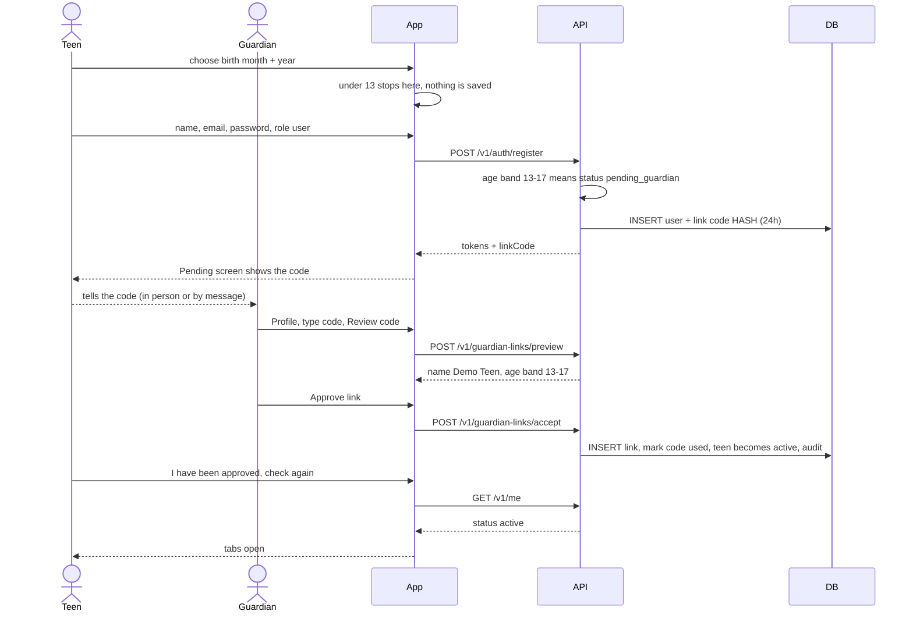
```mermaid
sequenceDiagram
    actor Teen
    actor Guardian
    participant App
    participant API
    participant DB
    Teen->>App: choose birth month + year
    App->>App: under 13 stops here, nothing is saved
    Teen->>App: name, email, password, role user
    App->>API: POST /v1/auth/register
    API->>API: age band 13-17 means status pending_guardian
    API->>DB: INSERT user + link code HASH (24h)
    API-->>App: tokens + linkCode
    App-->>Teen: Pending screen shows the code
    Teen-->>Guardian: tells the code (in person or by message)
    Guardian->>App: Profile, type code, Review code
    App->>API: POST /v1/guardian-links/preview
    API-->>App: name Demo Teen, age band 13-17
    Guardian->>App: Approve link
    App->>API: POST /v1/guardian-links/accept
    API->>DB: INSERT link, mark code used, teen becomes active, audit
    Teen->>App: I have been approved, check again
    App->>API: GET /v1/me
    API-->>App: status active
    App-->>Teen: tabs open
```

### 14.2 Text analysis (harmful message, linked teen)

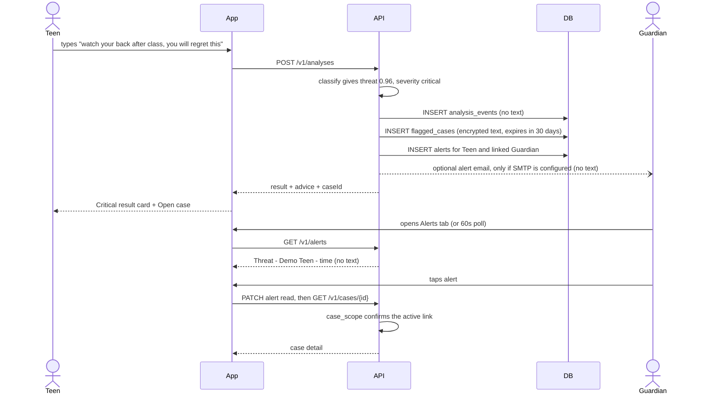
```mermaid
sequenceDiagram
    actor Teen
    participant App
    participant API
    participant DB
    actor Guardian
    Teen->>App: types "watch your back after class, you will regret this"
    App->>API: POST /v1/analyses
    API->>API: classify gives threat 0.96, severity critical
    API->>DB: INSERT analysis_events (no text)
    API->>DB: INSERT flagged_cases (encrypted text, expires in 30 days)
    API->>DB: INSERT alerts for Teen and linked Guardian
    API--)Guardian: optional alert email, only if SMTP is configured (no text)
    API-->>App: result + advice + caseId
    App-->>Teen: Critical result card + Open case
    Guardian->>App: opens Alerts tab (or 60s poll)
    App->>API: GET /v1/alerts
    API-->>App: Threat - Demo Teen - time (no text)
    Guardian->>App: taps alert
    App->>API: PATCH alert read, then GET /v1/cases/{id}
    API->>API: case_scope confirms the active link
    API-->>App: case detail
```

### 14.3 Screenshot analysis

```mermaid
sequenceDiagram
    actor U as User
    participant App
    participant API
    U->>App: Scan screenshot, Gallery
    App->>API: GET /v1/health (on screen open)
    API-->>App: ocrReady true
    App->>App: pick image with exif false
    App->>App: screenshotFormData - JPEG 80 percent, max 2000 px, File part
    App->>API: POST /v1/ocr (multipart file)
    API->>API: validate bytes, then Tesseract in a thread
    API-->>App: text + meanConfidence + lowConfidence
    App-->>U: text box filled, please check it
    U->>App: fixes a misread word, taps Analyze
    App->>API: POST /v1/analyses with sourceType screenshot
    API-->>App: result
    Note over API: the image was only in memory and is gone
```

### 14.4 Sharing with a school and taking it back

```mermaid
sequenceDiagram
    actor Owner
    participant App
    participant API
    actor Admin
    Owner->>App: case, Share with an organization
    App->>API: GET /v1/organizations
    Owner->>App: taps Demo High School, confirms the named dialog
    App->>API: POST /v1/cases/{id}/shares
    API->>API: INSERT case_shares, alerts (+ optional emails) for active org members if eligible
    Admin->>App: Review tab
    App->>API: GET /v1/cases
    API-->>App: the shared case is now in scope
    Owner->>App: Unshare
    App->>API: DELETE /v1/cases/{id}/shares/{shareId}
    API->>API: revoked_at set, the org's alerts for this case removed
    Admin->>App: refreshes
    App->>API: GET /v1/cases/{id}
    API-->>App: 404 - access ended immediately
```

### 14.5 Life of a harmful case (timeline)

```mermaid
gantt
    title Life of one harmful case
    dateFormat YYYY-MM-DD
    axisFormat %b %d
    section Case
    Encrypted and visible to allowed roles :active, a1, 2026-07-01, 30d
    Hidden from every query after expiry   :crit, a2, after a1, 1d
    Deleted by the cleanup job             :done, a3, after a1, 1d
```

Anytime before that, the **owner** can delete it; the evidence file is removed first.

### 14.6 App restart: restoring the session

```mermaid
sequenceDiagram
    participant App
    participant SS as SecureStore
    participant API
    App->>SS: read ambl.apiUrl
    App->>SS: read ambl.refreshToken
    App->>API: POST /v1/auth/refresh
    alt token valid
        API-->>App: new access token (memory) + new refresh token
        App->>SS: save new refresh token
        App->>App: go to tabs (or pending)
    else 401 - token dead
        App->>SS: delete refresh token
        App->>App: go to welcome
    else network error
        App->>App: keep token, go to welcome for now
    end
```

### 14.7 Account deletion

Profile → **Delete my account…** → type password → **Delete my account
permanently** → `DELETE /v1/privacy/account` → (server: files first → audit
de-identified → user row deleted → cascade) → app signs out → Welcome.
See the diagram in §8.9.

---

## 15. Tests

### 15.1 How the test system works

Run: `conda activate a-mbl && python -m pytest backend/tests`
Result on this Mac (2026-10-07): **120 tests → 119 passed, 1 skipped.**
(Before the 2026-09-10 fixes it was 105 tests; 8 were added with those fixes,
2 more with the 2026-10-05 follow-up, §19.1, and 5 with the 2026-10-07 merge:
the 3 email-alert tests, `test_obfuscation_raises_confidence` and
`test_summary_top_senders_and_weekday`.)

**The suite always tests the lexicon, never the trained model.** `conftest.py`
sets `A_MBL_FORCE_LEXICON=1` **before** the app is imported, because the
classifier tests assert the lexicon's exact labels and confidences and a fresh
clone has no `ml/artifacts/` anyway. It also removes every `A_MBL_SMTP_*`
variable, so a developer's real mailbox settings can never leak into a test
run. The trained model is evaluated separately by `ml/train.py` (§10.8).
The skipped one is `test_valid_image_reports_ocr_unavailable_without_tesseract`,
which can only run when Tesseract is **not** installed. Tesseract 5.5.3 is
installed in the `a-mbl` conda env (from conda-forge), so the six real-OCR
tests run instead; on a machine without it, those six skip and that one runs.
FastAPI's `TestClient` runs on the `httpx2` package (Starlette 1.3.1 warns
that plain `httpx` is deprecated), which is why `backend/requirements.txt`
lists `httpx2`.

**Fixtures** in [conftest.py](backend/tests/conftest.py) — ready-made helpers every test can ask for:

| Fixture | Gives you | Why |
| --- | --- | --- |
| `client` | A fresh app + `TestClient`, with `A_MBL_DATA_DIR` pointing to a **new temporary folder**, rate limits reset | Every test starts with an **empty database and new keys** — tests can't affect each other or your demo data |
| `db` | A function that opens a direct DB connection | To check or change rows directly (e.g. force a case to be expired) |
| `register(email, role, year, month, name, expect)` | Registers and returns the session JSON | Short tests |
| `register_teen()` | A user born 15 years ago → pending with a link code | Uses **today's** date, so it never "grows up" |
| `make_admin(org, email, name)` | Runs the real `create_admin` script, then logs in | Tests the real admin path |
| `auth(session)` | `{"Authorization": "Bearer …"}` | — |
| `analyze(session, text, expect, **extra)` | Posts an analysis and checks the status | — |
| `png_bytes(size)` | A tiny real PNG image | For upload tests |
| `make_linked_pair()` | A teen + a guardian already linked | Many tests need this |

**Password used in tests:** `password-123`.

> **How do tests prove "normal text is never stored"?** They analyze a text
> containing a unique word like `zebraQuietMarkerXyz`, then read the **raw
> bytes of the SQLite file** and check the word is not there. Same trick for
> encrypted cases, alerts, and PDFs.

**Tests per file:**

```mermaid
pie title 120 backend tests by file
    "health and auth 20" : 20
    "cases and shares 20" : 20
    "classifier 14" : 14
    "ocr 13" : 13
    "analyses 12" : 12
    "guardian links 10" : 10
    "alerts 10" : 10
    "reports 10" : 10
    "retention and privacy 8" : 8
    "email alerts 3" : 3
```

### 15.2 Every test and what it proves

Tests marked 🆕 were added on 2026-09-10 together with the fixes; the two
marked 🆕🆕 were added on 2026-10-05 (§19.1); the five marked ✨ came with the
2026-10-07 merge.

**`test_health_and_auth.py` (20)**

| Test | Proves |
| --- | --- |
| `test_health_reports_model_and_ocr` | Health says ok, model ready, version starts with `lexicon-` (the suite pins the lexicon, §15.1), `ocrReady` is a bool |
| `test_adult_user_registers_active` | Adult → active, band 18+, no link code, tokens given |
| `test_teen_registers_pending_with_link_code` | Teen → pending, band 13-17, 8-char code |
| `test_under_13_is_refused_and_no_account_exists` | 403 and **0 rows** in users |
| `test_guardian_must_be_adult` | 15-year-old guardian → 403 |
| `test_school_admin_is_not_a_public_role` | `role: school_admin` → 422 |
| `test_duplicate_email_conflicts` | Second registration → 409 |
| `test_short_password_and_bad_email_are_field_errors` | 422 with `fieldErrors` for both + a `requestId` |
| `test_login_and_wrong_password` | 200 then 401 `invalid_credentials` |
| `test_login_rate_limited` | 9th attempt in a minute → 429 even with the right password |
| `test_refresh_rotation_and_reuse_detection` | Reusing an old refresh token kills the **whole chain** |
| `test_logout_revokes_refresh_token` | After logout, refresh fails |
| `test_logout_works_without_access_token` | Logout needs only the refresh token |
| `test_tampered_access_tokens_rejected` | Changed signature, forged payload, garbage → all 401 |
| `test_expired_refresh_token_rejected` | Expired refresh → 401 `invalid_refresh` |
| `test_me_requires_token_and_can_update_name` | `/me` needs auth; PATCH changes the name |
| 🆕 `test_keys_are_created_at_startup_private_and_never_replaced` | Both keys exist before any request, mode `600`, a second `ensure_keys()` doesn't change them (F4) |
| 🆕 `test_schema_is_recreated_if_the_database_file_disappears` | Deleting the DB file while running → tables come back (F11) |
| 🆕 `test_rate_limiter_forgets_idle_keys` | `_sweep` removes idle keys (F14) |
| `test_malformed_json_body_returns_400` | Broken JSON → 400 `bad_request` |

**`test_guardian_links.py` (10)**

| Test | Proves |
| --- | --- |
| `test_guardian_approval_activates_teen` | Accept → link active → teen active |
| `test_code_is_single_use` | Second guardian using the same code → 404 `code_invalid` |
| `test_expired_code_is_rejected` | Expired code → 404 |
| `test_only_guardian_accounts_accept_codes` | A user trying to accept → 403 |
| `test_pending_teen_can_create_new_code` | Pending teens can make new codes |
| `test_guardians_cannot_create_codes` | Guardian → 403 |
| `test_either_side_can_revoke` | Guardian revokes; teen sees `revoked`; teen stays active |
| `test_guardian_previews_code_before_approving` | Preview shows name/band and **doesn't** use up the code |
| `test_preview_rejects_bad_codes_and_non_guardians` | Wrong code 404, non-guardian 403 |
| `test_link_grants_no_access_to_unrelated_users` | Guardian can't see a stranger's case |

**`test_analyses.py` (12)**

| Test | Proves |
| --- | --- |
| `test_normal_text_returns_result_and_stores_no_case` | Normal → safe, no case, no retention date, advice present |
| `test_normal_raw_text_is_not_retained_anywhere` | Marker word not in DB bytes; evidence folder empty |
| `test_harmful_text_is_stored_encrypted_only` | Threat → case; marker not in DB bytes; owner can read the decrypted text; preview hides "kill" |
| `test_offensive_creates_case_with_thirty_day_expiry` | Offensive → caution + case + expiry |
| `test_uncertain_result_sets_needs_review` | "idiot" → needsReview + "uncertain" advice |
| `test_empty_and_oversized_text_are_rejected` | Blank and 5001 chars → 422 |
| `test_pending_teen_cannot_analyze` | 403 `account_pending` |
| `test_analysis_requires_auth` | 401 |
| `test_get_analysis_is_scoped` | Stranger → 404 |
| `test_guardian_reads_linked_harmful_analysis_but_not_normal` | Harmful 200, normal 404 |
| `test_safe_result_can_be_flagged_for_review` | Flagged safe → case with `reviewRequested`, preview fully masked, **no alerts** |
| `test_flagged_safe_case_is_masked_in_the_pdf` | The PDF data has no raw words of that message |

**`test_cases_and_shares.py` (20)**

| Test | Proves |
| --- | --- |
| `test_owner_lists_and_filters_cases` | 2 cases (normal not counted); severity filter works |
| `test_case_idor_protection` | Stranger GET/PATCH/DELETE → 404; list total 0 |
| `test_guardian_sees_linked_cases_until_revoked` | Visible with link, 404 after revoke |
| `test_admin_sees_only_explicitly_shared_cases` | 404 → share → 200 → unshare → 404 |
| `test_admin_from_other_org_sees_nothing` | School B admin → 404 |
| `test_duplicate_share_conflicts` | Second share → 409 |
| `test_review_does_not_change_model_output` | Guardian says "offensive"; case still says "harassment"; status reviewed |
| `test_review_requires_label_or_note` | Empty review → 422 |
| `test_evidence_attach_fetch_and_single_slot` | Upload 201, second 409, download = same bytes, stranger 404 |
| `test_guardian_evidence_access_ends_with_link` | Guardian sees screenshot, then 404 after revoke |
| `test_oversized_evidence_rejected` | > 10 MB → 413 |
| `test_share_revocation_keeps_owner_and_guardian_alerts` | Unshare removes only the admin's alert |
| `test_evidence_is_encrypted_on_disk` | Stored file ≠ original, doesn't start with PNG magic |
| `test_delete_case_removes_evidence_file` | Delete → case 404 + evidence folder empty |
| `test_only_active_org_members_manage_members` | Admin lists members; user 403; self-removal 409 |
| `test_admin_adds_and_removes_member` | Add 201, duplicate 409, remove 204 |
| `test_suspended_membership_grants_nothing` | Suspended admin → case 404 and members 403 |
| `test_only_admin_accounts_can_join_organizations` | Regular account 409 `not_admin_account`; unknown email 404 |
| `test_owner_requests_review_and_a_review_clears_it` | `requestReview` true → a review sets it false + status reviewed |
| 🆕🆕 `test_cases_in_the_same_second_list_newest_first` | Three cases forced onto one shared timestamp are still listed newest first, so only the `rowid` tie-breaker can order them (F23) |

**`test_alerts.py` (10)**

| Test | Proves |
| --- | --- |
| `test_threat_alerts_owner_and_linked_guardian` | 1 alert each; guardian's shows the teen's name |
| `test_alert_preview_contains_no_raw_content` | Marker not in alerts; exactly 7 fields |
| `test_offensive_results_do_not_alert` | Case yes, alerts no |
| `test_unlinked_guardian_gets_no_alerts` | Nothing for unrelated guardians |
| `test_share_alerts_org_admins_and_revoke_removes` | Share → admin alert; unshare → gone |
| `test_duplicate_alert_creation_is_deduplicated` | Calling the helper twice → still 1 row |
| `test_link_revocation_removes_guardian_alerts` | Guardian's alert gone; teen keeps theirs |
| 🆕 `test_alert_shows_the_owners_current_name` | After the teen renames, the guardian's alert shows the new name (F15) |
| 🆕 `test_unshare_removes_alert_of_member_whose_other_membership_is_suspended` | A suspended membership in another sharing org doesn't keep the alert alive (F20) |
| `test_mark_alert_read_and_scoping` | Mark read works; someone else → 404 |

**`test_reports.py` (10)**

| Test | Proves |
| --- | --- |
| `test_summary_counts_by_label_and_severity` | Exact counts, pending 3, weekly sums to 3 |
| ✨ `test_summary_top_senders_and_weekday` | `topSenders` = `bully01` 2, `someone else` 1 (a case with no alias is not a sender); `byWeekday` has 7 entries summing to 4 |
| `test_summary_respects_role_scope` | Guardian sees teen's 1, never the stranger's |
| `test_invalid_date_range_rejected` | Bad date and swapped range → 422 |
| `test_pdf_is_generated_and_masked` | Real PDF (`%PDF`, >1000 bytes), 1 case, "kill you" masked |
| `test_summary_groups_by_sender_alias_only_when_given` | `{"anon_17": 2}` |
| `test_pdf_includes_review_notes_for_cases_in_scope` | Review label + note (with `<b>`) reach the PDF builder |
| `test_pdf_survives_many_long_review_notes` | 8 × 2000-char notes → still 200 |
| `test_pdf_survives_markup_in_names_and_case_text` | `<b>Mark & Up` → still 200 |
| `test_pdf_respects_role_scope` | Guardian PDF has 1 case; stranger's has 0 |

**`test_ocr.py` (13)**

| Test | Proves |
| --- | --- |
| `test_non_image_upload_rejected` | Text file → 422 `invalid_image` |
| `test_spoofed_extension_rejected` | GIF named `.png` → 422 |
| `test_corrupt_image_with_valid_magic_rejected` | PNG header + junk → 422 |
| `test_oversized_upload_rejected` | > 10 MB → 413 |
| `test_ocr_requires_auth` | 401 |
| `test_valid_image_reports_ocr_unavailable_without_tesseract` | 503 when no Tesseract (**skipped here**) |
| `test_ocr_extracts_text_when_available` | 200 with `text` |
| `test_validate_image_accepts_real_png` | Returns `image/png` |
| `test_ocr_reads_dark_mode_screenshots` | White-on-black "HELLO WORLD" read, confidence > 0.5 |
| `test_ocr_reads_low_contrast_screenshots` | Light-grey text read |
| `test_ocr_reads_rotated_screenshots` | 90° rotated text read |
| `test_ocr_empty_image_reports_low_confidence` | Blank → `""` + `lowConfidence` |
| `test_ocr_noise_image_does_not_trigger_rotation_passes` | Random noise → at most 4 Tesseract passes |

**`test_classifier.py` (14)**

| Test | Proves |
| --- | --- |
| `test_fixture_samples_get_expected_labels` | All 37 fixture lines get the right label and tag |
| `test_confidence_range_and_determinism` | 0–1 and same answer twice |
| `test_severity_mapping_and_body_shaming_floor` | Threat critical; body-shaming → high; normal safe |
| `test_low_confidence_sets_needs_review` | "idiot" uncertain; "i will kill you" not |
| `test_alert_eligibility_rules` | Threat yes; offensive no; body-only no |
| `test_obfuscated_terms_are_caught` | `l00ser`, `1d1ot`, `looooser` detected |
| ✨ `test_obfuscation_raises_confidence` | `l0ser` and `loser` are both offensive, `l0ser` scores higher and is not "needs review" |
| `test_punctuation_does_not_defeat_detection` | `kill you!`, `kys!`, `you're dead!`, `nobody likes you!!` detected |
| 🆕 `test_leet_plus_trailing_punctuation_is_caught` | `i will k1ll you!` → threat, `1d1ot!` / `l0ser!!` → offensive, `$hit` still caught (F2) |
| `test_no_phantom_matches_across_normalization_variants` | 3 innocent texts stay normal |
| `test_mask_text_hides_obfuscated_spellings` | `l0ser` / `1d1ot` hidden |
| `test_mask_text_censors_matched_terms` | `i••••`, `l••••` |
| 🆕 `test_mask_text_hides_the_rest_of_the_message_too` | "meet", "Riverside", "Park" are not readable in the preview (F1) |
| `test_mask_text_truncates_long_content` | ≤ 80 chars |

**`test_email_alerts.py` (3)** ✨ — no real SMTP connection is ever opened:
delivery is captured at `emailer._send_one`, and `_spawn` is made synchronous so
the test sees the result.

| Test | Proves |
| --- | --- |
| ✨ `test_unconfigured_by_default` | With no `A_MBL_SMTP_*` variables, `emailer.available()` is false |
| ✨ `test_guardian_gets_email_without_content` | A linked teen's threat emails **only** the guardian (never the owner); subject says critical; body says threat + critical and does **not** contain "kill" |
| ✨ `test_repeated_share_does_not_resend` | Sharing the same case with the school twice emails the school admin **once** |

**`test_retention_and_privacy.py` (8)**

| Test | Proves |
| --- | --- |
| `test_expired_cases_are_hidden_then_deleted` | Hidden immediately; cleanup removes case, alerts and file |
| `test_cleanup_purges_stale_codes_and_tokens` | 1 code + 1 token removed |
| `test_export_contains_own_decrypted_cases_only` | Teen export has the text; guardian export has the link but no teen content |
| `test_guardian_account_deletion_keeps_teen_case` | Teen case stays; guardian's reviews gone; status stays reviewed |
| `test_account_deletion_requires_password_and_removes_everything` | Wrong password 401; then 6 tables empty, files gone, login fails |
| 🆕 `test_failed_evidence_unlink_keeps_case_and_records_the_failure` | When the file can't be deleted: 503, case kept, and the audit row survives (F5) |
| `test_account_deletion_deidentifies_audit_rows` | No audit row points to the deleted id, but counters remain |
| 🆕🆕 `test_cleanup_loop_survives_a_failed_run` | A first daily run that raises ("database is locked") does not end `_cleanup_loop`; a second run happens (F21) |

### 15.3 The shared fixture file

[tests/fixtures/labeled_samples.jsonl](tests/fixtures/labeled_samples.jsonl) — 37 lines of JSON, each `{"text", "label", "bodyShaming"}`:

| Label | Count | Examples |
| --- | ---: | --- |
| normal | 11 | "See you at practice tomorrow…", "i am proud to be gay and happy today", "that concert was sick, we absolutely killed it" |
| offensive | 7 | "you are an idiot", "you are an 1d1ot", "lose some weight fatty" (body-shaming), "you are a l00ser!" 🆕 |
| harassment | 6 | "nobody likes you, loser", "you're a fat ugly whale" (body-shaming) |
| hate_speech | 4 | "go back to your country", "women are stupid and cant be trusted" |
| threat | 9 | "i will kill you", "kys!", "watch your back!", "i will k1ll you!" 🆕 |

3 lines have `bodyShaming: true`. The benign lines (slang, identity words,
"killed it") make sure the classifier does **not** over-flag.

### 15.4 Mobile checks

No mobile test runner (Jest) exists yet — a documented deviation. The mobile
quality gates are `npm run check` (the import-casing check, §16.7 — **passed,
72 local imports** on 2026-10-07 — then `tsc --noEmit`, **0 errors**),
`npm run lint` (ESLint, **0 problems**), `npx expo-doctor` (**21/21** checks on
2026-10-05) and `npx expo export` (iOS and Android bundles built on
2026-10-05). On 2026-10-05 the release
APK was also installed on an Android 15 emulator and driven end to end against
a live backend for all three roles: connect, teen sign-up and guardian
approval, analysis, OCR scan, case reveal/review/share, evidence attach and
view, reports and the PDF share sheet, and the school admin's review, alerts
and members screens. Driving the app on the emulator is what exposed F28 and
F29 (§19.1).

---

## 16. Scripts, running, and device testing

### 16.1 `backend/run.sh` and `backend/run.ps1`

`run.sh` (macOS):

1. Goes to the repo root.
2. For network cards `en0`…`en4` runs `ipconfig getifaddr` and prints
   `http://<address>:8000` for each one found (macOS-only command).
3. Runs `conda run --no-capture-output -n a-mbl uvicorn backend.app.main:app --host 0.0.0.0 --port 8000`.

`run.ps1` (Windows PowerShell, `.\backend\run.ps1` from anywhere):

1. Goes to the repo root.
2. Prints `http://<address>:8000 (<adapter>)` for every IPv4 address except
   loopback, `169.254.*` and virtual adapters (vEthernet, WSL, VirtualBox,
   Hyper-V), which a phone on the Wi-Fi cannot reach.
3. If there is no firewall rule named **"a-mbl API"**, prints a yellow note with
   the one-time `New-NetFirewallRule … -LocalPort 8000 …` command for an
   Administrator PowerShell — Windows Firewall blocks inbound port 8000 by
   default, which shows up on the phone as a silent timeout.
4. Starts uvicorn with the repo's `.venv\Scripts\python.exe` if it exists,
   else through the `a-mbl` conda env, else prints how to create the `.venv`
   and stops.

> **Why `.gitattributes`?** It came with the Windows support: Git stores text
> with LF endings, keeps `*.sh` LF (or bash breaks) and `*.ps1`/`*.bat`/`*.cmd`
> CRLF (for Windows), and marks images, PDFs and databases as binary, so a
> Windows and a macOS checkout agree.

### 16.2 `backend/scripts/create_admin.py`

`python -m backend.scripts.create_admin "School name" email password "Display name"`

- Creates the organization if it doesn't exist (by name).
- Refuses an email already in use, and passwords under 8 characters.
- Creates a `school_admin`, age band `18+`, `active` user + an `admin` membership + an audit row.

> **Why a Mac command?** School admins can see other people's shared cases.
> Letting anyone self-register as one would break the whole trust model
> (roadmap §5.3: invitation-only).

### 16.3 `backend/scripts/seed_demo.py`

`python -m backend.scripts.seed_demo` — builds the app and drives it with
`TestClient` **against your real data folder**:

> **Why use TestClient for seeding?** The demo data goes through the **exact
> same** validation, encryption, and alert rules as real requests — no special
> back door that could behave differently.

| Account (password `demo-pass-123`) | Role | Created how |
| --- | --- | --- |
| `demo.user@a-mbl.test` | adult user | registers (or logs in if it exists) |
| `demo.guardian@a-mbl.test` | guardian | registers (born 1985) |
| `demo.teen@a-mbl.test` | teen user (born January, 15 years before today) | registers pending → guardian accepts its code → active |
| `demo.admin@a-mbl.test` | school admin of "Demo High School" | `create_admin` |

Sample analyses for the demo user (results verified by running the classifier,
both lexicon-only and with the trained model loaded — they agree except where
noted):

| Text | Result |
| --- | --- |
| "Had a great day at school today, see you tomorrow!" | normal → nothing stored |
| "that new rule is so stupid, this app is trash" | offensive 0.81 → **caution** case |
| "you are such an idiot and a loser, everyone hates you" | harassment 0.92 (1.0 with the trained model loaded) → **high** case + alert |
| "stop showing up or i will hurt you, you're dead tomorrow" | threat → **critical** case + alert |
| "nobody likes you, just stop coming to school" (screenshot) | harassment 0.79 → **high** case, **no** alert (0.79 < 0.80) |

Plus the teen submits "watch your back after class, you will regret this" →
threat 0.96 → the **guardian gets an alert**.

Running the seed **again** is safe: existing accounts just log in, and the
sample analyses are skipped for any account that already has cases (checked by
running it twice into a temporary folder: still 5 cases).

### 16.4 Running everything (short version of HOW_TO_RUN.md)

```bash
# one time
conda create -n a-mbl python=3.11 -y
conda activate a-mbl
pip install -r backend/requirements.txt
cd mobile && npm install && cd ..
conda install -n a-mbl -c conda-forge tesseract   # optional: screenshot OCR (conda-forge, not Homebrew)

# every time
./backend/run.sh                       # terminal 1 — note the printed address
cd mobile && npx expo start            # terminal 2 — scan the QR with Expo Go
# in the app: enter http://<mac-ip>:8000 (or just <mac-ip>:8000) → Check connection → Continue

# optional: an installable Android app for testers
cd mobile && npm run build:apk         # → dist/a-mbl-0.2.0.apk (§16.6)

# optional: (re)train the classifier — already done on this Mac (§10.8)
pip install -r ml/requirements.txt && python ml/train.py   # then restart the backend
```

On Windows, start the backend with `.\backend\run.ps1` instead (§16.1).

Troubleshooting (from HOW_TO_RUN.md): different Wi-Fi / guest network isolation;
Mac IP changed (re-run `run.sh`, update the address in Profile); macOS firewall
(allow Python); port 8000 busy (`pkill -f "uvicorn backend.app.main"`); OCR
unavailable (`conda install -n a-mbl -c conda-forge tesseract`, restart); fresh start (`rm -rf backend/data`, reseed);
stale Expo Go (shake → Reload, or `npx expo start -c`).

The `a-mbl` conda env also holds the other tools: OpenJDK 17 (for APK builds;
`JAVA_HOME` is `$CONDA_PREFIX/lib/jvm`) and the official `cloudflared` binary
(for remote sessions), both installed there instead of with Homebrew.

### 16.5 Testing on real phones (summary of DEVICE_TESTING.md)

| Situation | How |
| --- | --- |
| Your own phone, same Wi-Fi (Expo Go) | `run.sh` + `npx expo start`, scan the QR in Expo Go (it must be on SDK 57); type the printed address, `http://` optional |
| **An Android tester, anywhere** (the client route) | Build the APK (`npm run build:apk`, §16.6) and send `dist/a-mbl-0.2.0.apk` (about 55 MB) by Drive, WhatsApp, Telegram or USB; install steps for the tester are in CLIENT_GUIDE.md §19. Backend: on the same Wi-Fi send `http://<mac-ip>:8000`; from anywhere run `conda run --no-capture-output -n a-mbl cloudflared tunnel --url http://localhost:8000` and send the printed `https://….trycloudflare.com` address (it changes every time cloudflared restarts) |
| Remote iPhone, guided session (free) | The same cloudflared tunnel (HTTPS URL for the API) + `npx expo start --tunnel` (for the app, in Expo Go) |
| Remote iPhone, a few days (free) | `eas update` publishes the JS bundle; the backend tunnel must still run |
| Real installed iPhone app (paid) | EAS build + TestFlight ($99/yr Apple Developer). Standalone iOS apps block plain `http://` (App Transport Security), so use the HTTPS tunnel URL |
| Check an APK yourself first | Android emulator from the SDK: `adb install -r dist/a-mbl-0.2.0.apk`, then enter `10.0.2.2:8000` (the emulator's address for the Mac) on the connect screen |

Warning from that doc: a tunnel makes the API **public** — anyone with the URL
can register. Use fake data and stop the tunnel (`Ctrl+C`) as soon as the session ends.

### 16.6 `mobile/scripts/build-apk.sh` — the installable Android APK

`cd mobile && npm run build:apk` runs this script. Step by step:

1. Asks conda where the `a-mbl` env lives and sets `JAVA_HOME` to its OpenJDK 17
   (`$CONDA_PREFIX/lib/jvm`) and `ANDROID_HOME` to `~/Library/Android/sdk`,
   unless they are already set. A missing JDK or SDK stops it with a clear message.
2. Backs up `package.json`, runs `CI=1 npx expo prebuild --platform android --no-install`
   (generates the native `mobile/android/` project from `app.json`; the folder is
   gitignored), then restores `package.json` — prebuild rewrites the
   `android`/`ios` npm scripts to native-run commands, and this project develops
   in Expo Go. An `EXIT` trap restores it even if prebuild fails.
3. Runs `./gradlew assembleRelease -PreactNativeArchitectures=arm64-v8a,armeabi-v7a`:
   real phones only, 64-bit ARM plus 32-bit ARM for older or budget devices.
4. Copies the release APK to `dist/a-mbl-<version>.apk` at the repository root
   (version from `app.json`, so today `dist/a-mbl-0.2.0.apk`, about 55 MB; built
   2026-10-07 in 3 min 15 s, and verified on an Android 15 emulator: it installs
   over 0.1.0 as an update, keeps the saved server address, shows the Home
   charts, and returns Threat · Critical · 95% for "I will find out where you
   live" against the server running the trained model). The
   root `.gitignore` ignores `/dist/`, `*.apk` and `*.aab`.

The APK is signed with React Native's standard **debug keystore**: fine for
sideloading test builds (a newer APK installs over an older one), not for the
Play Store. Before sending a new build, raise `expo.version` and
`expo.android.versionCode` in `app.json` (today 0.2.0 and 2; the first APK
sent out was 0.1.0 and 1). The first build downloads Gradle, the
NDK and CMake (about 30 minutes on this Mac, says DEVICE_TESTING.md); later
builds take 2–3 minutes.

> **Why an APK and not only Expo Go?** A client testing on their own Android
> phone should not need Expo Go, a matching SDK, or your bundler running. The
> APK carries its JavaScript inside; only the backend (same Wi-Fi or a quick
> tunnel) must be reachable.

### 16.7 `mobile/scripts/check-casing.mjs` — the import-casing check

`npm run check:casing` (or `npm run check`, which then also runs
`tsc --noEmit`). It walks every `.ts/.tsx/.js/.jsx` file in `mobile/src/`,
finds each **local** import (`./…`, `../…` and `@/…`; packages are skipped),
resolves it the way the bundler does (bare path, then `.ts`, `.tsx`, `.js`,
`.jsx`, `.ios.ts`, `.ios.tsx`, then `index.*`) and compares **every path
segment case-sensitively** with the real directory listing. Any import that
does not resolve exactly is printed as `file:line  cannot resolve '…'` and the
script exits 1; otherwise it prints `Casing check passed — N local imports
resolve exactly.` (N = 72 today).

> **Why?** Windows (and macOS by default) find `./Foo` even when the file is
> `foo.tsx`, so a wrong-case import builds on the developer's machine and
> breaks on a case-sensitive one. Reading each parent directory makes the
> check case-sensitive everywhere.

### 16.8 `ml/train.py` — training the classifier

`pip install -r ml/requirements.txt && python ml/train.py` (a few minutes on
this Mac). Reads `ml/data/train.csv` (stops with a download hint if it is
missing or lacks the Jigsaw columns), prints label counts, split sizes, the
tuned thresholds, a per-class report and a PASS/FAIL line per gate, and writes
`ml/artifacts/model.joblib`, `metrics.json` and `confusion_matrix.png`. Every
step and the measured results are in §10.8. Restart the backend afterwards so
`classifier.py` loads the new file.

---

## 17. The docs folder and other small files

| File | What it is |
| --- | --- |
| [README.md](README.md) | Front page: capabilities, tech table, quick start (Expo Go and the APK route), layout, links to both guides, limits |
| [CLIENT_GUIDE.md](CLIENT_GUIDE.md) | Non-technical guide for clients and testers: 22 sections, 13 Mermaid diagrams, 17 emulator screenshots, and in §19 the APK install steps, demo accounts and a 20-minute test script |
| `docs/images/guide/` | The 17 PNG screenshots of the app on an Android emulator that CLIENT_GUIDE.md shows (`01-connect.png` … `17-evidence.png`) |
| [docs/MOBILE_APP_ROADMAP.md](docs/MOBILE_APP_ROADMAP.md) | The master plan (20 sections): purpose, locked decisions, goals, scope, roles and permission matrix, classification policy, user journeys, screens, stack, API contract, DB model, ML plan, OCR plan, alerts, reports, privacy, 14-week schedule, tests, risks, definition of done |
| [docs/ARCHITECTURE.md](docs/ARCHITECTURE.md) | System diagram, module tables, key flows, data model, security design, testing, workflow, extension points |
| [docs/FLOWS.md](docs/FLOWS.md) | Mermaid screen flows per role + error states |
| [docs/HOW_TO_RUN.md](docs/HOW_TO_RUN.md) | Prerequisites (Tesseract and JDK 17 from conda-forge), setup, commands (incl. Windows `run.ps1`), the trained classifier and optional email alerts, demo accounts, tests and mobile checks (`npm run check`, lint, expo-doctor, export, APK), troubleshooting |
| [docs/DEVICE_TESTING.md](docs/DEVICE_TESTING.md) | Your own phone in Expo Go; the Android APK (build, send, make the backend reachable with a cloudflared quick tunnel, session checklist); iPhone options (tunnel, EAS Update, TestFlight); checking an APK on an emulator at `http://10.0.2.2:8000`; safety notes |
| [docs/IMPLEMENTATION_NOTES.md](docs/IMPLEMENTATION_NOTES.md) | What is built, deviations table, the 2026-07-12 completions and fixes, the 2026-09-10 fixes, the "Changes on 2026-10-05" and "Changes on 2026-10-07 (version 0.2.0)" sections, known limitations |
| [docs/REPORT_RECONCILIATION.md](docs/REPORT_RECONCILIATION.md) | For the TM471 report and slides: proposal vs. built stack, requirement scorecards, paste-ready evaluation text with this Mac's measured results, a corrections checklist, future work |
| [ml/README.md](ml/README.md) | The hybrid classifier, the measured results on this Mac (four gates: accuracy ≥ 0.85 ✅, FPR < 0.10 ✅, threat recall ≥ 0.80 ❌, macro-F1 ≥ 0.75 ❌; per-class table), how the data is prepared, and how to retrain (Hugging Face or Kaggle `train.csv`) |
| [ml/requirements.txt](ml/requirements.txt), [ml/train.py](ml/train.py) | Training-only libraries and the training script (§10.8, §16.8) |
| [mobile/README.md](mobile/README.md) | Run in Expo Go, build the APK (version 0.2.0), folder structure, checks (`npm run check`, `check:casing`, lint, expo-doctor, expo export) |
| `.gitignore` (root) | Standard Python template + project rules: `/coursework/`, `backend/data/`, `*.sqlite3`, `node_modules/`, `.expo/`, `mobile/dist/`, built Android packages (`/dist/`, `*.apk`, `*.aab`), `ml/data/`, `ml/artifacts/`, `.DS_Store`, `desktop.ini` |
| `.gitattributes` (root) | Line-ending rules (LF in Git; `*.sh` LF, `*.ps1`/`*.bat`/`*.cmd` CRLF) and binary markers for images, fonts, PDFs and databases (§16.1) |
| `mobile/.gitignore` | Expo template: `node_modules/`, `.expo/`, `dist/`, keys/certificates (`*.jks`, `*.p8`, `*.p12`, `*.key`, `*.mobileprovision`, `*.pem`), `.env*.local`, generated `/ios` and `/android` |
| `mobile/.claude/settings.json` | Turns on the `expo@claude-plugins-official` plugin for Claude Code |
| `.claude/settings.local.json` (untracked) | Allows Claude Code to run `conda run …` |
| `mobile/.vscode/extensions.json` | Recommends `expo.vscode-expo-tools` |
| `mobile/.vscode/settings.json` | On save: fix all, organize imports, sort members |
| `mobile/eslint.config.js` | ESLint flat config: `eslint-config-expo/flat`, ignoring `dist/*`, `android/*`, `ios/*`, `.expo/*` |
| `mobile/scripts/build-apk.sh` | The one-command release APK build (§16.6) |
| `mobile/scripts/check-casing.mjs` | The import-casing check (§16.7) |
| `backend/run.ps1` | Windows start script (§16.1) |
| ~~`mobile/LICENSE`~~ | Removed 2026-10-05: it was the Expo template's MIT licence (© 650 Industries), not the project's. The project has no licence file; choosing one is the owner's decision |
| `backend/requirements.txt` | `fastapi>=0.115`, `uvicorn[standard]>=0.30`, `python-multipart>=0.0.9` (file uploads), `cryptography>=42`, `pillow>=10`, `reportlab>=4`, `pytesseract>=0.3.10`, `pytest>=8`, `httpx2>=2.13` (the HTTP library under FastAPI's `TestClient`; Starlette 1.3 warns that plain `httpx` is deprecated there), `scikit-learn>=1.5`, `joblib>=1.4` (only to **load** `model.joblib`; without the file the API runs on the lexicon) |

> **Why are datasets and trained models ignored in Git?** Roadmap §12.1 /
> §18.5: raw datasets may have licence limits and can be huge; only scripts,
> manifests, and hashes should be tracked. Here `train.csv` is ~69 MB and
> `model.joblib` ~15 MB; another machine copies the model in or retrains.

---

## 18. Roadmap vs. what is really built

### 18.1 Done

| Roadmap item | Status |
| --- | --- |
| All `/v1` endpoints of §10 (+ preview, members, flag-for-review) | ✅ |
| Five labels + Body Shaming tag, severity mapping, 0.70 / 0.80 thresholds | ✅ |
| Age gate, pending teens, guardian codes (24 h, single use, hashed), preview + approve | ✅ |
| Invitation-only school admins, membership management with enforced status | ✅ |
| Role scope in SQL, 404 for unauthorized, IDOR tests | ✅ |
| Normal text never stored (tested on raw DB bytes) | ✅ |
| Fernet-encrypted cases, notes, evidence; 30-day expiry; cleanup at start + every 24 h | ✅ |
| In-app alerts: tiered, deduplicated, no content, cleaned on revocation | ✅ |
| Summary + weekly trend + alias grouping; masked PDF with review notes; download/share in the app | ✅ |
| Home dashboard charts: cases per week, by day of week, repeat senders (`byWeekday`, `topSenders`) | ✅ (2026-10-07) |
| Trained TF-IDF + Logistic Regression model (§12), with its evaluation gates measured on a held-out test set | ✅ (2026-10-07, trained on this Mac) — accuracy **0.903** ✅, FPR **0.053** ✅, threat recall **0.718** ❌, macro F1 **0.558** ❌ (§10.8) |
| Email alerts (proposal FR5) | ✅ optional, off by default (`A_MBL_SMTP_*`, §7.15) |
| Export + account deletion with de-identified audit | ✅ |
| OCR with validation, variants, rotation, feature flag | ✅ (Pillow instead of OpenCV) |
| Client-side JPEG re-encode / EXIF strip / 2000 px cap | ✅ |
| Accessibility basics (labels, icon+text+colour, 44–48 pt targets, capped dynamic type) | ✅ |
| Automated backend tests | ✅ 120 |

Beyond the roadmap (added 2026-10-05): a sideloaded Android release APK for
testers who do not use Expo Go (§16.6), now at version 0.2.0 (versionCode 2).
Added 2026-10-07: Windows support for the backend (`run.ps1`, Tesseract
probing, `.gitattributes`) and the import-casing check. The roadmap keeps store submission and
signed builds outside version one; this APK is signed only with the debug
keystore and is not submitted to any store.

### 18.2 Deliberate deviations (documented in IMPLEMENTATION_NOTES)

| Roadmap asked for | Built instead | Reason |
| --- | --- | --- |
| Trained TF-IDF + Logistic Regression | Hybrid: the trained `tfidf-logreg-0.2.0` merged severity-max with the lexicon `lexicon-0.1.0`, which runs alone without `model.joblib` | The lexicon still supplies masking terms and the Body Shaming tag; the ~15 MB model stays out of Git |
| Argon2 | PBKDF2 (210k) | No native dependency |
| SQLAlchemy + Alembic | plain `sqlite3` + idempotent ALTERs | Simpler |
| TanStack Query, React Hook Form, Zod | plain React state + small fetch wrapper | Fewer moving parts |
| OpenAPI-generated TS types | hand-written `types.ts` | Contract still changing |
| Role-specific tab sets | one 5-tab layout that adapts | Less navigation code |
| OpenCV OCR preprocessing | Pillow variants | Fewer dependencies |
| Tesseract always on | feature flag `ocrReady` | Tesseract may not be installed |
| Jest + React Native Testing Library | only the casing check + `tsc` + ESLint + `expo-doctor` + `expo export` (+ a manual emulator run of the APK) | Screens are thin; backend is heavily tested |

### 18.3 Still open

- The trained model's two **failed gates** (threat recall 0.718 < 0.80, macro
  F1 0.558 < 0.75), a **model card**, filling the `model_versions` checksum /
  label map / metrics columns, and the §18.4 latency runs (these must use the
  final model).
- The suite never exercises the model path (it pins the lexicon); the model is
  checked only by `ml/train.py`'s test-set evaluation.
- Physical-device acceptance checklist runs (manual; the 2026-10-05
  end-to-end run of the APK used an Android 15 emulator).
- The few §19 items deliberately kept as they are.

(Real a-mbl app icons and splash, listed here before, were done on 2026-10-05.)

---

## 19. Code review findings

These are the things I found while reading every file. **None of them were
caught by the original 105 tests.** On **2026-09-10** every real problem was
fixed, each with a new test; a few were kept on purpose (reason given).
F12 and F17 were finished on 2026-10-05, and the follow-up review of that day
added F21–F32 (§19.1).
Severity is my judgment for *this* project (a local safety-awareness prototype).

**Status summary:** ✅ fixed 17 · 🟡 kept on purpose 3 (on 2026-09-10 it was
fixed 16 · kept 3 · ℹ️ not changeable in code 1; F17 has since been fixed)

| # | Severity | Status | Where (now) | What was wrong | What was done |
| --- | --- | --- | --- | --- | --- |
| **F1** | Medium (privacy) | ✅ Fixed | [classifier.py:241](backend/app/classifier.py#L241) | "Masked preview" hid **only matched harmful words**; the rest of the first 80 characters stayed readable in case previews and the PDF. `i will kill you, meet me at the park` → `i will k•••••••, meet me at the park`. | `mask_text` now reduces **every** word to its first letter (matched phrases first): → `i w••• k•••••••, m••• m• a• t•• p•••`. Full text still available behind **Reveal**. Test: `test_mask_text_hides_the_rest_of_the_message_too`. |
| **F2** | **High** (safety) | ✅ Fixed | [classifier.py:28](backend/app/classifier.py#L28), [classifier.py:54](backend/app/classifier.py#L54) | **Leet + word-final punctuation defeated detection.** The leet map turned `!` into `i` (`k1ll you!` → `kill youi`). `i will k1ll you!` → **normal 0.92** — a threat discarded with no alert. | New third search base: drop `!@$` at the **end** of words, then apply leet. Now `i will k1ll you!` → threat. 3 new fixture lines + `test_leet_plus_trailing_punctuation_is_caught`. |
| **F3** | Low–Medium | ✅ Fixed | [api.ts:156](mobile/src/lib/api.ts#L156) | `api()` refreshed the session on **every** 401, including a wrong password on Delete account (`invalid_credentials`) → needless token rotation, then the same error. | New `authFailure()` reads the 401 body; only `unauthorized` triggers refresh + retry (in `api` and `apiBinary`). Checked with `tsc` + iOS/Android bundle. |
| **F4** | Low | ✅ Fixed | [security.py:48](backend/app/security.py#L48) | Keys were created lazily with "exists? → write"; two parallel first requests could write two different keys. | Exclusive create (`O_EXCL`, mode 600) + `ensure_keys()` at startup. Test: `test_keys_are_created_at_startup_private_and_never_replaced`. |
| **F5** | Low | ✅ Fixed | [cases.py:191](backend/app/routers/cases.py#L191), [privacy.py:70](backend/app/routers/privacy.py#L70) | The `evidence_cleanup_failed` audit row was rolled back by the 503. | Commit before raising. Test: `test_failed_evidence_unlink_keeps_case_and_records_the_failure`. |
| **F6** | Low (maintainability) | ✅ Fixed | [cases.py:299](backend/app/routers/cases.py#L299) | `share_case` copied the alert rule by hand (plus a redundant inner import). | Uses `policy.alert_eligible(stored_prediction(...))`; `stored_prediction` is now a shared helper in analysis.py. Existing share-alert tests pass. |
| **F7** | Low (spec gap) | 🟡 Kept | [links.py:38](backend/app/routers/links.py#L38) | Adults (18+ users) can also create link codes. | Kept: roadmap §5.1 lets **any** User "create or revoke a Guardian link", and only the user can create the code, so it is always their consent. Documented in IMPLEMENTATION_NOTES. |
| **F8** | Low | 🟡 Kept | [auth.py:87](backend/app/routers/auth.py#L87) | Login limit is per email only (someone could lock a known email out for ≤ 60 s; no per-IP limit). | Kept for the local demo; a real deployment needs IP limits and back-off. |
| **F9** | Low (data) | 🟡 Kept | [analyze.tsx:101](mobile/src/app/(tabs)/analyze.tsx#L101) | "Keep for human review" creates a second `analysis_events` row. | Kept: the first request's text was already discarded (by design), so re-sending it is the only way to keep it. Metadata-only rows, no content. |
| **F10** | Low (UX) | ✅ Fixed | [(tabs)/index.tsx:32](mobile/src/app/(tabs)/index.tsx#L32) | Home summary loaded only once. | `useFocusEffect` — reloads every time the tab gets focus. |
| **F11** | Low (performance) | ✅ Fixed | [db.py:179](backend/app/db.py#L179) | Every request re-ran the schema script + 5 ALTERs. | Runs once per database file per process (again if the file disappears). Test: `test_schema_is_recreated_if_the_database_file_disappears`. |
| **F12** | Info (cleanup) | ✅ Fixed (finished 2026-10-05) | `mobile/package.json`, `mobile/assets/images/`, `mobile/app.json` | Unused template images and packages. **Correction to my first review:** `@expo/ui`, `expo-glass-effect`, `expo-symbols` are **dependencies of expo-router** and must stay. | Removed `expo-web-browser`, `expo-device`, `expo-image` and 14 unused images (`git rm`, recoverable). The part left open on 2026-09-10 (Expo logos as icon / iOS icon / splash, Expo's template `mobile/LICENSE`) was done on 2026-10-05 — see F25. Choosing a project licence is still your decision. |
| **F13** | Info (docs drift) | ✅ Fixed | README, HOW_TO_RUN, ARCHITECTURE, IMPLEMENTATION_NOTES, DEVICE_TESTING, schemas.py | Wrong test counts (86 / 105), stale "future work" items, wrong `types.ts` path, 13 blank lines, "Reveal shows the masked preview" wording. | All corrected (113 tests at the time; 115 from 2026-10-05, 120 since 2026-10-07); IMPLEMENTATION_NOTES has a new "Fixes on 2026-09-10" section. |
| **F14** | Low | ✅ Fixed | [rate_limit.py:17](backend/app/rate_limit.py#L17) | The limiter never forgot keys. | `_sweep()` every 1,000 checks drops keys idle for an hour. Test: `test_rate_limiter_forgets_idle_keys`. |
| **F15** | Low | ✅ Fixed | [alerts.py:17](backend/app/routers/alerts.py#L17) | Alerts showed the owner's name from creation time. | Alerts join the owner's **current** name (stored name kept as fallback). Test: `test_alert_shows_the_owners_current_name`. |
| **F16** | Low | ✅ Fixed | [seed_demo.py:60](backend/scripts/seed_demo.py#L60) | Teen born 2011 (becomes an adult in 2029); re-running duplicated the samples. | Teen's year is `today − 15`; samples skipped if the account already has cases. Verified by running the seed twice into a temp folder → 5 cases. |
| **F17** | Info | ✅ Fixed 2026-10-05 | [requirements.txt:9](backend/requirements.txt#L9) | Starlette warns that `httpx` + `TestClient` is deprecated. | On 2026-09-10 there was nothing to change. With FastAPI 0.139 / Starlette 1.3.1, `TestClient` runs on the `httpx2` package, so `backend/requirements.txt` now lists `httpx2>=2.13` instead of `httpx>=0.27` (no code imports httpx directly). The suite runs with no warnings. |
| **F18** | Low | ✅ Fixed | [create_admin.py:21](backend/scripts/create_admin.py#L21) | Hard-coded `8`. | Uses `config.MIN_PASSWORD_CHARS`. |
| **F19** | Low (UX) | ✅ Fixed | [case/[id].tsx:43](mobile/src/app/case/[id].tsx#L43), [reports.tsx:97](mobile/src/app/reports.tsx#L97), [members.tsx:19](mobile/src/app/members.tsx#L19) | These screens didn't redirect when signed out. | `if (ready && !user) return <Redirect href="/(auth)/welcome" />`. |
| **F20** | Info | ✅ Fixed | [cases.py:339](backend/app/routers/cases.py#L339), [links.py:237](backend/app/routers/links.py#L237) | Alert-cleanup SQL ignored membership status for the "other org" exception. | Added `AND m.status = 'active'`. Test: `test_unshare_removes_alert_of_member_whose_other_membership_is_suspended`. |

**How the fixes were checked (2026-09-10):** backend `pytest` → **113 tests, 112 passed, 1
skipped** (the skip is the "no Tesseract" test; Tesseract is installed);
mobile `tsc --noEmit` → **0 errors**; `expo export` → iOS and Android bundles
build. While testing, one of *my new tests* briefly pointed at the real
`backend/data` folder (a `monkeypatch.undo()` mistake, corrected). A read-only
integrity check confirmed the real database is intact and nothing was written
to it.

**Overall verdict:** the backend is careful and well tested. Authorization is
centralized in one SQL function, privacy rules are proven by byte-level tests,
and error handling is uniform. The one serious gap — **F2**, a threat hidden by
`k1ll you!` — and the preview privacy issue **F1** are fixed. What remains is
the planned work (a trained model — since delivered on 2026-10-07, §10.7–§10.8)
and three small choices kept on purpose; the real app artwork arrived on
2026-10-05.

### 19.1 Follow-up review (2026-10-05)

A second pass on 2026-10-05, made together with the new Android APK route,
found 12 more problems. Two of them (**F28**, **F29**) broke features in the
app and were found by driving the APK on an Android emulator; the backend
tests could not see them, because they live in the phone's upload and image
code. All 12 are fixed; two come with new backend tests (🆕🆕 in §15.2).

**Status summary:** ✅ fixed 12

| # | Severity | Status | Where (now) | What was wrong | What was done |
| --- | --- | --- | --- | --- | --- |
| **F21** | Medium (privacy) | ✅ Fixed | [main.py:36](backend/app/main.py#L36) | One exception in a daily cleanup run (a locked database, a full disk) ended `_cleanup_loop` for good: retention silently stopped until the next restart. Expired cases stayed hidden (`case_scope`) but were no longer deleted. | Each run goes through `_run_cleanup()` inside `try/except`; the error is logged (`log.exception`, logger `"a-mbl"`) and the loop tries again 24 h later. Test: `test_cleanup_loop_survives_a_failed_run`. |
| **F22** | Low (consistency) | ✅ Fixed | [cases.py:209](backend/app/routers/cases.py#L209), [cases.py:241](backend/app/routers/cases.py#L241), [cases.py:288](backend/app/routers/cases.py#L288) | `add_review`, `attach_evidence` and `share_case` stored one `now_iso()` and returned a second call's value, so a response could show a different second from the database. | Each computes the timestamp once and returns the value it stored. |
| **F23** | Low (UX) | ✅ Fixed | [cases.py:151](backend/app/routers/cases.py#L151), [alerts.py:41](backend/app/routers/alerts.py#L41), [reports.py:108](backend/app/routers/reports.py#L108) | Timestamps have one-second resolution, so cases, alerts, PDF rows and reviews created in the same second came back in arbitrary order. | `rowid` is the tie-breaker: `created_at DESC, rowid DESC` for cases, alerts and PDF rows; `created_at, rowid` for reviews (case detail and PDF notes). Test: `test_cases_in_the_same_second_list_newest_first`. |
| **F24** | Medium (stability) | ✅ Fixed | [package.json:7](mobile/package.json#L7) | `expo` 57.0.4 had a Hermes V1 memory regression, flagged by `expo-doctor`. | Patch upgrade to `expo` ~57.0.26 with every Expo package aligned (`react-native` 0.86.3, `react-native-screens` ~4.26.0, reanimated 4.5.1, worklets 0.10.1). `expo-doctor` passes 21/21. |
| **F25** | Info (identity) | ✅ Fixed | [app.json:7](mobile/app.json#L7), `mobile/assets/images/` | The rest of F12: the app still shipped the Expo template's icons (blue "A", Expo symbol), the Expo logo as splash image, the iOS `assets/expo.icon/` bundle and the template's MIT `LICENSE` (© 650 Industries). | An a-mbl icon set (white speech bubble + purple shield with a check, on the app purple): icon, adaptive layers (background `#6C5FC7`), splash (width 120), favicon. `assets/expo.icon/`, `ios.icon` and `mobile/LICENSE` removed. |
| **F26** | Low (tooling) | ✅ Fixed | [eslint.config.js:5](mobile/eslint.config.js#L5) | `npm run lint` had no ESLint config to run, so it only offered to set ESLint up. | `eslint` + `eslint-config-expo` as dev dependencies and a flat config; `npm run lint` reports **0 problems**. Its rules led to `useFocusEffect` loading on Case detail / Reports / Members (`react-hooks/set-state-in-effect`, §13.15) and typographic apostrophes in JSX text. |
| **F27** | Low–Medium (UX) | ✅ Fixed | [api.ts:54](mobile/src/lib/api.ts#L54), [api.ts:233](mobile/src/lib/api.ts#L233) | The connect screen only trimmed the address: `192.168.1.20:8000` without a scheme failed, and so did a pasted `…/v1/health` or `…/docs` link. And any HTTP 200 answer counted as success, so another web page could be saved as the server. | `normalizeServerUrl()` (used by `setApiUrl` and `checkHealth`), and `checkHealth` accepts only `status === "ok"` with a string `modelVersion` (10 s timeout). The screen writes the cleaned address back, and its wording covers https links for remote testers. |
| **F28** | **High** (feature broken) | ✅ Fixed | [images.ts:61](mobile/src/lib/images.ts#L61), [api.ts:109](mobile/src/lib/api.ts#L109) | Expo SDK 57 installs `expo/fetch` as the global `fetch`; its FormData encoder rejects React Native `{uri, name, type}` parts before the request leaves the phone. Screenshot OCR **and** evidence attach both failed, with a misleading "could not reach the server" message. | `screenshotFormData()` appends an `expo-file-system` `File` (a real Blob) for both uploads. `rawRequest` now reports a timed-out request as `timeout` instead of `unreachable`, and the unreachable message no longer mentions the Mac. |
| **F29** | **High** (Android) | ✅ Fixed | [case/[id].tsx:345](mobile/src/app/case/[id].tsx#L345), [images.ts:47](mobile/src/lib/images.ts#L47) | Evidence was shown with `<Image source={{uri, headers}}>`, but Android's image loader never sent the `Authorization` header, so every view answered 401 ("could not be loaded"). | `EvidenceCard` downloads the bytes with `apiBinary` (which also refreshes an expired session) and shows a `data:` URI from memory (`imageDataUri`), with a Loading state; "Try again" re-runs the download. `currentAccessToken()` and the old `retryImage` remount were removed. |
| **F30** | Low (layout) | ✅ Fixed | [ui.tsx:23](mobile/src/components/ui.tsx#L23) | `Screen` always added the status-bar inset, so every screen under a navigation header had an empty band at the top. | New `safeTop` prop; only the header-less screens (welcome, boot) pass it. |
| **F31** | Medium (UX, Android) | ✅ Fixed | [ui.tsx:48](mobile/src/components/ui.tsx#L48) | Edge-to-edge Android no longer resizes the window for the keyboard, so a focused field low on the screen (password, sender nickname, link code, review note) was hidden under it. | Internal `KeyboardAware` wrapper: on Android a `KeyboardAvoidingView` (`behavior="padding"`, offset = the screen's measured window Y); on iOS the scroll view's `automaticallyAdjustKeyboardInsets`. |
| **F32** | Low (wording) | ✅ Fixed | [pending.tsx:54](mobile/src/app/pending.tsx#L54) | The teen's waiting screen told guardians to look under "Profile → Guardian links", which is the *user's* section; the guardian's is "Linked users". | Now says "under Profile → Linked users". In the same pass the Members hint became "created on the server with create_admin", and apostrophes in age, connect and pending became typographic. |

Also closed in this round: **F17** (`httpx2`, see its row above) and the open
part of **F12** (as F25).

**How the follow-up fixes were checked (2026-10-05):** backend `pytest` →
**115 tests, 114 passed, 1 skipped**, no warnings (Tesseract 5.5.3 is in the
conda env, so the skip is again the "no Tesseract" test); `tsc --noEmit` →
**0 errors**; `npm run lint` → **0 problems**; `npx expo-doctor` → **21/21**;
`expo export` → iOS and Android bundles build. The release APK was installed
on an Android 15 emulator and driven end to end against a live backend for
all three roles (connect, teen sign-up and guardian approval, analysis, OCR
scan, case reveal/review/share, evidence attach and view, reports and the PDF
share sheet, school admin review/alerts/members).

**Verdict for this round:** the backend needed only small robustness fixes
(F21–F23). The serious problems were in the phone's upload and image code
(F28, F29) and Android layout (F30, F31) — areas no automated test covers yet,
which is why a mobile test harness remains the main testing gap (§18.2).

---

## 20. FAQ — "Why does it work like this?"

**Q: Why is a Normal message not saved, even in the history?**
Data minimization (roadmap §16.1). If nothing harmful was found, there is no
reason to keep someone's private message. Only the result metadata is kept.

**Q: Then how can I keep a Normal message for review?**
Tap **Keep for human review anyway**. The app re-sends the text with
`flagForReview: true` — your explicit consent — and it becomes a 30-day case.

**Q: Why 30 days?**
Long enough to talk to someone or report it, short enough to limit stored
sensitive content. It's one constant in `config.py`.

**Q: Why is confidence 0.92 for every Normal result?**
Only with the lexicon alone (a fresh clone, or the test suite). The word-list
model has no real probability; 0.92 is a fixed placeholder meaning "no harmful
phrases found". With the trained model loaded (this Mac), a Normal result
carries the model's own probability instead — e.g. 0.93 for `see you at
practice tomorrow!`, 0.97 for `great job on the test` (§10.9). These are
uncalibrated logistic-regression probabilities, not measured certainty.

**Q: Why does "idiot" say "uncertain" but "you are an idiot" doesn't?**
That is the lexicon's behaviour: its formula adds +0.08 when the text is
**targeted** ("you"). 0.68 < 0.70 → uncertain; 0.76 ≥ 0.70 → not uncertain.
With the trained model loaded the answer is different: the model labels both
`idiot` and `you are an idiot` **harassment** at 1.0 (severity-max keeps the
more severe label), so neither is uncertain and both are alert-eligible.

**Q: Why doesn't an Offensive result alert my guardian?**
Roadmap §6.3: only High/Critical harassment, hate speech and threats with ≥ 0.80
confidence alert linked people — to avoid alarming parents over a single swear word.

**Q: Why can't a school see my cases automatically?**
Consent. A school sees a case only after **you** share that **specific** case
with that **specific** school, and you can unshare at any time.

**Q: Why do I get "not available" instead of "forbidden" for someone else's case?**
So nobody can find out whether a case ID exists (404 instead of 403).

**Q: Why do I stay signed in after closing the app?**
The refresh token (7 days) is in SecureStore. At start, the app swaps it for a
new access token. The access token itself is never saved.

**Q: Why did everyone get signed out at once?**
Probably a refresh token was used twice. The server treats that as theft and
revokes all sessions. The app's single-flight refresh prevents it in normal use.

**Q: Why does the Scan screenshot button sometimes not appear?**
It only shows when the server says `ocrReady: true` (Tesseract installed and the
server reachable). Install with `conda install -n a-mbl -c conda-forge tesseract`
and restart the server.

**Q: Why can I type the server address without `http://`?**
`normalizeServerUrl` adds `http://` when no scheme is given and cuts a pasted
`/v1/health`, `/v1` or `/docs` off the end, so a tester can type
`192.168.1.20:8000` or paste whatever link they were sent.

**Q: Why does the APK allow plain `http://` at all?**
A release Android build blocks unencrypted HTTP by default, but the backend on
the Mac speaks plain HTTP on the Wi-Fi. `expo-build-properties` sets
`usesCleartextTraffic: true` so the APK can use `http://<mac-ip>:8000`; remote
testers use the https quick-tunnel address instead.

**Q: Why are screenshots turned into JPEG before upload?**
To remove hidden metadata (like GPS location) and make them smaller.

**Q: Why is the text box filled but not analyzed automatically after OCR?**
OCR makes mistakes. You must check and correct the text first — only confirmed
text is analyzed (roadmap §7.3).

**Q: Why does deleting `backend/data/` reset everything?**
It holds the database **and the encryption keys**. Without the keys, old
encrypted data can't be read anyway, so it is a clean start.

**Q: Why can't I register as a school admin in the app?**
Admins can read other people's shared cases, so they are created only by
someone with access to the Mac (`create_admin`).

**Q: Why no dark mode?**
`userInterfaceStyle: "light"` — the pastel palette and contrast checks were designed for light mode only.

**Q: Why is it safe to use f-strings in SQL here?**
Only developer-written fragments are inserted with f-strings; all user values
use `?` parameters.

---

## 21. Cheat sheet

**Commands**

```bash
conda activate a-mbl
python -m pytest backend/tests                     # 120 tests (119 passed, 1 skipped here; lexicon pinned)
./backend/run.sh                                   # start server, print address (Windows: .\backend\run.ps1)
curl -s http://127.0.0.1:8000/v1/health            # modelVersion: tfidf-logreg-0.2.0 here, lexicon-0.1.0 without model.joblib
pip install -r ml/requirements.txt && python ml/train.py   # (re)train → ml/artifacts/, then restart the server
python -m backend.scripts.seed_demo                # demo data
python -m backend.scripts.create_admin "School" admin@school.test "password1" "Name"
rm -rf backend/data                                # wipe DB + keys + evidence
cd mobile && npx expo start                        # start the app bundler
cd mobile && npm run check                         # import-casing check (72 imports) + typecheck (0 errors)
cd mobile && npm run lint                          # ESLint (0 problems)
cd mobile && npx expo-doctor                       # dependency/config checks (21/21)
cd mobile && npm run build:apk                     # installable APK → dist/a-mbl-0.2.0.apk
conda run --no-capture-output -n a-mbl cloudflared tunnel --url http://localhost:8000   # https address for remote testers
open http://127.0.0.1:8000/docs                    # interactive API docs
```

**Demo accounts** (password `demo-pass-123`): `demo.user@a-mbl.test`,
`demo.guardian@a-mbl.test`, `demo.teen@a-mbl.test`, `demo.admin@a-mbl.test`.

**Key numbers**

| Thing | Value |
| --- | --- |
| Access token | 15 min (memory only) |
| Refresh token | 7 days, rotates on each use |
| Link code | 8 hex chars, 24 h, single use |
| Case retention | 30 days |
| Text limit | 5,000 characters |
| Image limits | 10 MB, 6000 px (server), 2000 px (app re-encode), 2200 px (OCR work size) |
| Needs review | confidence < 0.70 |
| Model class thresholds (this Mac) | threat 0.10 · hate_speech 0.45 · harassment 0.40 · offensive 0.50 |
| Model test results (this Mac) | accuracy 0.903 ✅ · FPR 0.053 ✅ · threat recall 0.718 ❌ · macro F1 0.558 ❌ |
| Alert | harassment / hate / threat, high/critical, confidence ≥ 0.80 |
| Cleanup | at start + every 24 h |
| App timeouts | 12 s normal, 30 s uploads / PDF / evidence download, 10 s health check |
| Alerts polling | every 60 s while the Alerts tab is open |
| Android APK | `com.ambl.app`, version 0.2.0, versionCode 2, arm64-v8a + armeabi-v7a, about 55 MB, debug-keystore signed |
| Emulator → Mac address | `10.0.2.2:8000` |

**Where to change things**

| I want to change… | Edit |
| --- | --- |
| A threshold, limit, token time, retention | `backend/app/config.py` |
| Which words are flagged | `backend/app/lexicon.py` (+ add fixture lines + run tests) |
| How labels are decided / confidence | `backend/app/classifier.py` (lexicon rules, model loading, severity-max merge) |
| The trained model itself | `ml/train.py` → retrain → restart the server (`A_MBL_MODEL_PATH` / `A_MBL_FORCE_LEXICON` to override) |
| Alert emails | `backend/app/emailer.py` + the `A_MBL_SMTP_*` environment variables |
| Home dashboard charts | `mobile/src/components/charts.tsx` + `mobile/src/app/(tabs)/index.tsx` |
| Severity / alert rules / advice text | `backend/app/policy.py` |
| Who can see which case | `backend/app/deps.py` → `case_scope` (and add IDOR tests) |
| A table or column | `backend/app/db.py` (`SCHEMA` + an `_MIGRATIONS` line for existing DBs) |
| A request/response field | `backend/app/schemas.py` **and** `mobile/src/lib/types.ts` |
| Colours / severity icons | `mobile/src/lib/theme.ts` |
| Shared buttons, cards, fields | `mobile/src/components/ui.tsx` |
| A screen | `mobile/src/app/...` (the file path is the screen address) |
| How a typed server address is cleaned up | `mobile/src/lib/api.ts` → `normalizeServerUrl` |
| Screenshot uploads / showing evidence | `mobile/src/lib/images.ts` |
| App icon, splash, Android package id, plugins | `mobile/app.json` (+ `mobile/assets/images/`) |
| The APK build | `mobile/scripts/build-apk.sh` |

**Contract rule:** change `schemas.py` → update `types.ts` → add or adjust a test.

---

*End of guide. Everything above comes from reading the code. Every number was
checked by running the tests, the classifier, and the TypeScript compiler on
2026-09-10, re-checked on 2026-10-05 with the tests, the TypeScript
compiler, ESLint, `expo-doctor` and `expo export`, and re-checked on
2026-10-07 with the tests, the TypeScript compiler, ESLint, the casing check,
`ml/train.py` and the classifier with the trained model loaded.*
