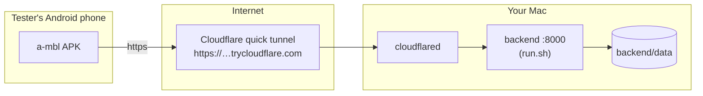

# Testing a-mbl on real phones

Three situations, three setups:

1. **You, on your own phone, while developing**: Expo Go on the same Wi-Fi.
   Five minutes.
2. **A tester on Android, anywhere**: send the installable **APK**, and make
   the backend reachable during the session. *This is the route for the
   client.*
3. **A tester on an iPhone**: the APK cannot run on iOS; use Expo Go over a
   tunnel, EAS Update, or TestFlight.

In every case the phone needs two things: **the app** and **a reachable
backend**. The backend always runs on your Mac.

## 0. One-time prerequisites on the Mac

| Tool | Check | Install if missing |
| --- | --- | --- |
| Node.js + npm | `node --version` | https://nodejs.org |
| Conda env `a-mbl` with backend deps | `conda run -n a-mbl python -c "import fastapi"` | see [HOW_TO_RUN.md](HOW_TO_RUN.md) §1 |
| Mobile JS deps | `ls mobile/node_modules` | `cd mobile && npm install` |
| Tesseract (screenshot OCR) | `conda run -n a-mbl tesseract --version` | `conda install -n a-mbl -c conda-forge tesseract` |
| JDK 17 (APK builds only) | `conda run -n a-mbl java -version` | `conda install -n a-mbl -c conda-forge openjdk=17` |
| Android SDK (APK builds only) | `ls ~/Library/Android/sdk` | Android Studio installs it |
| cloudflared (remote sessions only) | `conda run -n a-mbl cloudflared --version` | see §2.3 |

(On this Mac, as of 2026-10-05, all of these are installed: Node v26, env
`a-mbl` with Tesseract 5.5, OpenJDK 17 and cloudflared, and the Android SDK
under `~/Library/Android/sdk`.)

## 1. Your own phone in Expo Go (same Wi-Fi)

Install **Expo Go** from the Play Store / App Store and keep it updated; Expo
Go only runs projects on its current SDK (this app: SDK 57).

```bash
# Terminal 1: backend (note the http://<mac-ip>:8000 address it prints)
./backend/run.sh

# Optional: demo accounts (password demo-pass-123)
conda run -n a-mbl python -m backend.scripts.seed_demo

# Terminal 2: mobile bundler
cd mobile
npx expo start
```

On the phone: open **Expo Go → Scan QR code** (iPhone: the Camera app) and
scan the QR from Terminal 2. On the app's first screen, enter the address
`run.sh` printed and tap **Check connection**. The address field also accepts
`192.168.1.20:8000` without `http://`.

Tip: pre-fill that screen by starting the bundler with
`EXPO_PUBLIC_API_URL=http://<mac-ip>:8000 npx expo start`.

If anything fails, the troubleshooting table in
[HOW_TO_RUN.md](HOW_TO_RUN.md) §6 covers the usual causes (different Wi-Fi,
Mac firewall, changed IP, stale Expo Go cache).

## 2. An Android tester: the APK

### 2.1 Build the APK

```bash
cd mobile
npm run build:apk          # = ./scripts/build-apk.sh
```

The script regenerates the native `android/` project from `app.json` (it is
never committed), builds a release APK for real phones (64-bit and 32-bit
ARM), and writes **`dist/a-mbl-0.1.0.apk`** (about 55 MB) at the repository
root (`dist/` is gitignored). The first build downloads Gradle, the NDK and
CMake (about 30 minutes on this Mac, mostly downloading); later builds take
2–3 minutes.

About this build:

- It is a **standalone app**: no Expo Go, no bundler, no Play Store. The
  JavaScript is bundled inside the APK.
- It is signed with the standard React Native **debug keystore**, which is
  fine for sideloading test builds and lets a newer APK install over an older
  one. It is *not* suitable for the Play Store; that needs a private upload
  key (for example through EAS Build).
- Plain `http://` addresses are allowed (`usesCleartextTraffic`, set through
  `expo-build-properties` in `app.json`), so the APK works with
  `http://<mac-ip>:8000` on the same Wi-Fi as well as with https tunnels.
- When you send an updated APK, bump `expo.version` and
  `expo.android.versionCode` in `mobile/app.json` first, so testers can tell
  versions apart.

### 2.2 Send it

Share `dist/a-mbl-0.1.0.apk` through Google Drive, WhatsApp, Telegram or a
USB cable (some email providers block `.apk` attachments). The tester-facing
install steps (allow installs from this source, Play Protect's "Install
anyway") are written out in [CLIENT_GUIDE.md](../CLIENT_GUIDE.md) §19, which
you can send along with it.

### 2.3 Make the backend reachable

**Same Wi-Fi as the Mac:** run `./backend/run.sh` and send the
`http://<mac-ip>:8000` address it prints. Done.

**From anywhere:** expose the backend through a free Cloudflare quick tunnel,
which gives a temporary `https://…trycloudflare.com` address. cloudflared is
a single binary; install it into the conda env from Cloudflare's official
release (no Homebrew needed):

```bash
curl -L https://github.com/cloudflare/cloudflared/releases/latest/download/cloudflared-darwin-arm64.tgz \
  | tar -xz -C "$(conda run -n a-mbl python -c 'import sys; print(sys.prefix)')/bin"
conda run -n a-mbl cloudflared --version
```

### 2.4 Run a test session (checklist)

```bash
# Terminal 1: backend
./backend/run.sh

# Once: demo accounts (password demo-pass-123)
conda run -n a-mbl python -m backend.scripts.seed_demo

# Terminal 2: public https address for the backend (only for remote testers)
conda run --no-capture-output -n a-mbl cloudflared tunnel --url http://localhost:8000
#   → prints https://<random-words>.trycloudflare.com
```

Send the tester:

1. the **APK** (once; re-send only when you build a new version),
2. the **server address**: the `https://….trycloudflare.com` link (remote)
   or `http://<mac-ip>:8000` (same Wi-Fi),
3. the **demo logins** and the scenarios in
   [CLIENT_GUIDE.md](../CLIENT_GUIDE.md) §19.

She opens a-mbl, pastes the address on **Connect to the a-mbl server**, taps
**Check connection**, then **Continue**.

The quick-tunnel address changes every time cloudflared restarts. If you
restart it, send the new address; she can change it later under
**Profile → Change server address** (or **Change server address** on the
sign-in screens).



## 3. An iPhone tester

The APK is Android-only. For an iPhone, both the app bundle and the API must
reach her phone. Pick one:

| | Option A: live tunnel session | Option B: published update | Option C: TestFlight |
| --- | --- | --- | --- |
| Cost | free | free | Apple Developer, $99/yr |
| Your Mac during her test | must stay running | only the backend tunnel | only the backend tunnel |
| Feels like | dev preview in Expo Go | dev preview in Expo Go | a real installed app |
| Good for | a guided 30-min session | feedback over a few days | serious client testing |

### Option A: live session over tunnels

Start the backend and the cloudflared tunnel exactly as in §2.4, then:

```bash
# Terminal 3: mobile bundler over a tunnel (free Expo account, first time only)
cd mobile
npx expo login
npx expo start --tunnel
```

Send her the **project QR/link** that `expo start --tunnel` shows (the iPhone
Camera app opens it in Expo Go) and the **`https://….trycloudflare.com`
address**.

### Option B: publish the bundle with EAS Update

Publishing puts the JS bundle on Expo's servers so she can open the app in
Expo Go without your bundler running (the backend tunnel must still be up
while she tests). One-time setup adds the `expo-updates` package and an EAS
project id to the repo:

```bash
cd mobile
npx eas-cli update:configure     # one time; this modifies package.json/app.json
npx eas-cli update --branch preview --message "client test"
```

### Option C: TestFlight (a real install on her phone)

Needs an [Apple Developer Program](https://developer.apple.com/programs/)
membership.

```bash
cd mobile
npx eas-cli build --platform ios --profile production
npx eas-cli submit --platform ios
```

Then in App Store Connect → your app → **TestFlight**, add her email as a
tester. Outside Expo Go, iOS blocks plain `http://` addresses (App Transport
Security), so a TestFlight build needs the **https** tunnel address.

## 4. Verifying an APK yourself before sending it

An Android emulator from the SDK reaches the Mac's backend at
`http://10.0.2.2:8000`:

```bash
~/Library/Android/sdk/emulator/emulator -list-avds          # pick an AVD
~/Library/Android/sdk/emulator/emulator -avd <name> &
~/Library/Android/sdk/platform-tools/adb install -r dist/a-mbl-0.1.0.apk
```

Then open a-mbl in the emulator and enter `10.0.2.2:8000` on the connect
screen.

## 5. Safety notes for remote testing

- A tunnel makes the API **publicly reachable**: anyone with the URL can
  register and submit text. Use synthetic content only (the app says the
  same), and stop the tunnel (`Ctrl+C`) as soon as the session ends.
- To wipe everything afterwards: stop the backend, `rm -rf backend/data`,
  then reseed. This deletes all accounts, cases, keys, and evidence.
