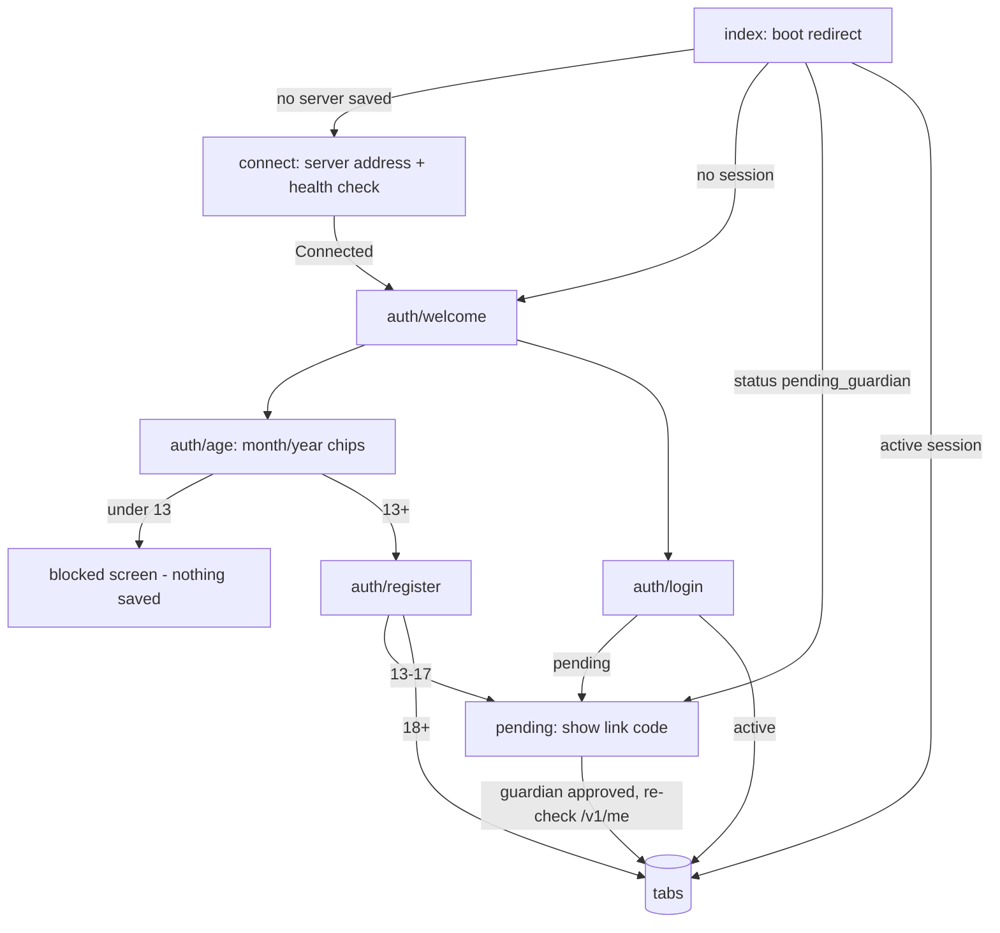
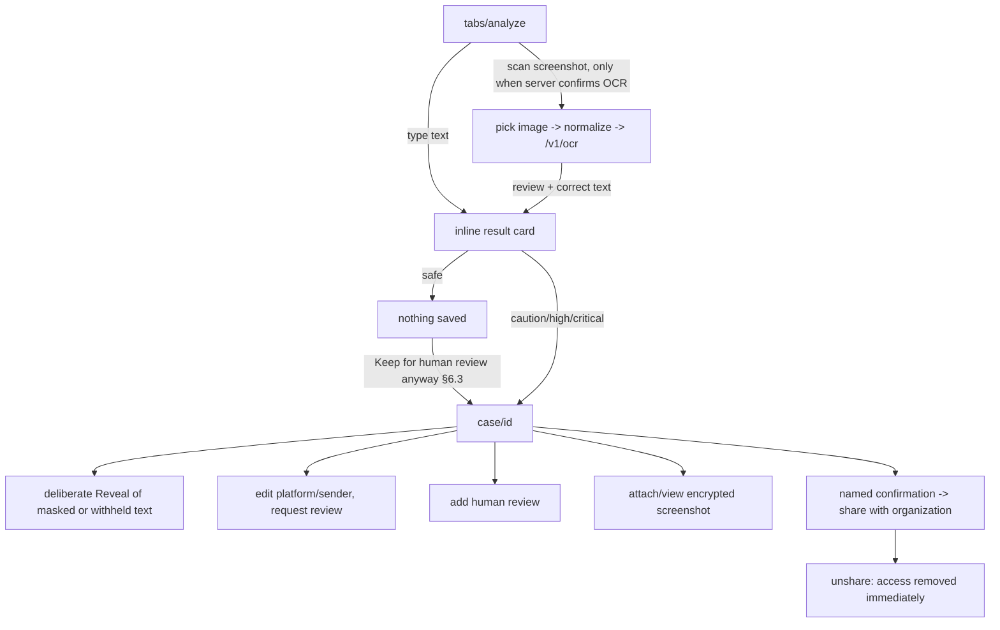
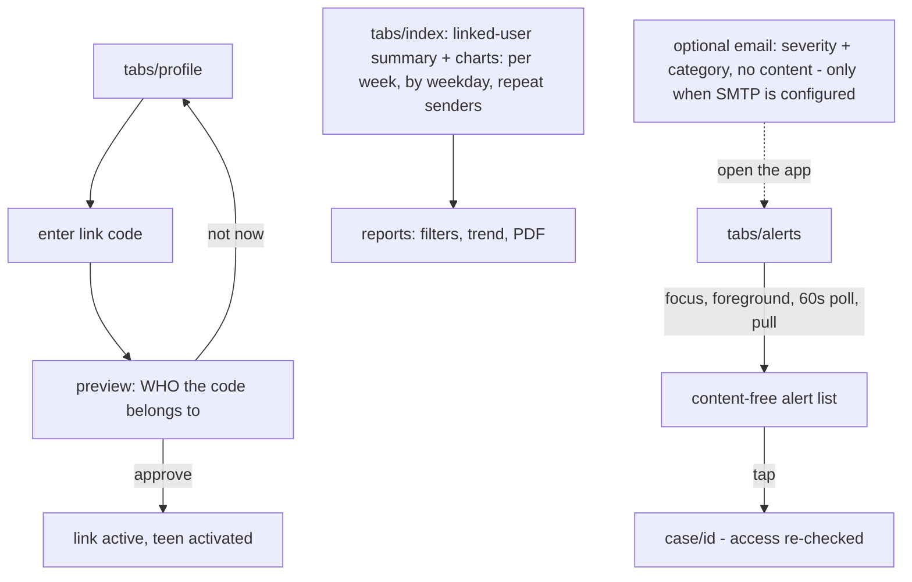
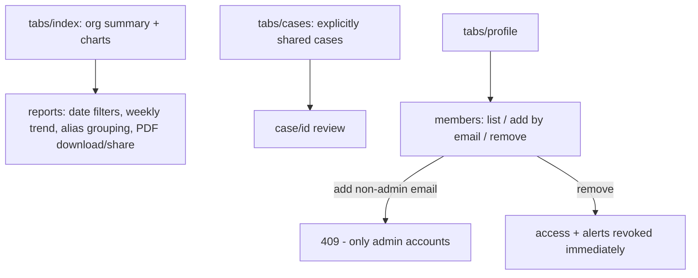
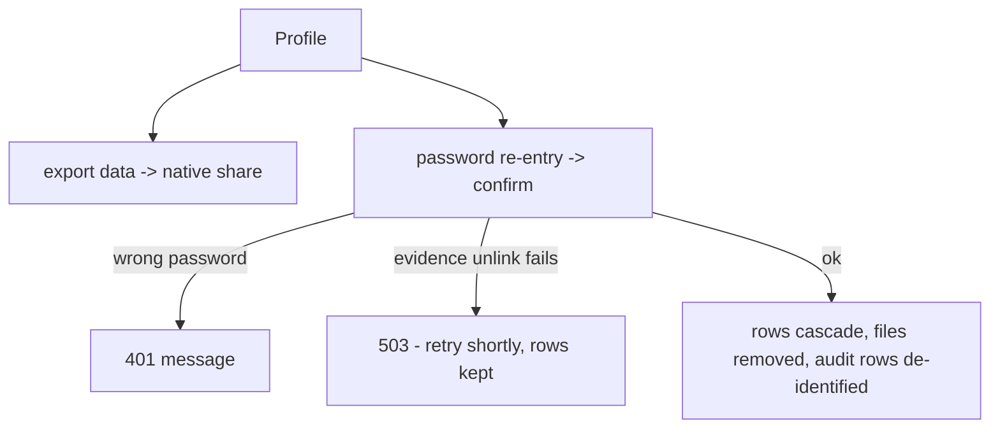

# Screen flows — all roles and core error states

Low-fidelity flows (roadmap §17 W1–2 deliverable, recorded post-hoc: the
implemented screens in `mobile/src/app/` are the source of truth; this maps
them). Every network step has loading, empty, error-with-retry, and timeout
states via the shared `Loading` / `EmptyState` / `ErrorNotice` components.

## Entry and authentication (all roles)

Error states: unreachable server (connect screen banner + troubleshooting),
wrong credentials (field errors), expired/reused refresh token (silent
sign-out to welcome), rate limiting (429 message).

## User: analyze → case → share (§7.2–7.4)

Error states: OCR unavailable (503 banner) or unconfirmed (connection
warning), image too large/wrong type (413/422 field message), camera
permission denied (inline message with gallery fallback), upload timeout
(30 s, retryable).

## Guardian (§7.1, §8.3)

Error states: invalid/expired/consumed code (404 message), non-guardian
account (403), already linked (409).

## School administrator (§8.4)

## Privacy (§7.5)

